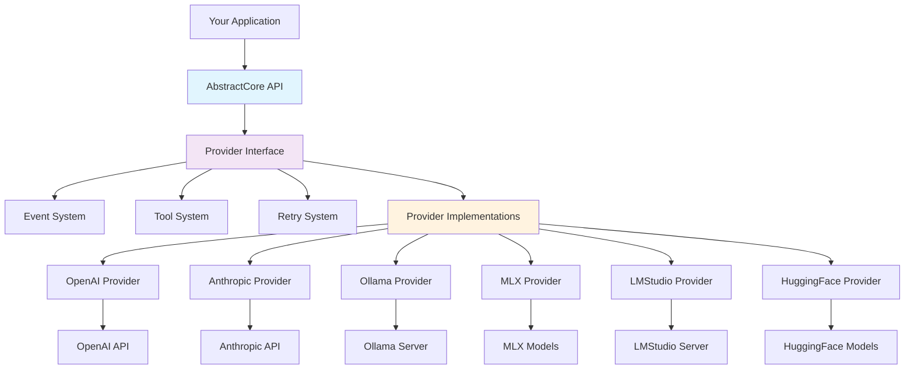
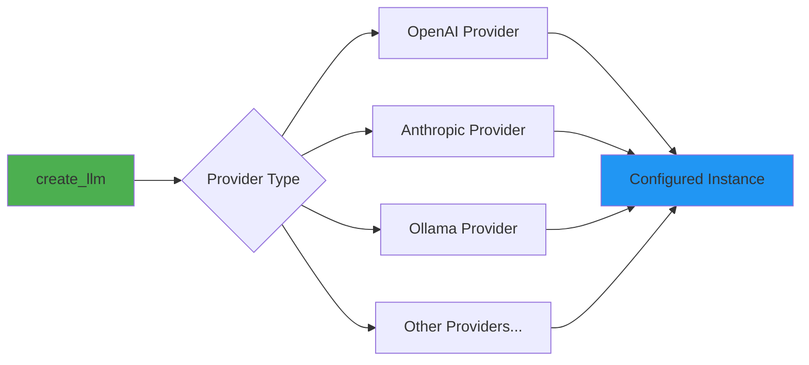
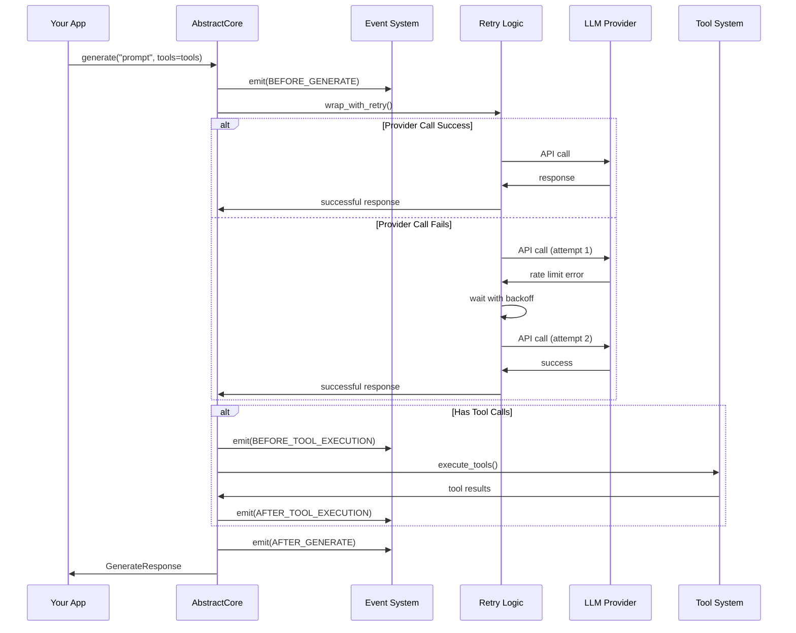
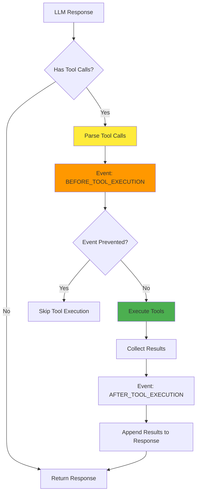
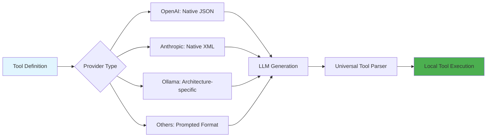
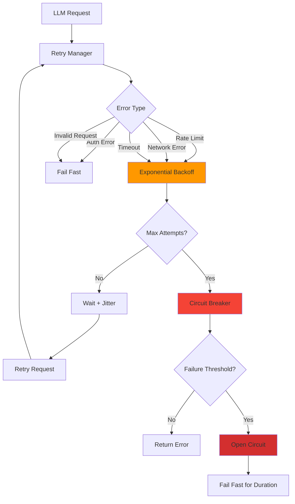
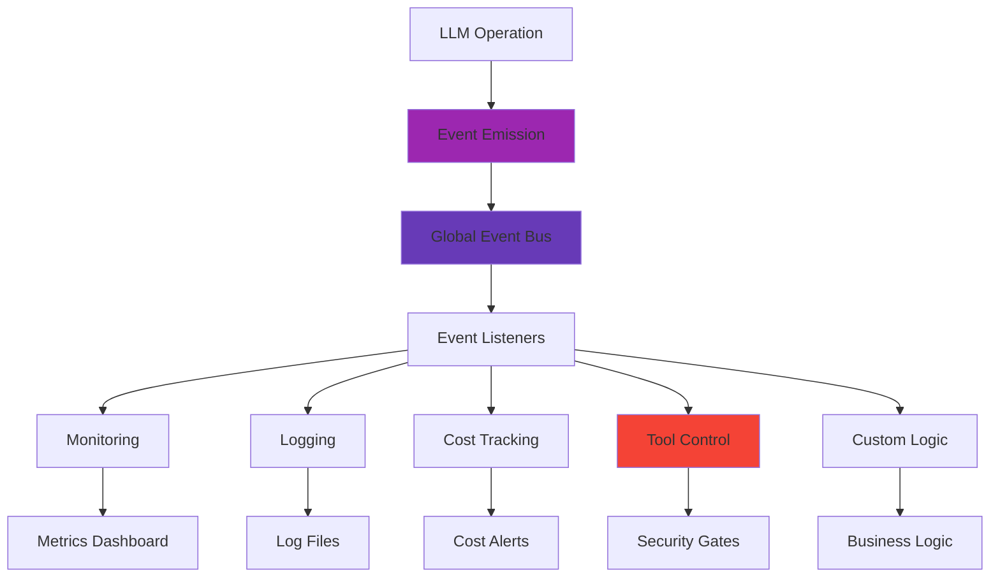
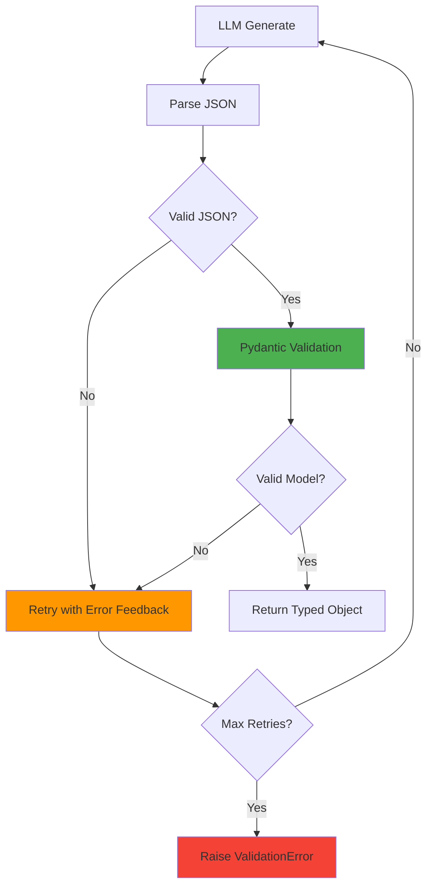
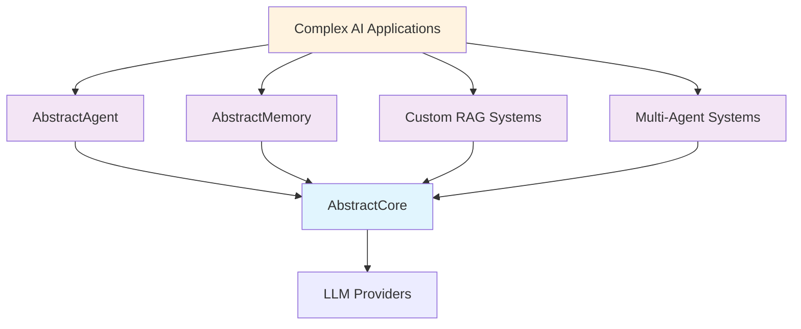

# AbstractCore Architecture

AbstractCore provides a unified interface to all major LLM providers with production-grade reliability. This document explains how it works internally and why it's designed this way.

## System Overview



## Design Principles

### 1. Provider Abstraction
**Goal**: Same interface for all providers
**Implementation**: Common interface with provider-specific implementations

### 2. Production Reliability
**Goal**: Handle real-world failures gracefully
**Implementation**: Built-in retry logic, circuit breakers, comprehensive error handling

### 3. Universal Tool Support
**Goal**: Tools work everywhere, even with providers that don't support them natively
**Implementation**: Native support where available, intelligent prompting as fallback

### 4. Simplicity Over Features
**Goal**: Clean, focused API that's easy to understand
**Implementation**: Minimal core with clear extension points

## Core Components

### 1. Factory Pattern (`create_llm`)

The main entry point uses the factory pattern for clean provider instantiation:



```python
from abstractllm import create_llm

# Factory creates the right provider with proper configuration
llm = create_llm("openai", model="gpt-4o-mini", temperature=0.7)
```

### 2. Provider Interface

All providers implement `AbstractLLMInterface`:

```python
class AbstractLLMInterface(ABC):
    @abstractmethod
    def generate(self, prompt: str, **kwargs) -> GenerateResponse:
        """Generate response from LLM"""

    @abstractmethod
    def get_capabilities(self) -> List[str]:
        """Get provider capabilities"""
```

This ensures:
- **Consistency**: Same methods across all providers
- **Reliability**: Standardized error handling
- **Extensibility**: Easy to add new providers

### 3. Request Lifecycle



### 4. Tool System Architecture

The tool system provides universal tool execution across all providers:



#### Tool Execution Flow

1. **Tool Detection**: Parse tool calls from LLM response
2. **Event Emission**: Emit `BEFORE_TOOL_EXECUTION` (preventable)
3. **Local Execution**: Execute tools in AbstractCore (not by provider)
4. **Result Collection**: Gather results and error information
5. **Event Emission**: Emit `AFTER_TOOL_EXECUTION` with results
6. **Response Integration**: Append tool results to original response

#### Provider-Specific Tool Handling



### 5. Retry and Reliability System

Production-grade error handling with multiple layers:



#### Retry Configuration

```python
from abstractllm import create_llm
from abstractllm.core.retry import RetryConfig

config = RetryConfig(
    max_attempts=3,           # Try up to 3 times
    initial_delay=1.0,        # Start with 1 second delay
    max_delay=60.0,           # Cap at 1 minute
    use_jitter=True,          # Add randomness
    failure_threshold=5,      # Circuit breaker after 5 failures
    recovery_timeout=60.0     # Test recovery after 1 minute
)

llm = create_llm("openai", model="gpt-4o-mini", retry_config=config)
```

### 6. Event System

Comprehensive observability and control through events:



#### Event Types and Use Cases

```python
from abstractllm.events import EventType, on_global

# Cost monitoring
def monitor_costs(event):
    if event.cost_usd and event.cost_usd > 0.10:
        alert(f"High cost request: ${event.cost_usd}")

# Security control
def prevent_dangerous_tools(event):
    for call in event.data.get('tool_calls', []):
        if call.name in ['delete_file', 'system_command']:
            event.prevent()  # Stop tool execution

# Performance tracking
def track_performance(event):
    if event.duration_ms > 10000:
        log(f"Slow request: {event.duration_ms}ms")

on_global(EventType.AFTER_GENERATE, monitor_costs)
on_global(EventType.BEFORE_TOOL_EXECUTION, prevent_dangerous_tools)
on_global(EventType.AFTER_GENERATE, track_performance)
```

### 7. Structured Output System

Type-safe responses with automatic validation and retry:



#### Automatic Error Feedback

When validation fails, AbstractCore provides detailed feedback to the LLM:

```python
# If LLM returns invalid data, AbstractCore automatically retries with:
"""
IMPORTANT: Your previous response had validation errors:
• Field 'age': Age must be positive (got -25)
• Field 'email': Invalid email format

Please correct these errors and provide valid JSON.
"""
```

### 8. Session Management

Simple conversation memory without complexity:

```mermaid
graph LR
    A[BasicSession] --> B[Message History]
    A --> C[System Prompt]
    A --> D[Provider Reference]

    B --> E[generate()]
    C --> E
    D --> E

    E --> F[Add to History]
    F --> G[Return Response]

    A --> H[save()/load()]
    H --> I[JSON Persistence]

    style A fill:#2196f3
    style B fill:#4caf50
```

## Architecture Benefits

### 1. Provider Agnostic
- **Same code works everywhere**: Switch providers by changing one line
- **No vendor lock-in**: Easy migration between cloud and local providers
- **Consistent behavior**: Tools, streaming, structured output work identically

### 2. Production Ready
- **Automatic reliability**: Built-in retry logic and circuit breakers
- **Comprehensive observability**: Events for every operation
- **Error handling**: Proper error classification and handling

### 3. Extensible
- **Event system**: Hook into any operation
- **Tool system**: Add new tools easily
- **Provider system**: Add new providers with minimal code

### 4. Performance Optimized
- **Lazy loading**: Providers loaded only when needed
- **Connection pooling**: Reuse HTTP connections
- **Efficient parsing**: Optimized JSON and tool parsing

## Extension Points

AbstractCore is designed to be extended:

### Adding a New Provider

```python
from abstractllm.providers.base import BaseProvider

class MyProvider(BaseProvider):
    def generate(self, prompt: str, **kwargs) -> GenerateResponse:
        # Implement provider-specific logic
        return GenerateResponse(content="...")

    def get_capabilities(self) -> List[str]:
        return ["text_generation", "streaming"]
```

### Adding Custom Events

```python
from abstractllm.events import EventType, emit_global

class EventType(Enum):  # Extend the enum
    CUSTOM_EVENT = "custom_event"

# Emit custom events
emit_global(EventType.CUSTOM_EVENT, data={"custom": "data"})
```

### Adding Tools

```python
from abstractllm.tools import register_tool

@register_tool
def my_custom_tool(param: str) -> str:
    """Custom tool that does something useful."""
    return f"Processed: {param}"
```

## Performance Characteristics

### Memory Usage
- **Core**: ~15MB base memory
- **Per Provider**: ~2-5MB additional
- **Scaling**: Linear with number of concurrent requests

### Latency Overhead
- **Provider abstraction**: ~1-2ms overhead
- **Event system**: ~0.5ms per event
- **Tool parsing**: ~1-5ms depending on complexity
- **Retry logic**: Only on failures

### Throughput
- **Single instance**: 100+ requests/second
- **Bottleneck**: Usually the LLM provider, not AbstractCore
- **Scaling**: Horizontal scaling through multiple instances

## Security Considerations

### 1. Tool Execution Safety
- **Local execution**: Tools run in AbstractCore, not by providers
- **Event prevention**: Stop dangerous tools before execution
- **Input validation**: Validate tool parameters

### 2. API Key Management
- **Environment variables**: Secure key storage
- **No logging**: Keys never appear in logs
- **Provider isolation**: Keys scoped to specific providers

### 3. Data Privacy
- **Local options**: Support for local providers (Ollama, MLX)
- **No data retention**: AbstractCore doesn't store conversation data
- **Transparent processing**: All operations are observable through events

## Testing Strategy

### 1. No Mocking Philosophy
- **Real implementations**: Test against actual providers
- **Real models**: Use actual LLM models in tests
- **Real scenarios**: Test real-world usage patterns

### 2. Provider Coverage
- **All providers tested**: Every provider has comprehensive tests
- **Cross-provider consistency**: Same tests run across all providers
- **Feature parity**: Ensure consistent behavior

### 3. Reliability Testing
- **Failure scenarios**: Test retry logic and error handling
- **Performance tests**: Measure latency and throughput
- **Integration tests**: Test with real external dependencies

## Future Architecture

AbstractCore is designed to be the foundation for more advanced capabilities:



### Planned Extensions
- **AbstractAgent**: Advanced agent workflows and planning
- **AbstractMemory**: Temporal knowledge graphs and long-term memory
- **AbstractSwarm**: Multi-agent orchestration
- **AbstractPipeline**: Complex workflow orchestration

## Summary

AbstractCore's architecture prioritizes:

1. **Reliability** - Production-grade error handling and retry logic
2. **Simplicity** - Clean APIs that are easy to understand and use
3. **Universality** - Same interface and features across all providers
4. **Extensibility** - Clear extension points for advanced features
5. **Observability** - Comprehensive events for monitoring and control

The result is a foundation that works reliably in production while remaining simple enough to learn quickly and flexible enough to build advanced applications on top of.