# AbstractCore Architecture

AbstractCore provides a unified interface to major LLM providers with production-oriented reliability features. This document explains how it works internally and why it's designed this way.

Related docs (user-facing):
- Media inputs (images/audio/video + documents): `docs/media-handling-system.md`
- Vision input + fallback: `docs/vision-capabilities.md`
- Capability plugins (voice/audio/vision): `docs/capabilities.md`
- OpenAI-compatible gateway server: `docs/server.md`
- Single-model OpenAI-compatible endpoint: `docs/endpoint.md`
- Tool calling semantics (passthrough vs execution): `docs/tool-calling.md`

## System Overview

AbstractCore operates as a Python library and can also be exposed via **optional OpenAI-compatible HTTP servers**:

- **Gateway server (multi-provider)**: `abstractcore.server.app` (docs: `docs/server.md`)
- **Endpoint server (single-model)**: `abstractcore.endpoint.app` (docs: `docs/endpoint.md`)

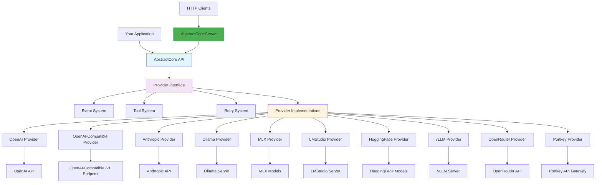

## Design Principles

### 1. Provider Abstraction
**Goal**: Same interface for all providers
**Implementation**: Common interface with provider-specific implementations

### 2. Production Reliability
**Goal**: Handle real-world failures gracefully
**Implementation**: Built-in retry logic, circuit breakers, comprehensive error handling

### 3. Universal Tool Support
**Goal**: Tools work everywhere, even with providers that don't support them natively
**Implementation**: Native support where available, intelligent prompting as fallback

### 4. Simplicity Over Features
**Goal**: Clean, focused API that's easy to understand
**Implementation**: Minimal core with clear extension points

### 5. Optional HTTP Access
**Goal**: Flexible deployment as library or server
**Implementation**: OpenAI-compatible REST API built on core library

## Core Components

### 1. Factory Pattern (`create_llm`)

The main entry point uses the factory pattern for clean provider instantiation:

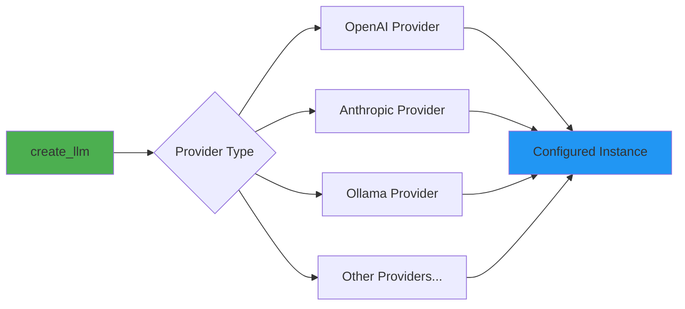

```python
from abstractcore import create_llm

# Factory creates the right provider with proper configuration
llm = create_llm("openai", model="gpt-4o-mini", temperature=0.7)

# OpenAI-compatible /v1 endpoints (LMStudio, vLLM, custom proxies)
llm_local = create_llm("lmstudio", model="qwen/qwen3-4b-2507", base_url="http://localhost:1234/v1")
llm_openrouter = create_llm("openrouter", model="openai/gpt-4o-mini")  # requires OPENROUTER_API_KEY
llm_portkey = create_llm("portkey", model="gpt-4o-mini", config_id="pcfg_...")  # requires PORTKEY_API_KEY + PORTKEY_CONFIG
```

Gateway providers (OpenRouter/Portkey) route to external backends; AbstractCore forwards only **explicit** generation parameters to avoid sending defaults that strict backends reject.

### 2. Provider Interface

All providers implement `AbstractCoreInterface` (see `abstractcore/core/interface.py`):

```python
class AbstractCoreInterface(ABC):
    @abstractmethod
    def generate(
        self,
        prompt: str,
        messages: Optional[List[Dict[str, str]]] = None,
        system_prompt: Optional[str] = None,
        tools: Optional[List[Dict[str, Any]]] = None,
        media: Optional[List[Union[str, Dict[str, Any], "MediaContent"]]] = None,
        stream: bool = False,
        thinking: Optional[Union[bool, str]] = None,
        **kwargs,
    ) -> Union[GenerateResponse, Iterator[GenerateResponse]]:
        """Generate a response (or a stream of chunks)."""

    @abstractmethod
    def get_capabilities(self) -> List[str]:
        """Get provider capabilities"""

    @abstractmethod
    def unload_model(self, model_name: str) -> None:
        """Unload/cleanup resources for a specific model (best-effort)."""
```

This ensures:
- **Consistency**: Same methods across all providers
- **Reliability**: Standardized error handling
- **Extensibility**: Easy to add new providers
- **Memory Management**: Explicit control over model lifecycle

#### Response Normalization (Model Output Cleanup)

`BaseProvider` also applies **asset-driven response normalization** so downstream code sees clean, consistent output across providers:

- **Output wrappers**: Strip configured leading/trailing wrapper tokens (e.g., GLM `<|begin_of_box|>…<|end_of_box|>`)
- **Harmony transcripts (GPT-OSS)**: Extract `<|channel|>final` into `GenerateResponse.content` and capture `<|channel|>analysis` as `GenerateResponse.metadata["reasoning"]` (non-streaming)
- **Thinking tags**: Extract inline `<think>...</think>` blocks into `GenerateResponse.metadata["reasoning"]` (when configured)

**Why this belongs in `BaseProvider` (even for streaming):**
- These artifacts are **model/template-specific**, not provider-specific (the same model can be served via Ollama, vLLM, LMStudio, HF, or MLX)
- In streaming mode, wrappers often appear in the first/last chunks; stripping them incrementally avoids leaking markup into UIs and tool parsers without buffering the full response

Configuration comes from `abstractcore/assets/architecture_formats.json` and `abstractcore/assets/model_capabilities.json`; implementation lives in `abstractcore/architectures/response_postprocessing.py`.

#### Memory Management

The `unload_model(model_name)` method is a **best-effort resource cleanup hook**.

- **API providers** (OpenAI, Anthropic): typically a no-op (safe to call).
- **Local / self-hosted providers**: behavior is provider-specific:
  - some can actively release memory (or request server-side eviction),
  - others can only close client connections and rely on server-side TTL/auto-eviction.
  - Example: **LMStudio** does not expose an explicit “unload model” API; `unload_model()` closes HTTP clients and relies on LMStudio TTL/auto-evict.

In the OpenAI-compatible AbstractCore server (`abstractcore.server.app`), requests can set `unload_after` (default `false`)
to call `llm.unload_model(model)` after the request completes. For providers that can unload shared server state (e.g. Ollama),
this is disabled by default and must be explicitly enabled by the server operator.

```python
# Load model, use it, then free memory
llm = create_llm("ollama", model="large-model")
response = llm.generate("Hello")
llm.unload_model(llm.model)  # Explicitly free memory
del llm
```

This is critical for:
- Test suites that load multiple models sequentially
- Memory-constrained environments (<32GB RAM)
- Production systems serving different models sequentially

### 3. Media Handling System

AbstractCore includes a policy-driven media handling system that enables file attachments across all providers:

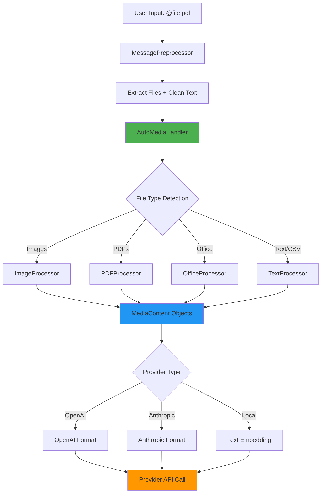

#### Media System Architecture

**Core Components:**
- **MessagePreprocessor**: Parses `@filename` syntax in CLI and extracts file references
- **AutoMediaHandler**: Intelligent coordinator that selects appropriate processors
- **Specialized Processors**:
  - `ImageProcessor` (PIL-based for images)
  - `PDFProcessor` (PyMuPDF4LLM for documents)
  - `OfficeProcessor` (Unstructured for DOCX/XLSX/PPTX)
  - `TextProcessor` (pandas for CSV/TSV data analysis)
- **Provider Handlers**: Format media content for each provider's API requirements

**Provider-Specific Formatting:**
```python
# Same MediaContent gets formatted differently:

# OpenAI (JSON with image_url):
{
  "role": "user",
  "content": [
    {"type": "text", "text": "Analyze this"},
    {"type": "image_url", "image_url": {"url": "data:image/png;base64,..."}}
  ]
}

# Anthropic (Messages API with source):
{
  "role": "user",
  "content": [
    {"type": "text", "text": "Analyze this"},
    {"type": "image", "source": {"type": "base64", "media_type": "image/png", "data": "..."}}
  ]
}

# Local (Text embedding):
"Analyze this\n\nImage description: A chart showing quarterly trends..."
```

**Graceful Fallback Strategy:**
1. **Advanced Processing**: PyMuPDF4LLM, Unstructured libraries
2. **Basic Processing**: Simple text extraction
3. **Metadata Fallback**: File information and properties
4. **Degrades gracefully for documents**: PDFs/Office/text aim to return best-effort extracted text/metadata rather than crashing.
5. **Policy-driven for true multimodal inputs**: for image/audio/video message parts, behavior is policy-driven; unsupported requests fail loudly unless an explicit enrichment fallback is configured (see `docs/media-handling-system.md` and `docs/vision-capabilities.md`).

#### Unified Media API

The same `media=[]` parameter works across all providers:

```python
# Universal API - works with any provider
llm = create_llm("openai", model="gpt-4o")  # or "anthropic", "ollama", etc.
response = llm.generate(
    "Analyze these files",
    media=["report.pdf", "chart.png", "data.xlsx"]
)
```

**CLI Integration:**
```bash
# Simple @filename syntax works everywhere
python -m abstractcore.utils.cli --prompt "What's in @document.pdf and @image.jpg"
```

#### Capability plugins (voice/audio/vision)
To keep the default `abstractcore` install dependency-light while still enabling deterministic modality APIs, AbstractCore supports optional **capability plugins**:
- `abstractvoice` provides `core.voice` + `core.audio` (TTS/STT).
- `abstractvision` provides `core.vision` (T2I/I2I/T2V/I2V; backend-pluggable).

Discovery:
- `llm.capabilities.status()` returns a JSON-safe snapshot (which backends are available/selected, plus install hints).
- Convenience facades exist as properties: `llm.voice`, `llm.audio`, `llm.vision` (lazy; missing plugins raise actionable errors).

### 4. Request Lifecycle

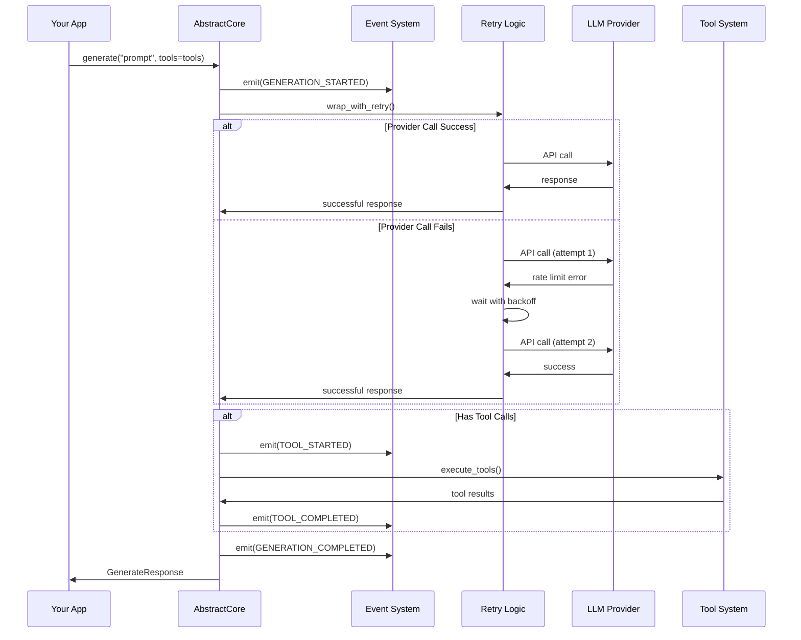

Note: in the Python API, `execute_tools` defaults to `False` (**pass-through**). Tool calls are returned in `GenerateResponse.tool_calls` for your host/runtime to execute. `execute_tools=True` exists for simple demos but is deprecated for most production use cases. The optional HTTP gateway server runs in pass-through mode.

### 5. Tool System Architecture

The tool system provides universal tool-call detection (and optional local execution) across all providers:

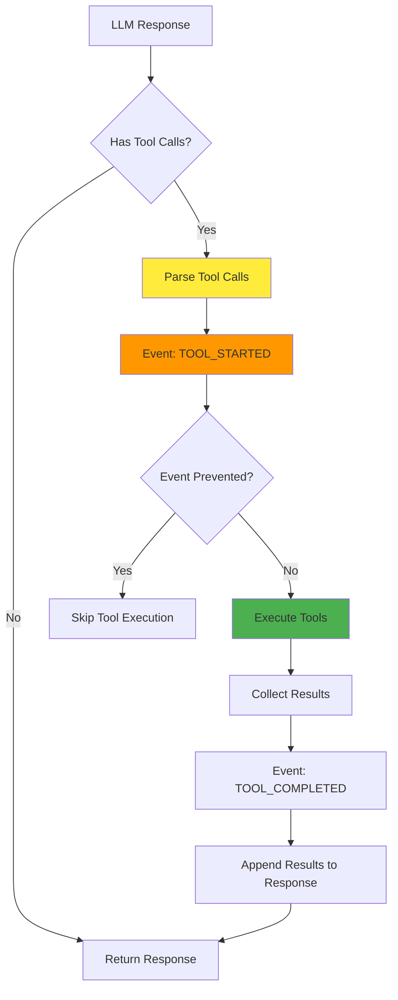

#### Tool Execution Flow

1. **Tool Detection**: Parse tool calls from LLM response
2. **Event Emission**: Emit `TOOL_STARTED` (preventable)
3. **Optional local execution (deprecated)**: execute tools inside AbstractCore when `execute_tools=True` (providers never execute arbitrary local tools)
4. **Result Collection**: Gather results and error information
5. **Event Emission**: Emit `TOOL_COMPLETED` with results
6. **Response Integration**: Append tool results to original response

#### Provider-Specific Tool Handling with Tag Rewriting

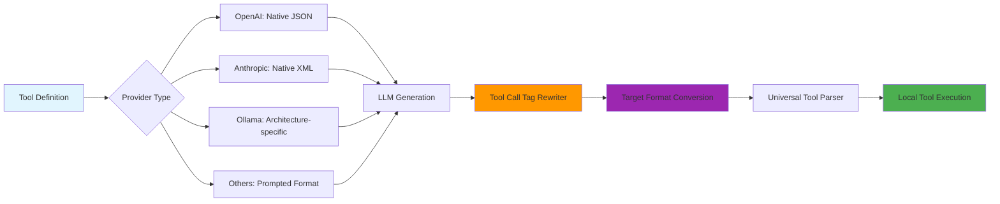

#### Tool Call Tag Rewriting System

AbstractCore includes a sophisticated tag rewriting system that enables compatibility with any agentic CLI:

**Rewriting Pipeline**:

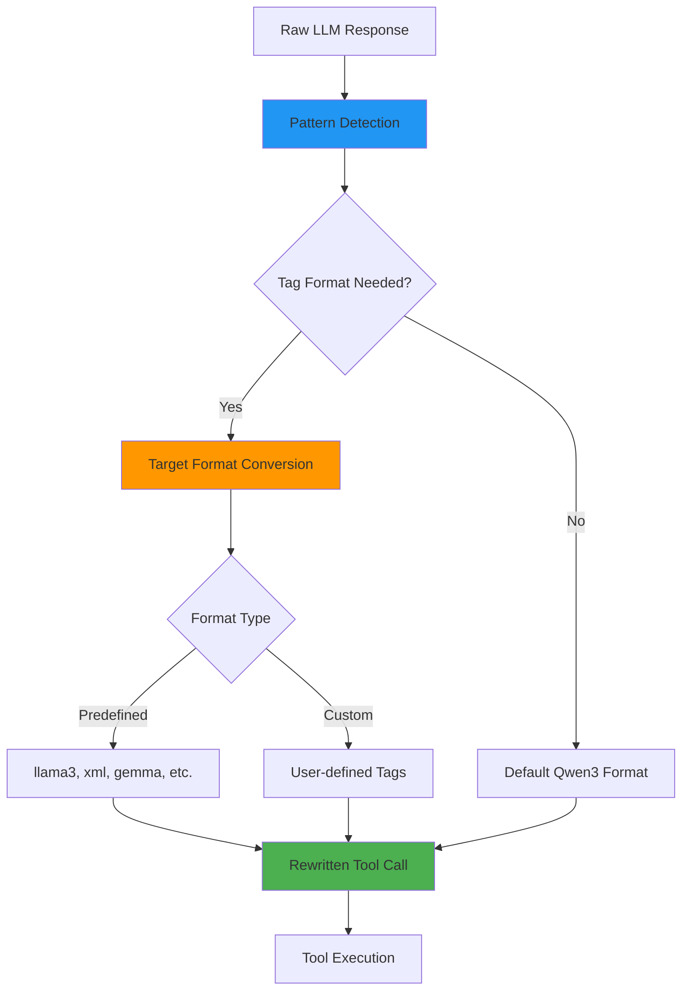

**Supported Formats**:
- **Default (Qwen3)**: `<|tool_call|>...JSON...</|tool_call|>` - Compatible with Codex CLI
- **LLaMA3**: `<function_call>...JSON...</function_call>` - Compatible with Crush CLI
- **XML**: `<tool_call>...JSON...</tool_call>` - Compatible with Gemini CLI
- **Gemma**: ````tool_code...JSON...```` - Compatible with Gemma models
- **Custom**: Any user-defined format (e.g., `[TOOL]...JSON...[/TOOL]`)

**Real-Time Integration**:
- **Streaming Compatible**: Works seamlessly with unified streaming architecture
- **Zero Latency**: No additional processing delays
- **Universal Detection**: Automatically detects source format from any model
- **Graceful Fallback**: Returns original content if rewriting fails

### 6. Retry and Reliability System

Production-grade error handling with multiple layers:

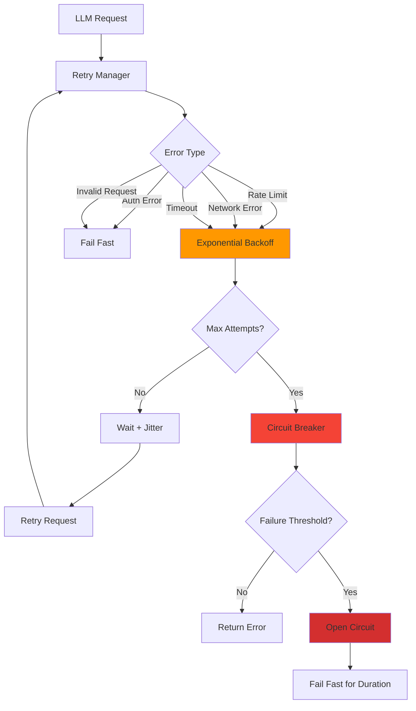

#### Retry Configuration

```python
from abstractcore import create_llm
from abstractcore.core.retry import RetryConfig

config = RetryConfig(
    max_attempts=3,           # Try up to 3 times
    initial_delay=1.0,        # Start with 1 second delay
    max_delay=60.0,           # Cap at 1 minute
    use_jitter=True,          # Add randomness
    failure_threshold=5,      # Circuit breaker after 5 failures
    recovery_timeout=60.0     # Test recovery after 1 minute
)

llm = create_llm("openai", model="gpt-4o-mini", retry_config=config)
```

### 7. Event System

Observability hooks through events:

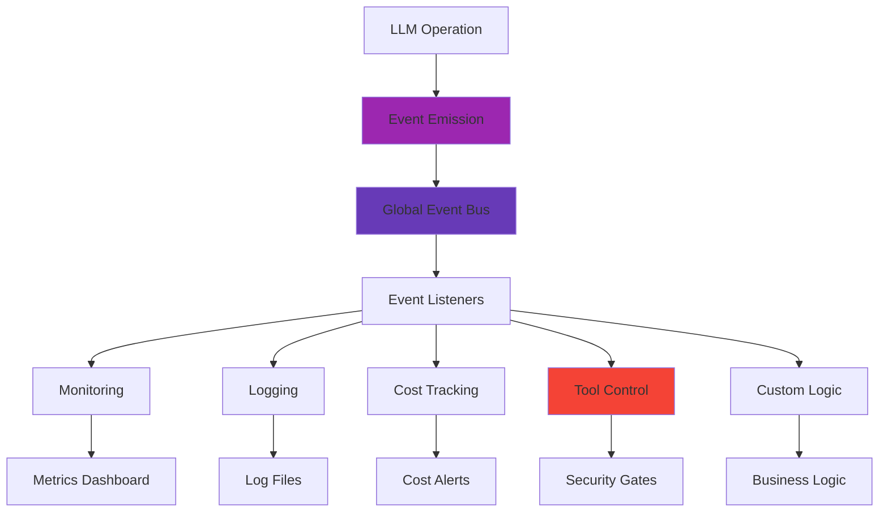

#### Event Types and Use Cases

```python
from abstractcore.events import EventType, on_global

# Cost monitoring (best-effort estimate; based on token usage)
def monitor_costs(event):
    if event.type != EventType.GENERATION_COMPLETED:
        return
    cost = event.data.get("cost_usd")
    if isinstance(cost, (int, float)) and cost > 0.10:
        alert(f"High estimated cost: ${cost:.2f}")

# Tool monitoring
def log_tools(event):
    if event.type == EventType.TOOL_COMPLETED:
        log(f"Tool completed: {event.data.get('tool_name')}")

# Performance tracking
def track_performance(event):
    if event.type != EventType.GENERATION_COMPLETED:
        return
    duration_ms = event.data.get("duration_ms")
    if isinstance(duration_ms, (int, float)) and duration_ms > 10_000:
        log(f"Slow request: {float(duration_ms):.0f}ms")

on_global(EventType.GENERATION_COMPLETED, monitor_costs)
on_global(EventType.TOOL_COMPLETED, log_tools)
on_global(EventType.GENERATION_COMPLETED, track_performance)
```

### 8. Structured Output System with Streaming Integration

Type-safe responses with automatic validation, retry, and unified streaming:

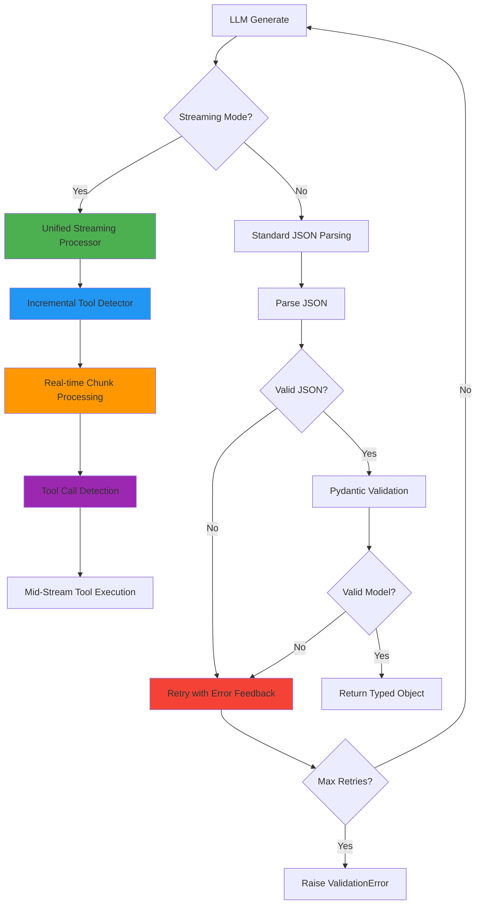

#### Unified Streaming Architecture

AbstractCore’s streaming system provides character-by-character streaming with incremental tool detection and optional tool-call syntax rewriting.

**Architecture Components**:

```mermaid
graph TD
    A[Stream Input] --> B[UnifiedStreamProcessor]
    B --> C[IncrementalToolDetector]
    C --> D[Tag Rewriter]
    D --> E[Tool Execution (optional)]
    E --> F[Stream Output]

    B --> G[Character-by-Character Handling]
    G --> H[Intelligent Buffering]
    H --> C

    style B fill:#4caf50
    style C fill:#2196f3
    style D fill:#ff9800
    style E fill:#9c27b0
```

**Key Features**:

1. **Unified Streaming Strategy**
   - Single consistent approach across all providers
   - Best-effort time-to-first-token (TTFT) telemetry for debugging
   - Minimal buffering (incremental parsing)

2. **Incremental Tool Detection**
   - Real-time tool call detection during streaming
   - Emits `chunk.tool_calls` as soon as a full tool call is detected
   - Handles partial tool calls across chunk boundaries

3. **Character-by-Character Streaming**
   - Handles micro-chunking from providers (very small deltas)
   - Intelligent buffering for partial tool calls
   - Robust parsing with auto-repair for malformed JSON

4. **Tool Call Tag Rewriting Integration**
   - Real-time format conversion during streaming
   - Support for multiple formats (Qwen3, LLaMA3, Gemma, XML, custom)
   - Designed to avoid large buffering while keeping tool calls structured

**Streaming with Tag Rewriting Example**:
```python
# Real-time streaming with automatic tool call format conversion
for chunk in llm.generate(
    "Create a Python function and analyze it",
    stream=True,
    tools=[code_analysis_tool],
    tool_call_tags="llama3"  # Convert to Crush CLI format
):
    # Immediate character-by-character output
    print(chunk.content, end="", flush=True)

    # Tool calls are surfaced as structured dicts; execute them in your host/runtime.
    if chunk.tool_calls:
        print(f"\nTool calls: {chunk.tool_calls}")

# Output format: <function_call>{"name": "analyze_code"}...</function_call>
```

Implementation pointers (source of truth):
- Unified streaming + tool detection: `abstractcore/providers/streaming.py`
- Streaming wrapper + TTFT metadata: `abstractcore/providers/base.py`

#### Automatic Error Feedback

When validation fails, AbstractCore provides detailed feedback to the LLM:

```python
# If LLM returns invalid data, AbstractCore automatically retries with:
"""
IMPORTANT: Your previous response had validation errors:
• Field 'age': Age must be positive (got -25)
• Field 'email': Invalid email format

Please correct these errors and provide valid JSON.
"""
```

### 9. Session Management

Simple conversation memory without complexity:

```mermaid
graph LR
    A[BasicSession] --> B[Message History]
    A --> C[System Prompt]
    A --> D[Provider Reference]

    B --> E[generate()]
    C --> E
    D --> E

    E --> F[Add to History]
    F --> G[Return Response]

    A --> H[save()/load()]
    H --> I[JSON Persistence]

    style A fill:#2196f3
    style B fill:#4caf50
```

### 10. Server Architecture (Optional Component)

The AbstractCore server provides OpenAI-compatible HTTP endpoints built on top of the core library:

```mermaid
	graph TD
	    A[HTTP Client] --> B[FastAPI Server]
	    B --> C{Endpoint Router}
	    
	    C --> D[/v1/chat/completions]
	    C --> E[/v1/embeddings]
	    C --> F[/v1/models]
	    C --> G[/providers]
	    C --> Img[/v1/images/* (optional)]
	    C --> Aud[/v1/audio/* (optional)]
	    C --> Cache[/acore/prompt_cache/*]
    
    D --> H[Request Validation]
    E --> H
    F --> I[Provider Discovery]
    G --> I
    
    H --> J[AbstractCore Library]
    I --> J
    
    J --> K[Provider Interface]
    K --> L[LLM Providers]
    
    style B fill:#4caf50
    style J fill:#e1f5fe
    style K fill:#f3e5f5
```

**Architecture Layers**:

1. **HTTP Layer**: FastAPI-based REST API with request validation
2. **Translation Layer**: Converts HTTP requests to AbstractCore library calls
3. **Core Layer**: Uses the full AbstractCore provider system
4. **Response Layer**: Transforms responses to OpenAI-compatible format

**Key Capabilities**:

- **OpenAI Compatibility**: Drop-in replacement for OpenAI API clients
- **Universal Provider Access**: Single API for all providers (OpenAI, Anthropic, Ollama, etc.)
- **Format Conversion**: Automatic tool call format conversion for agentic CLIs
- **Streaming Support**: Server-sent events for real-time responses
- **Model Discovery**: Dynamic model listing across all providers
- **Embedding Support**: Multi-provider embedding generation (HuggingFace, Ollama, LMStudio)
- **Optional Vision Endpoints**: OpenAI-compatible `/v1/images/generations` and `/v1/images/edits` (plus `/v1/vision/*` control plane) delegated to `abstractvision` (safe-by-default; requires explicit config).
- **Optional Audio Endpoints**: OpenAI-compatible `/v1/audio/transcriptions` and `/v1/audio/speech` delegated to capability plugins (typically `abstractvoice`).
- **Prompt Cache Control Plane**: `/acore/prompt_cache/*` proxy endpoints for cache stats/set/update/fork/clear (best-effort; typically targets an `abstractcore.endpoint` upstream).

**Request Flow Example**:

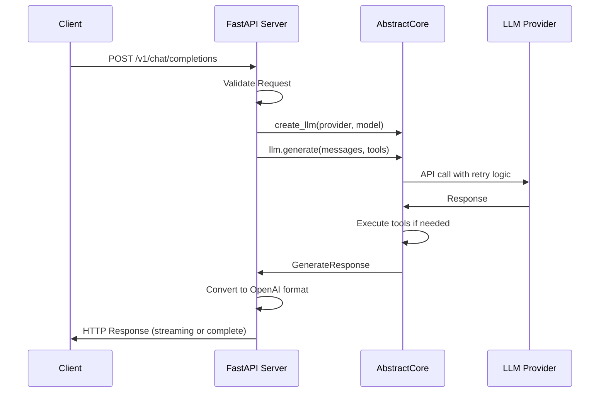

**Server Features**:

- **Automatic Retry**: Built-in retry logic from core library
- **Event System**: Full observability through events
- **Debug Logging**: Comprehensive request/response logging
- **Health Checks**: `/health` endpoint for monitoring
- **Interactive Docs**: Auto-generated Swagger UI at `/docs`
- **Multi-Worker Support**: Production deployment with multiple workers

## Architecture Benefits

### 1. Provider Agnostic
- **Same code works everywhere**: Switch providers by changing one line
- **No vendor lock-in**: Easy migration between cloud and local providers
- **Consistent semantics**: tools, streaming, and structured output follow the same API surface (provider/model differences still apply)

### 2. Production Ready
- **Automatic reliability**: Built-in retry logic and circuit breakers
- **Comprehensive observability**: Events for every operation
- **Error handling**: Proper error classification and handling

### 3. Extensible
- **Event system**: Hook into any operation
- **Tool system**: Add new tools easily
- **Provider system**: Add new providers with minimal code

### 4. Performance Optimized
- **Lazy loading**: Providers loaded only when needed
- **Connection pooling**: Reuse HTTP connections
- **Efficient parsing**: Optimized JSON and tool parsing

## Extension Points

AbstractCore is designed to be extended:

### Adding a New Provider

```python
from abstractcore.providers.base import BaseProvider

class MyProvider(BaseProvider):
    def generate(self, prompt: str, **kwargs) -> GenerateResponse:
        # Implement provider-specific logic
        return GenerateResponse(content="...")

    def get_capabilities(self) -> List[str]:
        return ["text_generation", "streaming"]
```

### Adding Tools

```python
from abstractcore import tool

@tool
def my_custom_tool(param: str) -> str:
    """Custom tool that does something useful."""
    return f"Processed: {param}"
```

## Performance Characteristics

AbstractCore’s overhead is usually small compared to model inference and network latency. If performance matters, benchmark on your target provider/model/hardware.

Common levers:
- Provider choice and base URL latency
- Concurrency (async + connection pooling)
- Streaming vs non-streaming
- Structured output (schema size, retry behavior)
- Tool execution strategy (pass-through vs host execution)

## Security Considerations

### 1. Tool Execution Safety
- **Local execution (optional)**: tool execution is local (never executed by the provider); by default tool calls are returned for your host/runtime to execute
- **Event prevention**: Stop dangerous tools before execution
- **Input validation**: Validate tool parameters

### 2. API Key Management
- **Environment variables**: Secure key storage
- **Avoid logging**: treat logs as sensitive; do not log secrets (AbstractCore tries to avoid printing keys in logs)
- **Provider isolation**: Keys scoped to specific providers

### 3. Data Privacy
- **Local options**: Support for local providers (Ollama, MLX)
- **No persistent storage by default**: conversation state lives in memory (for example `BasicSession`) unless you explicitly save it or enable tracing/logging
- **Transparent processing**: All operations are observable through events

## Testing Strategy

The repo uses a mix of unit tests and integration tests. Some tests are provider-/network-/hardware-dependent and are opt-in.

Quick pointers:
- Run: `pytest -q`
- Vision tests: `tests/README_VISION_TESTING.md`
- Seed tests: `tests/README_SEED_TESTING.md`
- Streaming/tool parsing tests: `tests/streaming/` and `tests/test_agentic_cli_compatibility.py`
- Server/endpoint tests: `tests/server/` and `tests/test_abstractendpoint_singleton_provider.py`

## Integration with AbstractFramework

AbstractCore is a core package in the **AbstractFramework** ecosystem:

- AbstractFramework (umbrella): https://github.com/lpalbou/AbstractFramework
- AbstractCore (this repo): https://github.com/lpalbou/AbstractCore
- AbstractRuntime: https://github.com/lpalbou/abstractruntime

In this ecosystem, AbstractCore focuses on **LLM I/O + provider abstraction**, while AbstractRuntime focuses on **durable execution** (effects/tools/workflows/state). AbstractCore remains usable standalone; when you need durability/policy/sandboxing around tools, plug it into a runtime (for example AbstractRuntime).

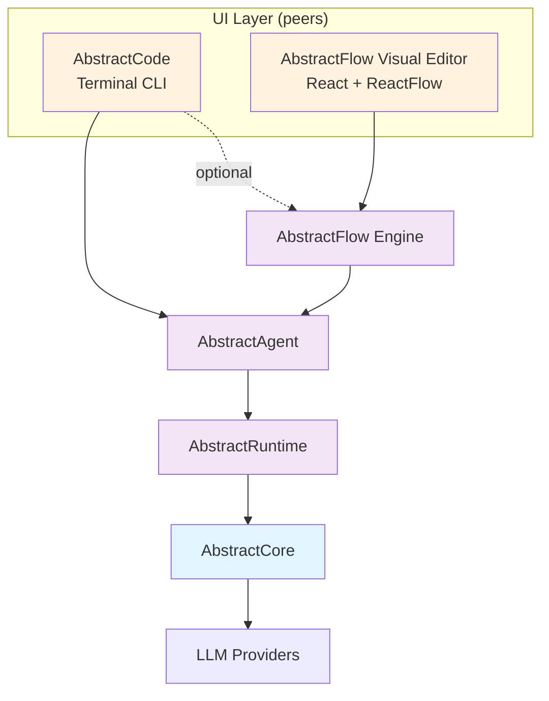

### Framework Layers
- **UI Layer** (peers):
  - AbstractCode: Terminal CLI for interactive sessions
  - AbstractFlow Visual Editor: Web-based diagram editor (React + ReactFlow + FastAPI)
- **AbstractFlow**: Multi-agent orchestration engine + visual editor
- **AbstractAgent**: Agent patterns (ReactAgent, CodeActAgent) with durable execution
- **AbstractRuntime**: Effect system, workflows, state persistence

AbstractCode can optionally use AbstractFlow for running flows. AbstractFlow includes its own visual editor for designing workflows.

## Summary

AbstractCore's architecture prioritizes:

1. **Reliability** - Production-grade error handling and retry logic
2. **Simplicity** - Clean APIs that are easy to understand and use
3. **Universality** - Same interface and features across all providers
4. **Extensibility** - Clear extension points for advanced features
5. **Observability** - Comprehensive events for monitoring and control
6. **Flexibility** - Deploy as Python library or OpenAI-compatible HTTP server

The result is a foundation that works reliably in production while remaining simple enough to learn quickly and flexible enough to build advanced applications on top of.
