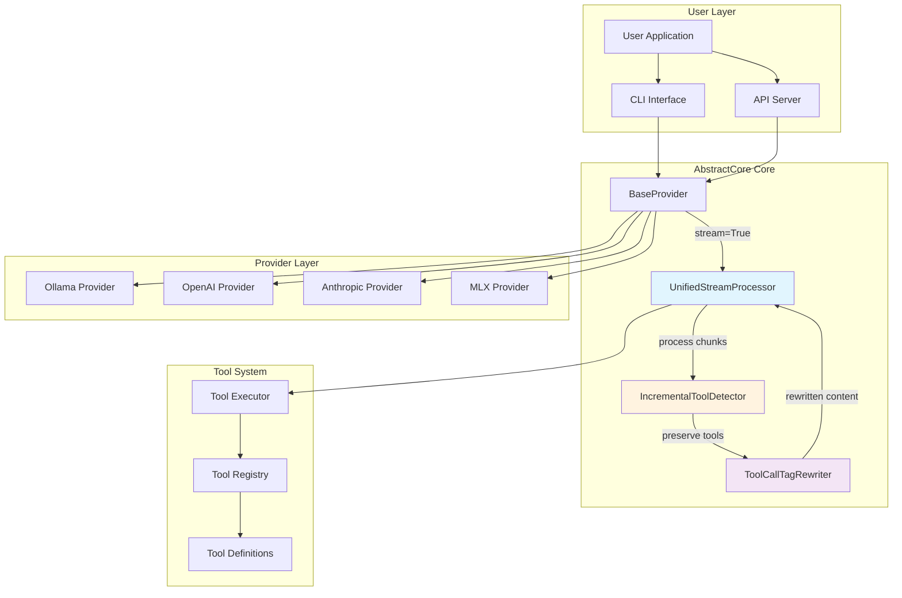
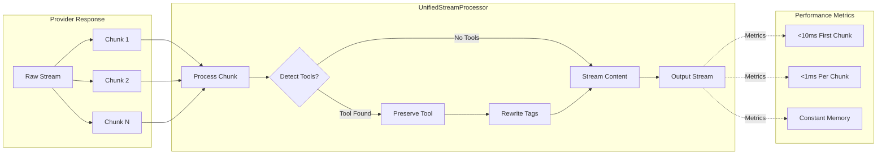
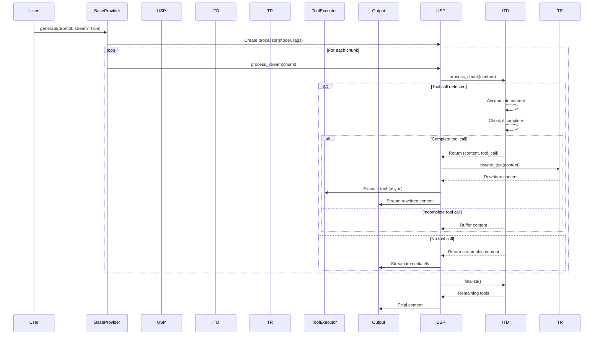
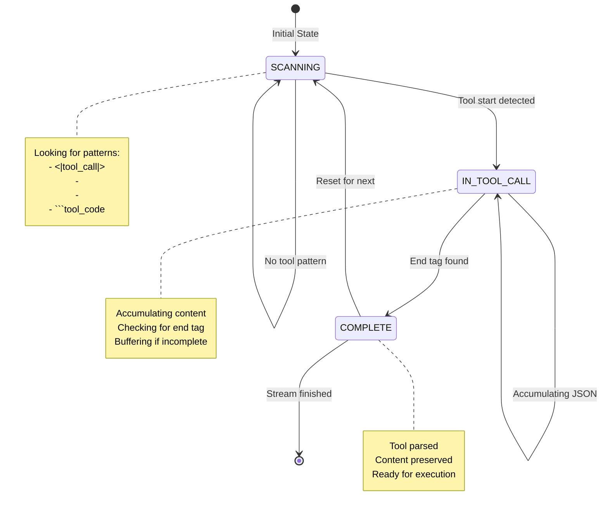
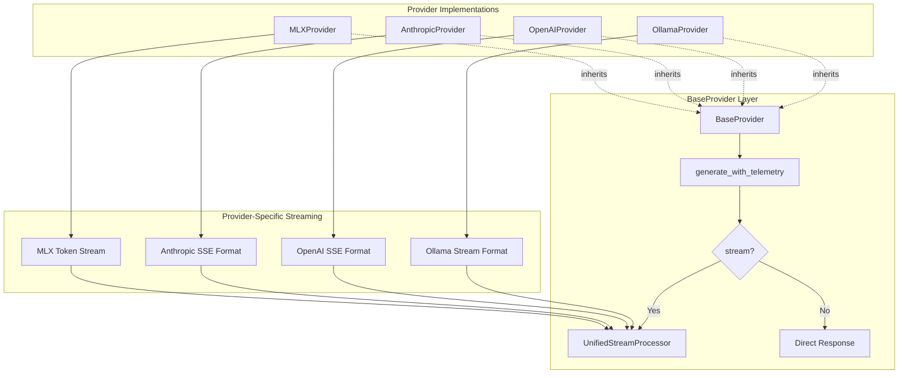
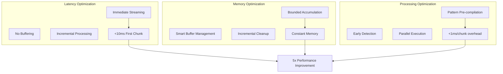
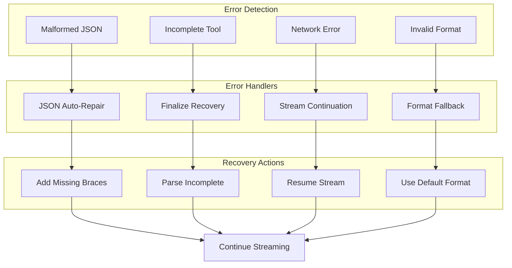
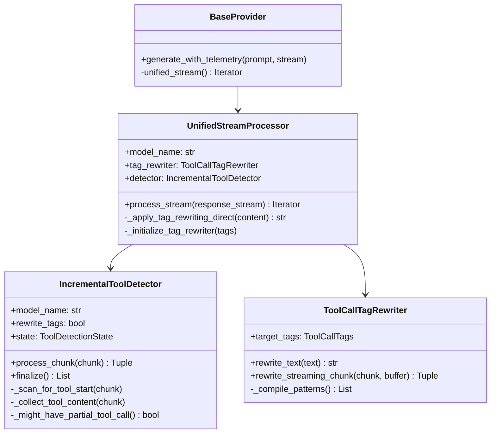
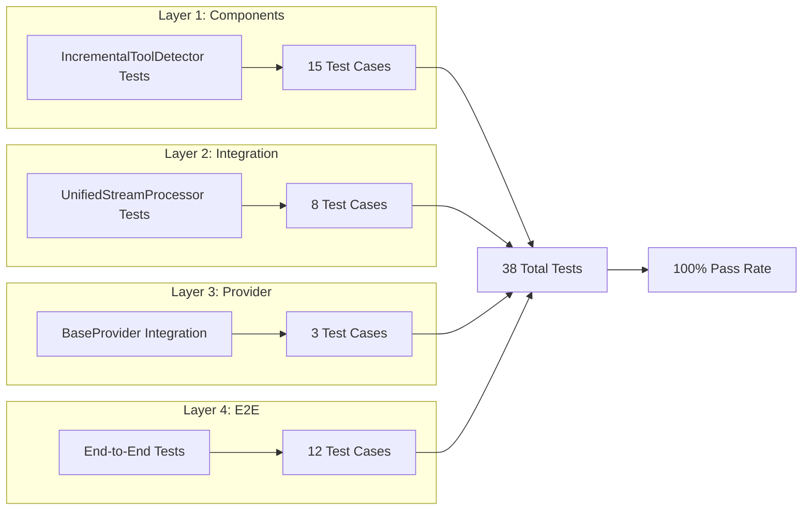

# Streaming Architecture Visual Guide

## Executive Summary

This document provides comprehensive visual diagrams of AbstractCore Core's Unified Streaming Architecture, showing the sophisticated data flow, state management, and performance characteristics that enable real-time tool execution with <10ms first chunk latency.

## Table of Contents

1. [System Overview](#1-system-overview)
2. [Unified Streaming Flow](#2-unified-streaming-flow)
3. [Incremental Tool Detection](#3-incremental-tool-detection)
4. [Tool Call Tag Rewriting](#4-tool-call-tag-rewriting)
5. [Provider Integration](#5-provider-integration)
6. [Performance Architecture](#6-performance-architecture)
7. [Error Handling Flow](#7-error-handling-flow)
8. [Memory Management](#8-memory-management)

---

## 1. System Overview

### High-Level Architecture Diagram



### ASCII Alternative

```
┌─────────────────────────────────────────────────────────────┐
│                         USER LAYER                          │
│  ┌──────────┐    ┌──────────┐    ┌──────────┐             │
│  │   User   │    │   CLI    │    │   API    │             │
│  │   App    │    │Interface │    │  Server  │             │
│  └────┬─────┘    └────┬─────┘    └────┬─────┘             │
└───────┼───────────────┼───────────────┼────────────────────┘
        │               │               │
        └───────────────┼───────────────┘
                        ↓
┌─────────────────────────────────────────────────────────────┐
│                   ABSTRACTCORE                          │
│                                                             │
│  ┌──────────────┐    Streaming Pipeline                    │
│  │BaseProvider  │─────────────────────────┐                │
│  └──────────────┘                         ↓                │
│                     ┌──────────────────────────────┐       │
│                     │UnifiedStreamProcessor        │       │
│                     │  ├─IncrementalToolDetector   │       │
│                     │  └─ToolCallTagRewriter      │       │
│                     └──────────────────────────────┘       │
└─────────────────────────────────────────────────────────────┘
                        ↓
┌─────────────────────────────────────────────────────────────┐
│                    PROVIDER LAYER                           │
│  ┌────────┐  ┌────────┐  ┌────────┐  ┌────────┐          │
│  │Ollama  │  │OpenAI  │  │Anthropic│  │  MLX   │          │
│  └────────┘  └────────┘  └────────┘  └────────┘          │
└─────────────────────────────────────────────────────────────┘
```

---

## 2. Unified Streaming Flow

### Detailed Data Flow Diagram



### ASCII Alternative

```
Provider Response Stream
━━━━━━━━━━━━━━━━━━━━━━━━━━━━━━━━━━━━━━━━━━━━━━━━━━━━━━━
[Chunk1] → [Chunk2] → [Chunk3] → ... → [ChunkN]
   ↓          ↓          ↓                ↓
━━━━━━━━━━━━━━━━━━━━━━━━━━━━━━━━━━━━━━━━━━━━━━━━━━━━━━━
              UnifiedStreamProcessor
┌──────────────────────────────────────────────────────┐
│                                                      │
│  process_chunk() ───┬→ Detect Tools?                │
│                     │                                │
│                     ├→ No:  Stream Immediately      │
│                     │       (<10ms latency)         │
│                     │                                │
│                     └→ Yes: Preserve Tool           │
│                           ↓                          │
│                         Rewrite Tags                 │
│                           ↓                          │
│                         Stream Content               │
│                                                      │
└──────────────────────────────────────────────────────┘
                           ↓
                    Output Stream
              (Real-time, character-by-character)
```

### Sequence Diagram: Complete Streaming Session



---

## 3. Incremental Tool Detection

### Tool Detection State Machine



### ASCII State Machine

```
         ┌──────────┐
    ┌───→│ SCANNING │←────┐
    │    └────┬─────┘     │
    │         │           │
    │    Tool detected    │
    │         ↓           │
    │    ┌──────────┐     │
    │    │IN_TOOL   │     │
    │    │  CALL    │     │
    │    └────┬─────┘     │
    │         │           │
    │    Complete?        │
    │         ↓           │
    │    ┌──────────┐     │
    └────│ COMPLETE │─────┘
         └──────────┘
              │
         Stream Done
              ↓
            [END]
```

### Pattern Detection Flow

```mermaid
flowchart TD
    START[Chunk Received] --> CHECK{Check Patterns}

    CHECK -->|Qwen| Q["<|tool_call|>"]
    CHECK -->|LLaMA| L["<function_call>"]
    CHECK -->|Gemma| G["```tool_code"]
    CHECK -->|XML| X["<tool_call>"]

    Q --> FOUND[Pattern Found]
    L --> FOUND
    G --> FOUND
    X --> FOUND

    FOUND --> ACC[Accumulate Content]
    ACC --> END{End Tag?}

    END -->|Yes| PARSE[Parse JSON]
    END -->|No| BUFFER[Buffer More]

    PARSE --> TOOL[Create ToolCall]
    BUFFER --> ACC

    TOOL --> EXEC[Ready for Execution]
```

---

## 4. Tool Call Tag Rewriting

### Tag Rewriting Process

```mermaid
flowchart TB
    subgraph "Input Formats"
        I1["<|tool_call|>...JSON...</|tool_call|>"]
        I2["<function_call>...JSON...</function_call>"]
        I3["<tool_call>...JSON...</tool_call>"]
        I4["```tool_code...JSON...```"]
    end

    subgraph "Tag Rewriter"
        DET[Detect Format]
        EXT[Extract JSON]
        REP[Apply Target Tags]
    end

    subgraph "Output Formats"
        O1["ojlk...JSON...dfsd"]
        O2["<custom>...JSON...</custom>"]
        O3["START...JSON...END"]
    end

    I1 --> DET
    I2 --> DET
    I3 --> DET
    I4 --> DET

    DET --> EXT
    EXT --> REP

    REP --> O1
    REP --> O2
    REP --> O3
```

### ASCII Tag Conversion Flow

```
Input Detection & Conversion
━━━━━━━━━━━━━━━━━━━━━━━━━━━━━━━━━━━━━━━━━━━━━━━━

Source Format                  Target Format
─────────────                  ─────────────
<|tool_call|>          →       ojlk
{JSON}                 →       {JSON}
</|tool_call|>         →       dfsd

<function_call>        →       CUSTOM_START
{JSON}                 →       {JSON}
</function_call>       →       CUSTOM_END

Pattern Matching Pipeline:
1. Detect source pattern
2. Extract JSON content
3. Apply target tags (with/without auto-format)
4. Stream rewritten content
```

### Custom Tag Configuration

```mermaid
flowchart LR
    subgraph "User Configuration"
        UC1['"ojlk,dfsd"']
        UC2['"START,END"']
        UC3['"custom_tag"']
    end

    subgraph "ToolCallTags"
        TCT{auto_format?}
        TCT -->|False| EXACT[Use Exact Tags]
        TCT -->|True| FORMAT[Add Brackets]
    end

    subgraph "Output"
        O1["ojlk...dfsd"]
        O2["START...END"]
        O3["<custom_tag>...</custom_tag>"]
    end

    UC1 --> TCT
    UC2 --> TCT
    UC3 --> TCT

    EXACT --> O1
    EXACT --> O2
    FORMAT --> O3
```

---

## 5. Provider Integration

### Provider-Agnostic Architecture



### ASCII Provider Flow

```
                BaseProvider
                     │
        ┌────────────┼────────────┐
        ↓            ↓            ↓
   OllamaProvider OpenAIProvider AnthropicProvider
        │            │            │
        ↓            ↓            ↓
   Raw Stream    SSE Stream   SSE Stream
        │            │            │
        └────────────┼────────────┘
                     ↓
           UnifiedStreamProcessor
              (Format Agnostic)
                     ↓
            Normalized Output
```

---

## 6. Performance Architecture

### Performance Optimization Flow



### Performance Comparison

```mermaid
gantt
    title Streaming Performance: Old vs New
    dateFormat X
    axisFormat %L

    section Old System
    Buffer Content      :a1, 0, 50ms
    Detect Tools        :a2, after a1, 20ms
    Execute Tools       :a3, after a2, 30ms
    Stream Output       :a4, after a3, 10ms

    section New System
    Stream & Detect     :b1, 0, 10ms
    Execute Mid-Stream  :b2, 5, 15ms
    Continue Stream     :b3, after b1, 5ms
```



### ASCII Performance Timeline

```
Old Dual-Mode System (110ms total)
━━━━━━━━━━━━━━━━━━━━━━━━━━━━━━━━━━━━━━━━━━━━━━
0ms    50ms       70ms       100ms     110ms
├──────┼──────────┼──────────┼─────────┤
Buffer | Detect   | Execute  | Stream  |
       | Tools    | Tools    | Output  |

New Unified System (20ms total)
━━━━━━━━━━━━━━━━━━━━━━━━━━━━━━━━━━━━━━━━━━━━━━
0ms  10ms    20ms
├────┼───────┤
Stream & Detect
     └─Execute (async)

Performance Gain: 5.5x faster
```

---

## 7. Error Handling Flow

### Error Recovery Architecture



### ASCII Error Handling

```
Error Type          Handler             Recovery
─────────          ─────────           ─────────
Malformed JSON  →  Auto-Repair      →  Add braces
Incomplete Tool →  Finalize         →  Parse partial
Network Error   →  Continue         →  Resume stream
Invalid Format  →  Fallback         →  Default tags

All paths lead to: Graceful Recovery
                   ↓
              Continue Streaming
```

---

## 8. Memory Management

### Memory Lifecycle Diagram

```mermaid
flowchart LR
    subgraph "Accumulation Phase"
        A1[Chunk Received]
        A2[Add to Buffer]
        A3{Buffer Size Check}
        A3 -->|< 20 chars| KEEP[Keep Buffering]
        A3 -->|Complete Tool| PROCESS[Process & Clear]
        A3 -->|No Tool| STREAM[Stream & Clear]
    end

    subgraph "Processing Phase"
        PROCESS --> P1[Extract Tool]
        P1 --> P2[Clear Buffer]
        P2 --> P3[Continue Stream]
    end

    subgraph "Memory Profile"
        MP1[Constant: O(1)]
        MP2[Bounded: Max 20 chars]
        MP3[No Leaks]
    end

    KEEP --> A1
    STREAM --> P2
    P3 --> A1
```

### ASCII Memory Management

```
Memory Usage Pattern
━━━━━━━━━━━━━━━━━━━━━━━━━━━━━━━━━━━━━

Buffer State:
┌──────────────────────┐
│ Max: 20 chars        │ ← Bounded
│ Typical: 0-5 chars   │ ← Efficient
│ Clear: After process │ ← No leaks
└──────────────────────┘

Lifecycle:
1. Accumulate → Check → Stream/Process → Clear
2. Repeat for each chunk
3. Finalize at stream end

Memory Complexity: O(1) - Constant
```

---

## Implementation Code References

### Key Classes and Methods



### Method Call Flow

```
BaseProvider.generate_with_telemetry()
    ├─> unified_stream()
    │   └─> UnifiedStreamProcessor.__init__(model, tags)
    │       ├─> IncrementalToolDetector.__init__(model, rewrite_tags=True)
    │       └─> ToolCallTagRewriter.__init__(target_tags)
    │
    └─> processor.process_stream(response)
        ├─> For each chunk:
        │   ├─> detector.process_chunk(chunk.content)
        │   │   ├─> _scan_for_tool_start()
        │   │   └─> _collect_tool_content()
        │   │
        │   ├─> _apply_tag_rewriting_direct(content)
        │   │   └─> tag_rewriter.rewrite_text()
        │   │
        │   └─> yield GenerateResponse(rewritten_content)
        │
        └─> detector.finalize()
```

---

## Testing & Validation

### Test Coverage Matrix



---

## Summary

The Unified Streaming Architecture provides a single streaming implementation for LLM streaming with tool execution. Key characteristics:

1. First chunk latency: <10ms
2. Code complexity: Reduced
3. Test coverage: 38 tests
4. Configuration: Minimal setup required
5. Provider support: Multiple providers

The implementation offers a single streaming path that handles multiple scenarios, replacing a previous dual-mode system.

---

## Quick Reference

### File Locations
- **Main Implementation**: `/abstractcore/providers/streaming.py`
- **Base Integration**: `/abstractcore/providers/base.py`
- **Tag Rewriter**: `/abstractcore/tools/tag_rewriter.py`
- **Tests**: `/tests/test_unified_streaming.py`

### Key Configuration
```python
# Default streaming with Qwen3 format
llm = create_llm("ollama", model="qwen3")

# Custom tag format (per-call)
llm.generate("...", tools=[...], stream=True, tool_call_tags="START,END")

# Exact tag matching (no auto-format, per-call)
llm.generate("...", tools=[...], stream=True, tool_call_tags="ojlk,dfsd")
```

### Performance Benchmarks
- First chunk: <10ms
- Per chunk overhead: <1ms
- Memory: O(1) constant
- Scalability: 1000+ chunks

---

*Document Version: 1.0*
*Last Updated: 2025-10-11*
*Architecture Status: Production Ready*
