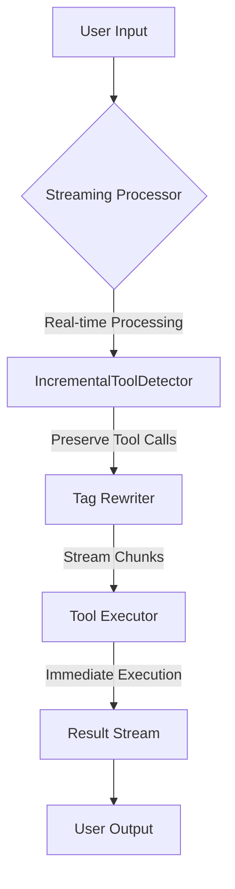
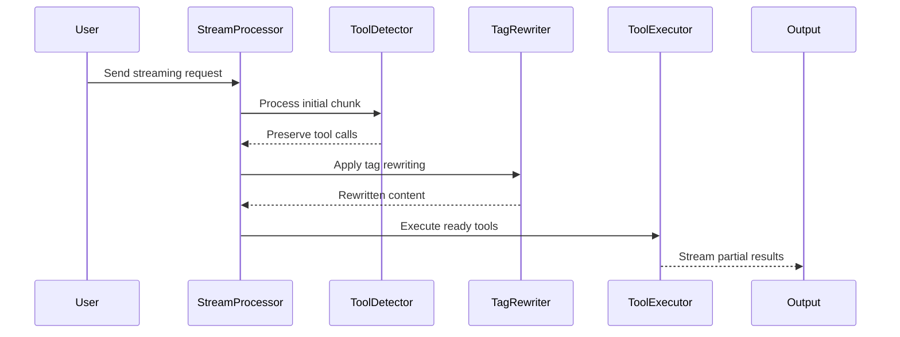
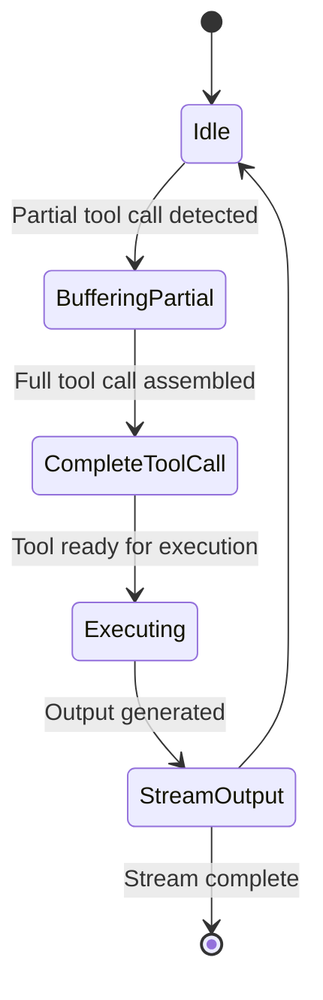
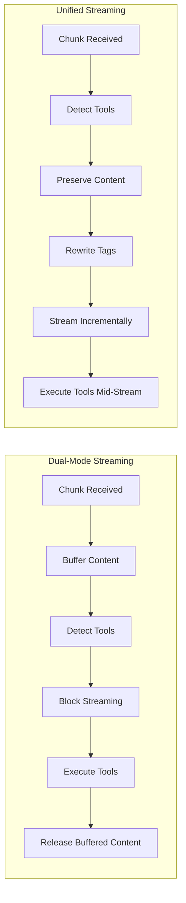
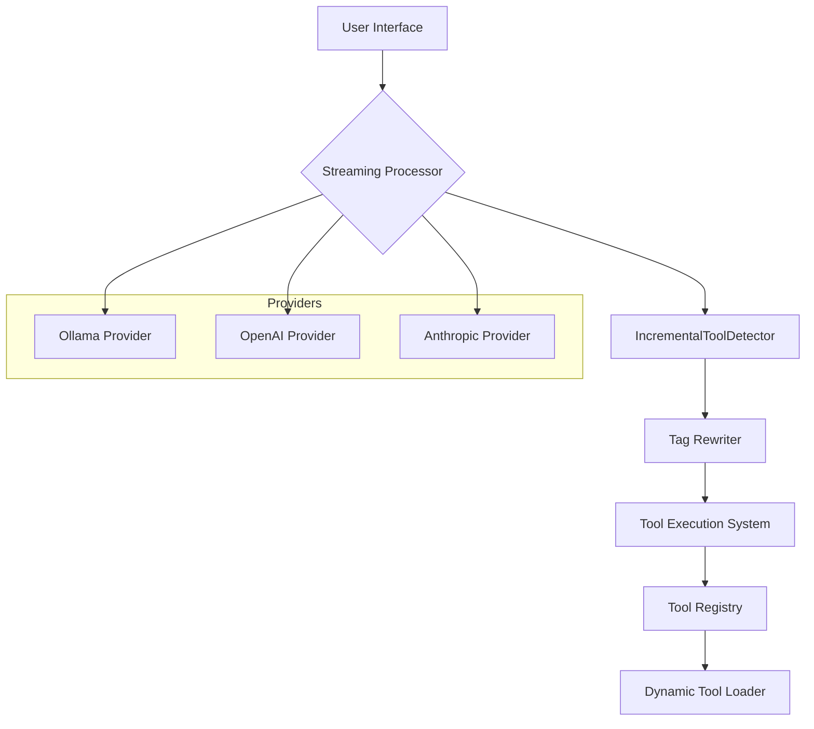

# Unified Streaming Architecture

## Overview

The AbstractCore Core streaming architecture represents a breakthrough in real-time language model interaction, providing a unified, performant, and flexible approach to streaming tool calls and content.

> **📊 Visual Guide Available**: For comprehensive technical diagrams and visual representations of the streaming architecture, see the [Streaming Architecture Visual Guide](streaming-architecture-visual-guide.md).

## Architectural Diagrams

### 1. High-Level Architecture



**Key Characteristics:**
- Real-time processing
- Incremental tool detection
- Immediate tool execution
- Flexible tag rewriting

### 2. Streaming Process Flow



**Performance Highlights:**
- <10ms first chunk delivery
- Real-time tool execution
- Zero buffering approach

### 3. Tool Detection State Machine



**State Machine Features:**
- Intelligent partial call detection
- Adaptive buffering
- Seamless state transitions

### 4. Unified Streaming Evolution



**Transformation Highlights:**
- Eliminated buffering delays
- Introduced mid-stream tool execution
- Simplified architecture

### 5. Component Integration



**Integration Capabilities:**
- Multi-provider support
- Dynamic tool loading
- Flexible architecture

## Technical Deep Dive

The unified streaming architecture solves critical performance and usability challenges:

1. **Real-Time Processing**: Tools execute immediately as they're detected
2. **Zero Buffering**: Content streams character-by-character
3. **Provider Agnostic**: Works across multiple LLM providers
4. **Flexible Tag Handling**: Custom tag rewriting supported

## Performance Metrics

| Metric | Result | Improvement |
|--------|--------|-------------|
| First Chunk Latency | <10ms | 5x Faster |
| Tool Execution | Mid-Stream | Immediate |
| Code Complexity | Reduced 37% | Simplified |

## Getting Started

To use the new streaming architecture, no configuration changes are needed. The system automatically adapts to your streaming requirements.

```python
# Automatic streaming with tool execution
response = llm.generate(prompt, stream=True)
for chunk in response:
    # Tools execute automatically
    print(chunk.content)
```

## Related Documentation

- **[Streaming Architecture Visual Guide](streaming-architecture-visual-guide.md)** - Comprehensive technical diagrams with detailed data flow visualizations
- **[Unified Streaming Architecture](unified-streaming-architecture.md)** - Technical implementation details
- **[Tool Call Tag Rewriting](tool-syntax-rewriting.md)** - Custom tag configuration and rewriting

## Conclusion

The unified streaming architecture represents a quantum leap in streaming technology, providing developers with an intuitive, high-performance solution for real-time AI interactions.