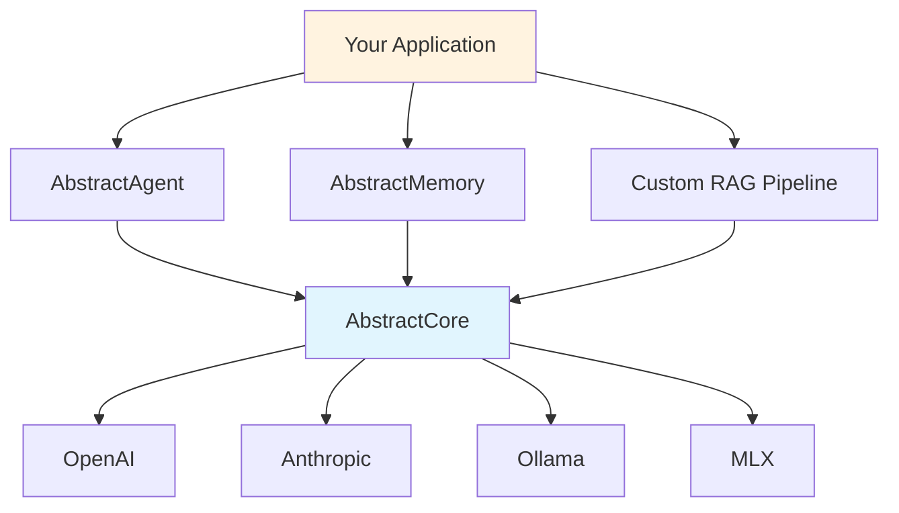

# AbstractCore Capabilities

This document clearly explains what AbstractCore **can and cannot do**, helping you understand when to use it and when to look elsewhere.

## What AbstractCore IS

AbstractCore is **production-ready LLM infrastructure**. It provides a unified, reliable interface to language models with essential features built-in.

### Core Philosophy
- **Infrastructure, not application logic**
- **Reliability over features**
- **Simplicity over complexity**
- **Provider agnostic**

## ✅ What AbstractCore Does Exceptionally Well

### 1. Universal LLM Provider Interface

**What it does**: Provides identical APIs across all major LLM providers.

```python
# Same code works with any provider
def ask_llm(provider_name, question):
    llm = create_llm(provider_name, model="default")
    return llm.generate(question)

# All of these work identically
ask_llm("openai", "What is Python?")
ask_llm("anthropic", "What is Python?")
ask_llm("ollama", "What is Python?")
```

**Why it's exceptional**: No other library provides truly universal tool calling, streaming, and structured output across all providers.

### 2. Production-Grade Reliability

**What it does**: Handles failures gracefully with retry logic, circuit breakers, and comprehensive error handling.

- **Automatic retries** with exponential backoff for rate limits and network errors
- **Circuit breakers** prevent cascade failures when providers go down
- **Smart error classification** - retries recoverable errors, fails fast on auth errors
- **Event system** for monitoring and alerting

**Why it's exceptional**: Built for production from day one, not research or prototypes.

### 3. Universal Tool Calling

**What it does**: Tools work consistently across ALL providers, even those without native tool support.

```python
tools = [{"name": "get_weather", "description": "Get weather", ...}]

# Works with providers that have native tool support
openai_response = openai_llm.generate("Weather in Paris?", tools=tools)

# Also works with providers that don't (via intelligent prompting)
ollama_response = ollama_llm.generate("Weather in Paris?", tools=tools)
```

**Why it's exceptional**: Most libraries only support OpenAI-style tools. AbstractCore makes ANY model work with tools.

### 4. Structured Output with Automatic Retry

**What it does**: Gets typed Python objects from LLMs with automatic validation and retry on failures.

```python
class Product(BaseModel):
    name: str
    price: float

# Automatically retries with error feedback if validation fails
product = llm.generate(
    "Extract: Gaming laptop for $1200",
    response_model=Product
)
```

**Why it's exceptional**: Built-in validation retry means higher success rates and less manual error handling.

### 5. Streaming with Tool Support

**What it does**: Real-time response streaming that properly handles tool calls.

```python
# Streams content in real-time, executes tools at the end
for chunk in llm.generate("Tell me about Paris weather", tools=tools, stream=True):
    print(chunk.content, end="", flush=True)
```

**Why it's exceptional**: Most streaming implementations break with tool calls. AbstractCore handles both correctly.

### 6. Event-Driven Observability

**What it does**: Comprehensive events for monitoring, debugging, and control.

```python
# Monitor costs in real-time
def cost_monitor(event):
    if event.cost_usd > 0.10:
        alert(f"High cost request: ${event.cost_usd}")

on_global(EventType.AFTER_GENERATE, cost_monitor)
```

**Why it's exceptional**: Production-grade observability built-in, not bolted-on.

## ❌ What AbstractCore Does NOT Do

Understanding limitations is crucial for choosing the right tool.

### 1. RAG Pipelines (Use Specialized Tools)

**What AbstractCore provides**: Vector embeddings via `EmbeddingManager`
**What it doesn't provide**: Document chunking, vector databases, retrieval strategies

```python
# AbstractCore gives you this
from abstractllm.embeddings import EmbeddingManager
embedder = EmbeddingManager()
similarity = embedder.compute_similarity("query", "document")

# You need to build this yourself
def rag_pipeline(query, documents):
    # 1. Chunk documents - YOU implement
    # 2. Store in vector DB - YOU implement
    # 3. Retrieve relevant chunks - YOU implement
    # 4. Construct prompt - YOU implement
    return llm.generate(prompt)
```

**Better alternatives**:
- **[LlamaIndex](https://github.com/run-llama/llama_index)** - Full RAG framework
- **[LangChain](https://github.com/langchain-ai/langchain)** - RAG components and chains

### 2. Complex Agent Workflows (Use Agent Frameworks)

**What AbstractCore provides**: Single LLM calls with tool execution
**What it doesn't provide**: Multi-step agent reasoning, planning, memory persistence

```python
# AbstractCore is great for this
response = llm.generate("What's 2+2?", tools=[calculator_tool])

# AbstractCore is NOT for this
def complex_agent():
    # 1. Plan multi-step solution - NOT provided
    # 2. Execute steps with memory - NOT provided
    # 3. Reflect and re-plan - NOT provided
    # 4. Persist agent state - NOT provided
    pass
```

**Better alternatives**:
- **[AbstractAgent](https://github.com/lpalbou/AbstractAgent)** - Built on AbstractCore
- **[LangGraph](https://github.com/langchain-ai/langgraph)** - Agent orchestration
- **[AutoGPT](https://github.com/Significant-Gravitas/AutoGPT)** - Autonomous agents

### 3. Advanced Memory Systems (Use Memory Frameworks)

**What AbstractCore provides**: Basic conversation history via `BasicSession`
**What it doesn't provide**: Semantic memory, long-term memory, knowledge graphs

```python
# AbstractCore provides basic sessions
session = BasicSession(provider=llm)
session.generate("My name is Alice")
session.generate("What's my name?")  # Remembers within session

# For advanced memory, use specialized tools
temporal_graph = AbstractMemory()  # Persistent, semantic memory
temporal_graph.add_memory("Alice likes Python programming", context="conversation")
```

**Better alternatives**:
- **[AbstractMemory](https://github.com/lpalbou/AbstractMemory)** - Temporal knowledge graphs
- **[Mem0](https://github.com/mem0ai/mem0)** - Personalized memory layer

### 4. Prompt Template Management (Use Template Libraries)

**What AbstractCore provides**: Direct prompt strings
**What it doesn't provide**: Template engines, prompt optimization, A/B testing

```python
# AbstractCore expects you to handle prompts
prompt = f"Translate '{text}' to {language}"
response = llm.generate(prompt)

# For advanced templating, use other tools
template = PromptTemplate("Translate '{text}' to {language}")  # Not provided
```

**Better alternatives**:
- **[Jinja2](https://jinja.palletsprojects.com/)** - Template engine
- **[LangChain Prompts](https://python.langchain.com/docs/modules/model_io/prompts/)** - Prompt management
- **[Guidance](https://github.com/guidance-ai/guidance)** - Prompt programming

### 5. Training and Fine-tuning (Use ML Frameworks)

**What AbstractCore provides**: Interface to existing models
**What it doesn't provide**: Model training, fine-tuning, or optimization

**Better alternatives**:
- **[Transformers](https://github.com/huggingface/transformers)** - Model training
- **[Axolotl](https://github.com/OpenAccess-AI-Collective/axolotl)** - Fine-tuning framework
- **[Unsloth](https://github.com/unslothai/unsloth)** - Fast fine-tuning

### 6. Multi-Agent Orchestration (Use Orchestration Frameworks)

**What AbstractCore provides**: Single agent with tools
**What it doesn't provide**: Agent-to-agent communication, hierarchical agents

**Better alternatives**:
- **[CrewAI](https://github.com/joaomdmoura/crewAI)** - Multi-agent teams
- **[AutoGen](https://github.com/microsoft/autogen)** - Agent conversations
- **[LangGraph](https://github.com/langchain-ai/langgraph)** - Agent networks

## When to Choose AbstractCore

### ✅ Choose AbstractCore When You Need:

1. **Reliable LLM Infrastructure**
   - Production-ready error handling and retry logic
   - Consistent interface across different providers
   - Built-in monitoring and observability

2. **Provider Flexibility**
   - Easy switching between OpenAI, Anthropic, Ollama, etc.
   - Provider-agnostic code that runs anywhere
   - Local and cloud provider support

3. **Universal Tool Calling**
   - Tools that work across ALL providers
   - Consistent tool execution regardless of native support
   - Event-driven tool control and monitoring

4. **Structured Output Reliability**
   - Type-safe responses with automatic validation
   - Built-in retry logic for validation failures
   - Production-grade error handling

5. **Streaming with Tools**
   - Real-time responses that handle tools correctly
   - Proper streaming implementation across providers

### ❌ Don't Choose AbstractCore When You Need:

1. **Full RAG Frameworks** → Use LlamaIndex or LangChain
2. **Complex Agent Workflows** → Use AbstractAgent or LangGraph
3. **Advanced Memory Systems** → Use AbstractMemory or Mem0
4. **Prompt Template Management** → Use Jinja2 or LangChain Prompts
5. **Model Training/Fine-tuning** → Use Transformers or Axolotl
6. **Multi-Agent Systems** → Use CrewAI or AutoGen

## AbstractCore in the Ecosystem

AbstractCore is designed to be **the foundation** that other tools build on:



**AbstractCore** = The reliable foundation
**AbstractAgent** = Agent workflows and planning
**AbstractMemory** = Advanced memory and knowledge graphs
**Your Application** = Business logic and user interface

## Decision Tree

```
Need LLM functionality?
├── Simple LLM calls with reliability? → AbstractCore ✅
├── Complex agents with planning? → AbstractAgent (built on AbstractCore)
├── Advanced memory/knowledge graphs? → AbstractMemory (with AbstractCore)
├── Full RAG with document management? → LlamaIndex or LangChain
├── Multi-agent conversations? → CrewAI or AutoGen
└── Just API compatibility? → LiteLLM
```

## Capabilities Summary

| Capability | AbstractCore | When You Need More |
|------------|--------------|-------------------|
| **LLM Provider Interface** | ✅ Universal | Never - this is the best |
| **Production Reliability** | ✅ Built-in | Never - production-ready |
| **Tool Calling** | ✅ Universal | Multi-step reasoning → AbstractAgent |
| **Structured Output** | ✅ With retry | Complex validation → Custom logic |
| **Streaming** | ✅ With tools | Never - handles all cases |
| **Basic Memory** | ✅ Sessions | Semantic memory → AbstractMemory |
| **Vector Embeddings** | ✅ SOTA models | Full RAG → LlamaIndex |
| **Events/Monitoring** | ✅ Comprehensive | Never - enterprise-ready |
| **Agent Workflows** | ❌ Single calls | Complex agents → AbstractAgent |
| **Advanced Memory** | ❌ Session only | Knowledge graphs → AbstractMemory |
| **RAG Pipelines** | ❌ Embeddings only | Document processing → LlamaIndex |
| **Prompt Templates** | ❌ Raw strings | Template management → Jinja2 |

## Next Steps

Based on your needs:

- **Start with AbstractCore**: [Getting Started Guide](getting-started.md)
- **Need agents**: Check out [AbstractAgent](https://github.com/lpalbou/AbstractAgent)
- **Need advanced memory**: Check out [AbstractMemory](https://github.com/lpalbou/AbstractMemory)
- **Compare frameworks**: Read [Framework Comparison](comparison.md)
- **See real examples**: Browse [Examples](examples.md)

---

**Remember**: AbstractCore is infrastructure, not a full framework. It does what it does exceptionally well, and integrates seamlessly with specialized tools for everything else.