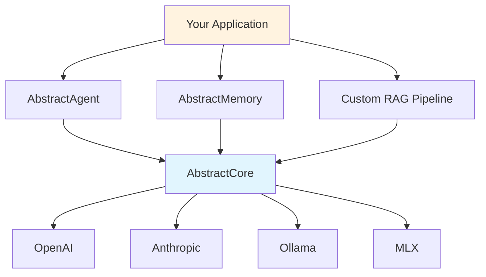

# AbstractCore Capabilities

This document clearly explains what AbstractCore **can and cannot do**, helping you understand when to use it and when to look elsewhere.

## What AbstractCore IS

AbstractCore is **production-ready LLM infrastructure**. It provides a unified, reliable interface to language models with essential features built-in.

### Core Philosophy
- **Infrastructure, not application logic**
- **Reliability over features**
- **Simplicity over complexity**
- **Provider agnostic**

## Optional capability plugins (voice/audio/vision)

AbstractCore stays dependency-light by default. Deterministic modality APIs (STT/TTS, generative vision) live in **optional packages** and are exposed through the capability plugin layer:

- Install `abstractvoice` → `llm.voice` / `llm.audio` (TTS/STT)
- Install `abstractvision` → `llm.vision` (text→image, image→image, …)

```bash
pip install abstractvoice
pip install abstractvision
```

```python
from abstractcore import create_llm

llm = create_llm("openai", model="gpt-4o-mini")  # example; pick a provider/model you have access to
print(llm.capabilities.status())  # availability + selected backend ids + install hints

# Voice/audio
wav_bytes = llm.voice.tts("Hello", format="wav")
text = llm.audio.transcribe("speech.wav")

# Vision (requires vision_base_url / ABSTRACTVISION_BASE_URL)
# png_bytes = llm.vision.t2i("a red square")
```

## What AbstractCore Does Well

### 1. Universal LLM Provider Interface

**What it does**: Provides identical APIs across all major LLM providers.

```python
# Same code works with any provider
def ask_llm(provider_name, question):
    llm = create_llm(provider_name, model="default")
    return llm.generate(question)

# All of these use the same API surface
ask_llm("openai", "What is Python?")
ask_llm("anthropic", "What is Python?")
ask_llm("ollama", "What is Python?")
```

**Why this helps**: Provides consistent tool calling, streaming, and structured output across supported providers.

### 2. Production-Grade Reliability

**What it does**: Handles failures gracefully with retry logic, circuit breakers, and comprehensive error handling.

- **Automatic retries** with exponential backoff for rate limits and network errors
- **Circuit breakers** prevent cascade failures when providers go down
- **Smart error classification** - retries recoverable errors, fails fast on auth errors
- **Event system** for monitoring and alerting

**Why this helps**: Includes production reliability features like retry logic and error handling.

### 3. Universal Tool Calling

**What it does**: Tools work consistently across supported providers, even those without native tool support.

```python
tools = [{"name": "get_weather", "description": "Get weather", ...}]

# Works with providers that have native tool support
openai_response = openai_llm.generate("Weather in Paris?", tools=tools)

# Also works with providers that don't (via intelligent prompting)
ollama_response = ollama_llm.generate("Weather in Paris?", tools=tools)
```

**Why this helps**: Tools work with any provider, including those without native tool support.

### 4. Tool Call Tag Rewriting for Agentic CLI Compatibility

**What it does**: Automatically rewrites tool call tags to match different agentic CLI requirements in real-time.

```python
# Rewrite tool calls for different CLIs
# Use a prompted-tools provider (tool-call markup lives in assistant content)
llm = create_llm("ollama", model="qwen3:4b-instruct")

# For Codex CLI (Qwen3 format)
response = llm.generate("Weather in Paris?", tools=tools, tool_call_tags="qwen3")
# Output: <|tool_call|>{"name": "get_weather", "arguments": {"location": "Paris"}}</|tool_call|>

# For Crush CLI (LLaMA3 format)  
response = llm.generate("Weather in Paris?", tools=tools, tool_call_tags="llama3")
# Output: <function_call>{"name": "get_weather", "arguments": {"location": "Paris"}}</function_call>

# For Gemini CLI (XML format)
response = llm.generate("Weather in Paris?", tools=tools, tool_call_tags="xml")
# Output: <tool_call>{"name": "get_weather", "arguments": {"location": "Paris"}}</tool_call>
```

**Why this helps**: Works with different agentic CLIs without code changes.

### 5. Tool Execution Control

**What it does**: Control whether AbstractCore executes tools automatically or lets the agent handle execution.

```python
# Default (recommended): passthrough mode (tools are *not* executed in AbstractCore)
llm = create_llm("openai", model="gpt-4o-mini")
response = llm.generate("Weather in Paris?", tools=tools)
# response.tool_calls contains structured tool call requests; host/runtime executes them

# Optional (deprecated): direct execution in AbstractCore for simple scripts only
# llm = create_llm("openai", model="gpt-4o-mini", execute_tools=True)
```

**Why this helps**: Allows flexible tool execution control for different deployment scenarios.

### 6. Structured Output with Automatic Retry

**What it does**: Gets typed Python objects from LLMs with automatic validation and retry on failures.

```python
class Product(BaseModel):
    name: str
    price: float

# Automatically retries with error feedback if validation fails
product = llm.generate(
    "Extract: Gaming laptop for $1200",
    response_model=Product
)
```

**Why this helps**: Built-in validation retry reduces manual error handling.

> **See**: [Structured Output Guide](structured-output.md) for native vs prompted strategies, schema design, and production deployment

### 5. Streaming with Tool Support

**What it does**: Real-time response streaming that properly handles tool calls.

```python
# Streams content in real-time, executes tools at the end
for chunk in llm.generate("Tell me about Paris weather", tools=tools, stream=True):
    print(chunk.content, end="", flush=True)
```

**Why this helps**: Streaming works correctly with tool calls.

### 6. Event-Driven Observability

**What it does**: Comprehensive events for monitoring, debugging, and control.

```python
from abstractcore.events import EventType, on_global

def cost_monitor(event):
    if event.type != EventType.GENERATION_COMPLETED:
        return
    cost = event.data.get("cost_usd")
    if isinstance(cost, (int, float)) and cost > 0.10:
        # NOTE: `cost_usd` is a best-effort estimate based on token usage.
        alert(f"High estimated cost: ${cost:.2f}")

on_global(EventType.GENERATION_COMPLETED, cost_monitor)
```

**Why this helps**: Provides built-in observability for monitoring and debugging.

### 7. Built-in Production Applications

**What it does**: Provides ready-to-use command-line applications for common LLM tasks without any programming.

```bash
# Document summarization with multiple strategies
summarizer document.pdf --style executive --length brief
summarizer report.txt --focus "technical details" --output summary.txt

# Entity and relationship extraction
extractor research_paper.pdf --format json-ld --focus technology
extractor article.txt --entity-types person,organization,location

# Text evaluation and scoring
judge essay.txt --criteria clarity,accuracy,coherence --context "academic writing"
judge code.py --context "code review" --format plain

# Intent analysis and deception detection
intent conversation.txt --focus-participant user --depth comprehensive
intent email.txt --format plain --context document --verbose
```

**Available Applications:**
- **Summarizer**: Document summarization with customizable styles and focus areas
- **Extractor**: Entity and relationship extraction with multiple output formats
- **Judge**: Text evaluation with custom criteria and scoring rubrics
- **Intent Analyzer**: Psychological intent analysis with deception detection

**Why this helps**: Provides ready-to-use CLI tools that work with any LLM provider.

## What AbstractCore Does NOT Do

Understanding limitations is crucial for choosing the right tool.

### 1. RAG Pipelines (Use Specialized Tools)

**What AbstractCore provides**: Vector embeddings via `EmbeddingManager`
**What it doesn't provide**: Document chunking, vector databases, retrieval strategies

```python
# AbstractCore gives you this
from abstractcore.embeddings import EmbeddingManager
embedder = EmbeddingManager()
similarity = embedder.compute_similarity("query", "document")

# You need to build this yourself
def rag_pipeline(query, documents):
    # 1. Chunk documents - YOU implement
    # 2. Store in vector DB - YOU implement
    # 3. Retrieve relevant chunks - YOU implement
    # 4. Construct prompt - YOU implement
    return llm.generate(prompt)
```

**Better alternatives**:
- **[LlamaIndex](https://github.com/run-llama/llama_index)** - Full RAG framework
- **[LangChain](https://github.com/langchain-ai/langchain)** - RAG components and chains

### 2. Complex Agent Workflows (Use Agent Frameworks)

**What AbstractCore provides**: Single LLM calls with tool execution
**What it doesn't provide**: Multi-step agent reasoning, planning, memory persistence

```python
# AbstractCore is great for this
response = llm.generate("What's 2+2?", tools=[calculator_tool])

# AbstractCore is NOT for this
def complex_agent():
    # 1. Plan multi-step solution - NOT provided
    # 2. Execute steps with memory - NOT provided
    # 3. Reflect and re-plan - NOT provided
    # 4. Persist agent state - NOT provided
    pass
```

**Better alternatives**:
- **[AbstractAgent](https://github.com/lpalbou/AbstractAgent)** - Built on AbstractCore
- **[LangGraph](https://github.com/langchain-ai/langgraph)** - Agent orchestration
- **[AutoGPT](https://github.com/Significant-Gravitas/AutoGPT)** - Autonomous agents

### 3. Advanced Memory Systems (Use Memory Frameworks)

**What AbstractCore provides**: Basic conversation history via `BasicSession`
**What it doesn't provide**: Semantic memory, long-term memory, knowledge graphs

```python
# AbstractCore provides basic sessions
session = BasicSession(provider=llm)
session.generate("My name is Alice")
session.generate("What's my name?")  # Remembers within session

# For advanced memory, use specialized tools
temporal_graph = AbstractMemory()  # Persistent, semantic memory
temporal_graph.add_memory("Alice likes Python programming", context="conversation")
```

**Better alternatives**:
- **[AbstractMemory](https://github.com/lpalbou/AbstractMemory)** - Temporal knowledge graphs
- **[Mem0](https://github.com/mem0ai/mem0)** - Personalized memory layer

### 4. Prompt Template Management (Use Template Libraries)

**What AbstractCore provides**: Direct prompt strings
**What it doesn't provide**: Template engines, prompt optimization, A/B testing

```python
# AbstractCore expects you to handle prompts
prompt = f"Translate '{text}' to {language}"
response = llm.generate(prompt)

# For advanced templating, use other tools
template = PromptTemplate("Translate '{text}' to {language}")  # Not provided
```

**Better alternatives**:
- **[Jinja2](https://jinja.palletsprojects.com/)** - Template engine
- **[LangChain Prompts](https://python.langchain.com/docs/modules/model_io/prompts/)** - Prompt management
- **[Guidance](https://github.com/guidance-ai/guidance)** - Prompt programming

### 5. Training and Fine-tuning (Use ML Frameworks)

**What AbstractCore provides**: Interface to existing models
**What it doesn't provide**: Model training, fine-tuning, or optimization

**Better alternatives**:
- **[Transformers](https://github.com/huggingface/transformers)** - Model training
- **[Axolotl](https://github.com/OpenAccess-AI-Collective/axolotl)** - Fine-tuning framework
- **[Unsloth](https://github.com/unslothai/unsloth)** - Fast fine-tuning

### 6. Multi-Agent Orchestration (Use Orchestration Frameworks)

**What AbstractCore provides**: Single agent with tools
**What it doesn't provide**: Agent-to-agent communication, hierarchical agents

**Better alternatives**:
- **[CrewAI](https://github.com/joaomdmoura/crewAI)** - Multi-agent teams
- **[AutoGen](https://github.com/microsoft/autogen)** - Agent conversations
- **[LangGraph](https://github.com/langchain-ai/langgraph)** - Agent networks

## When to Choose AbstractCore

### Choose AbstractCore When You Need:

1. **Reliable LLM Infrastructure**
   - Production-ready error handling and retry logic
   - Consistent interface across different providers
   - Built-in monitoring and observability

2. **Provider Flexibility**
   - Easy switching between OpenAI, Anthropic, Ollama, etc.
   - Provider-agnostic code that runs anywhere
   - Local and cloud provider support

3. **Universal Tool Calling**
   - Tools that work across supported providers
   - Consistent tool execution regardless of native support
   - Event-driven tool control and monitoring

4. **Structured Output Reliability**
   - Type-safe responses with automatic validation
   - Built-in retry logic for validation failures
   - Production-grade error handling

5. **Streaming with Tools**
   - Real-time responses that handle tools correctly
   - Proper streaming implementation across providers

### Don't Choose AbstractCore When You Need:

1. **Full RAG Frameworks** → Use LlamaIndex or LangChain
2. **Complex Agent Workflows** → Use AbstractAgent or LangGraph
3. **Advanced Memory Systems** → Use AbstractMemory or Mem0
4. **Prompt Template Management** → Use Jinja2 or LangChain Prompts
5. **Model Training/Fine-tuning** → Use Transformers or Axolotl
6. **Multi-Agent Systems** → Use CrewAI or AutoGen

## AbstractCore in the Ecosystem

AbstractCore is designed to be **the foundation** that other tools build on:



**AbstractCore** = The reliable foundation
**AbstractAgent** = Agent workflows and planning
**AbstractMemory** = Advanced memory and knowledge graphs
**Your Application** = Business logic and user interface

## Decision Tree

```
Need LLM functionality?
├── Simple LLM calls with reliability? → AbstractCore ✅
├── Complex agents with planning? → AbstractAgent (built on AbstractCore)
├── Advanced memory/knowledge graphs? → AbstractMemory (with AbstractCore)
├── Full RAG with document management? → LlamaIndex or LangChain
├── Multi-agent conversations? → CrewAI or AutoGen
└── Just API compatibility? → LiteLLM
```

## Capabilities Summary

| Capability | AbstractCore | When You Need More |
|------------|--------------|-------------------|
| **LLM Provider Interface** | ✅ Universal | Covers most use cases |
| **Production Reliability** | ✅ Built-in | Covers most use cases |
| **Tool Calling** | ✅ Universal | Multi-step reasoning → AbstractAgent |
| **Structured Output** | ✅ With retry | Complex validation → Custom logic |
| **Streaming** | ✅ With tools | Covers most use cases |
| **Basic Memory** | ✅ Sessions | Semantic memory → AbstractMemory |
| **Vector Embeddings** | ✅ SOTA models | Full RAG → LlamaIndex |
| **Events/Monitoring** | ✅ Comprehensive | Covers most use cases |
| **Agent Workflows** | ❌ Single calls | Complex agents → AbstractAgent |
| **Advanced Memory** | ❌ Session only | Knowledge graphs → AbstractMemory |
| **RAG Pipelines** | ❌ Embeddings only | Document processing → LlamaIndex |
| **Prompt Templates** | ❌ Raw strings | Template management → Jinja2 |

## Next Steps

Based on your needs:

- **Start with AbstractCore**: [Getting Started Guide](getting-started.md)
- **Need agents**: Check out [AbstractAgent](https://github.com/lpalbou/AbstractAgent)
- **Need advanced memory**: Check out [AbstractMemory](https://github.com/lpalbou/AbstractMemory)
- **Compare frameworks**: Read [Framework Comparison](comparison.md)
- **See real examples**: Browse [Examples](examples.md)

---

**Remember**: AbstractCore is infrastructure, not a full framework. It focuses on LLM provider abstraction and integrates with specialized tools for other needs.
