# AbstractLLM Core - Visual Architecture

This document provides visual diagrams to complement the [Architecture Documentation](architecture.md).

## Table of Contents

- [System Overview](#system-overview)
- [Provider Architecture](#provider-architecture)
- [Tool Execution Flow](#tool-execution-flow)
- [Event System](#event-system)
- [Component Relationships](#component-relationships)
- [Data Flow Diagrams](#data-flow-diagrams)

## System Overview

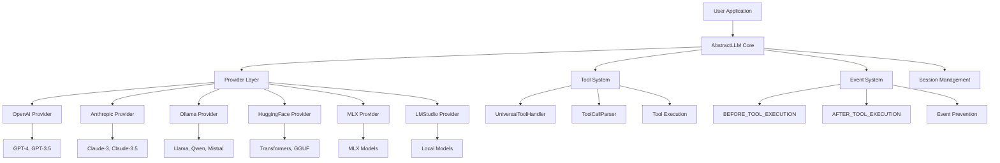

## Provider Architecture

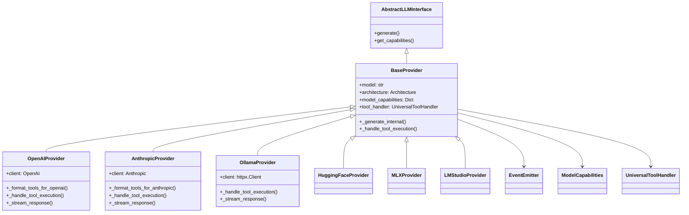

## Tool Execution Flow

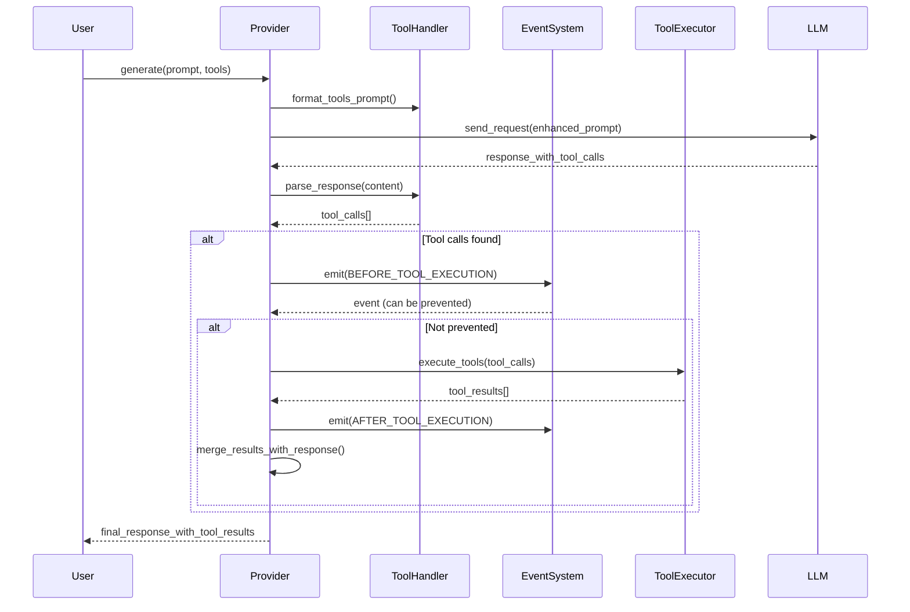

## Tool System Architecture

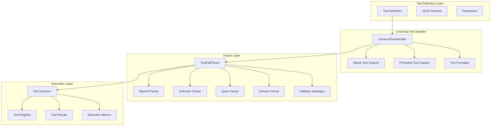

## Event System

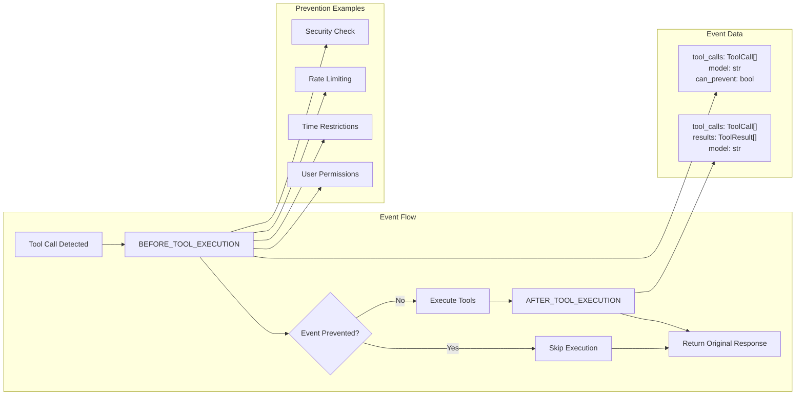

## Provider Tool Support Matrix

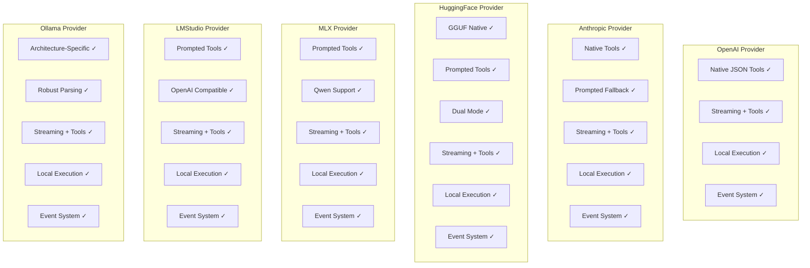

## Data Flow: Non-Streaming vs Streaming

### Non-Streaming Flow

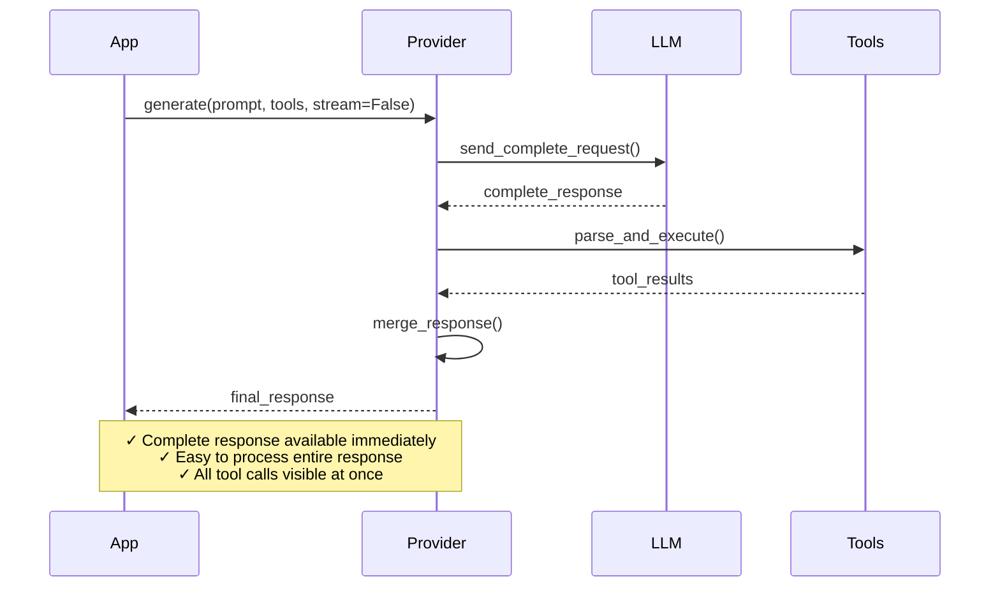

### Streaming Flow

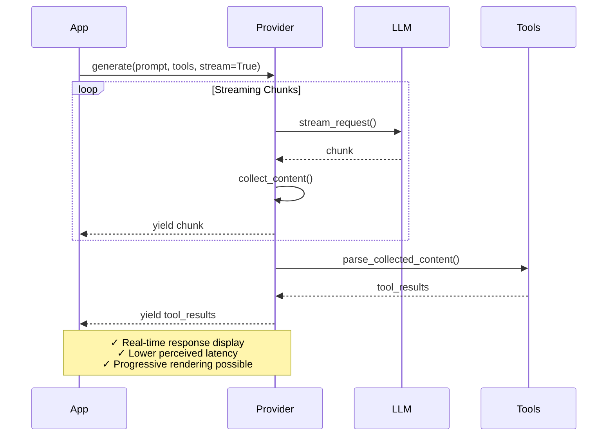

## Component Interaction Diagram

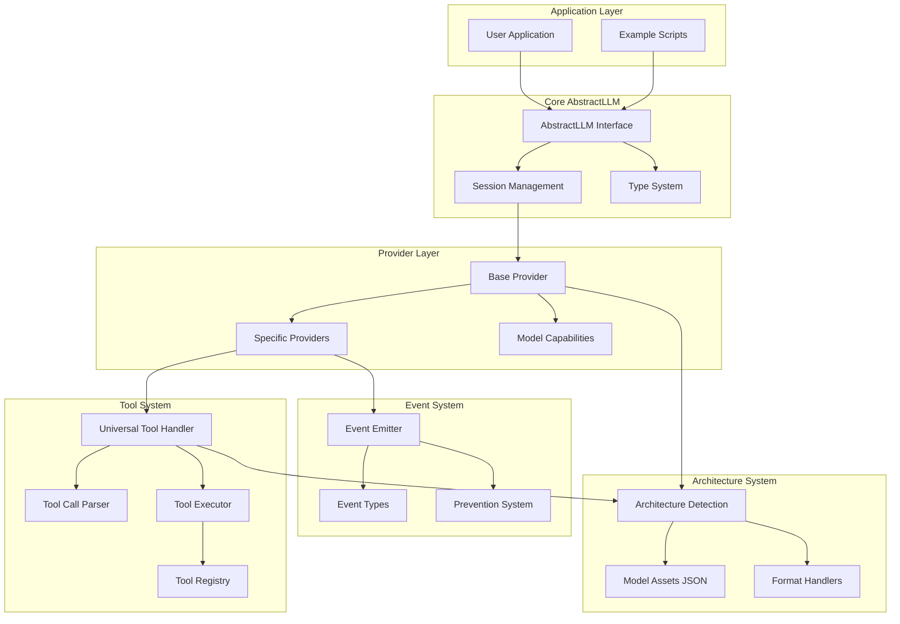

## Tool Parsing Strategies

```mermaid
graph TB
    subgraph "Robust Parsing Pipeline"
        Input[LLM Response Text]

        subgraph "Native Parsing"
            OpenAIFormat[OpenAI JSON Format]
            AnthropicFormat[Anthropic XML Format]
            GGUFFormat[GGUF Function Calling]
        end

        subgraph "Prompted Parsing"
            QwenStyle[Qwen <|tool_call|> Format]
            LlamaStyle[Llama JSON Format]
            MistralStyle[Mistral Function Format]
            GenericJSON[Generic JSON Detection]
            XMLFormat[XML Tool Tags]
        end

        subgraph "Fallback Strategies"
            PatternMatch[Pattern Matching]
            BraceCount[Brace Counting]
            OverlapDetect[Overlap Detection]
            ErrorRecovery[Error Recovery]
        end

        subgraph "Output"
            ToolCalls[Parsed Tool Calls]
            ValidationErrors[Validation Errors]
        end
    end

    Input --> OpenAIFormat
    Input --> AnthropicFormat
    Input --> GGUFFormat
    Input --> QwenStyle
    Input --> LlamaStyle
    Input --> MistralStyle
    Input --> GenericJSON
    Input --> XMLFormat

    OpenAIFormat --> PatternMatch
    AnthropicFormat --> PatternMatch
    QwenStyle --> BraceCount
    LlamaStyle --> OverlapDetect
    GenericJSON --> ErrorRecovery

    PatternMatch --> ToolCalls
    BraceCount --> ToolCalls
    OverlapDetect --> ToolCalls
    ErrorRecovery --> ToolCalls

    PatternMatch --> ValidationErrors
    BraceCount --> ValidationErrors
    OverlapDetect --> ValidationErrors
    ErrorRecovery --> ValidationErrors
```

## Model Capabilities Integration

```mermaid
graph LR
    subgraph "Model Assets"
        JSON1[gpt-models.json]
        JSON2[claude-models.json]
        JSON3[ollama-models.json]
        JSON4[huggingface-models.json]
    end

    subgraph "Capability Detection"
        Detection[get_model_capabilities()]
        ContextLength[context_length]
        MaxOutput[max_output_tokens]
        ToolSupport[supports_tools]
        Vision[supports_vision]
    end

    subgraph "Provider Configuration"
        BaseProvider[Base Provider Init]
        DefaultTokens[Default Token Limits]
        ToolStrategy[Tool Support Strategy]
        Features[Feature Enablement]
    end

    JSON1 --> Detection
    JSON2 --> Detection
    JSON3 --> Detection
    JSON4 --> Detection

    Detection --> ContextLength
    Detection --> MaxOutput
    Detection --> ToolSupport
    Detection --> Vision

    ContextLength --> BaseProvider
    MaxOutput --> BaseProvider
    ToolSupport --> BaseProvider
    Vision --> BaseProvider

    BaseProvider --> DefaultTokens
    BaseProvider --> ToolStrategy
    BaseProvider --> Features
```

## Performance and Monitoring

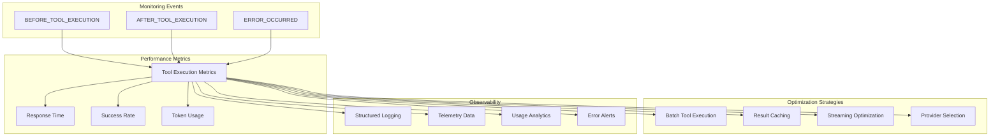

## Security and Control

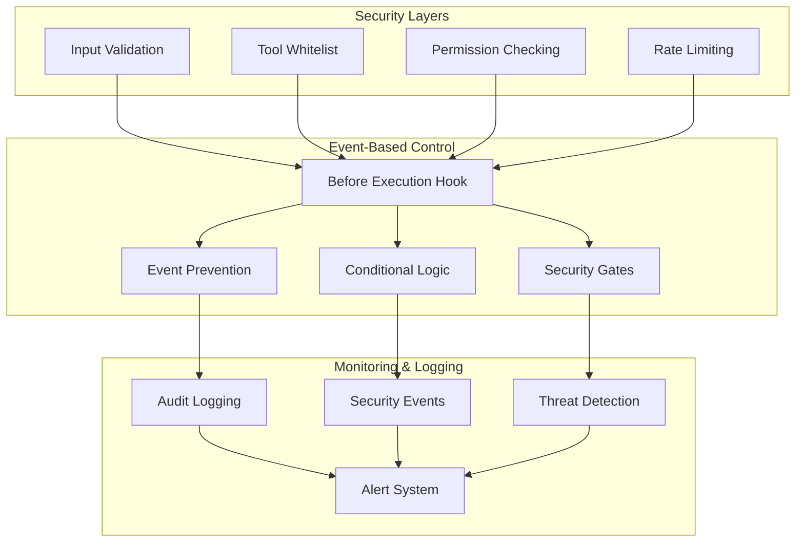

---

## Diagram Usage Notes

1. **Mermaid Rendering**: These diagrams use Mermaid syntax and can be rendered in:
   - GitHub README files
   - GitLab documentation
   - Notion pages
   - VS Code with Mermaid extension
   - Online Mermaid editors

2. **Interactive Elements**: In supported viewers, diagram elements may be clickable or hoverable for additional information.

3. **Maintenance**: Keep diagrams updated when architecture changes. Consider generating some diagrams programmatically from code structure.

4. **Accessibility**: Each diagram includes descriptive text and can be supplemented with detailed explanations for screen readers.

For implementation details, see [Architecture Documentation](architecture.md).