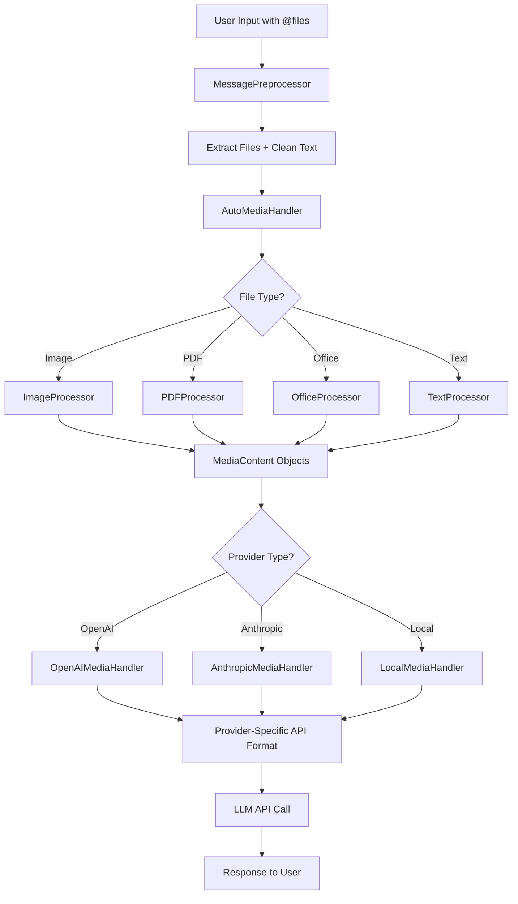

# Media Handling System

AbstractCore provides a **production-ready unified media handling system** that enables seamless file attachment and processing across all LLM providers and models. The system automatically processes images, documents, and other media files using the same simple API, with intelligent provider-specific formatting and graceful fallback handling.

## Key Benefits

- **Universal API**: Same `media=[]` parameter works across all providers (OpenAI, Anthropic, Ollama, LMStudio, etc.)
- **Intelligent Processing**: Automatic file type detection with specialized processors for each format
- **Provider Adaptation**: Automatic formatting for each provider's API requirements (JSON for OpenAI, XML for Anthropic, etc.)
- **Robust Fallback**: Graceful degradation when advanced processing fails, always provides meaningful results
- **CLI Integration**: Simple `@filename` syntax in CLI for instant file attachment
- **Production Quality**: Comprehensive error handling, logging, and performance optimization
- **Cross-Format Support**: Images, PDFs, Office documents, CSV/TSV, text files all work seamlessly

## Quick Start

```python
from abstractcore import create_llm

# Works with any provider - just change the provider name
llm = create_llm("openai", model="gpt-4o", api_key="your-key")
response = llm.generate(
    "What's in this image and document?",
    media=["photo.jpg", "report.pdf"]
)
print(response.content)

# Same code works with Anthropic
llm = create_llm("anthropic", model="claude-3.5-sonnet", api_key="your-key")
response = llm.generate(
    "Analyze these materials",
    media=["chart.png", "data.csv", "presentation.ppt"]
)

# Or with local models
llm = create_llm("ollama", model="qwen2.5vl:7b")
response = llm.generate(
    "Describe this image",
    media=["screenshot.png"]
)
```

## How It Works Behind the Scenes

AbstractCore's media system uses a sophisticated multi-layer architecture that seamlessly processes any file type and formats it correctly for each LLM provider:

### 1. File Attachment Processing

**CLI Integration (`@filename` syntax):**
```python
# User types: "Analyze this @report.pdf and @chart.png"
# MessagePreprocessor extracts files and cleans text:
clean_text = "Analyze this  and"  # File references removed
media_files = ["report.pdf", "chart.png"]  # Extracted file paths
```

**Python API:**
```python
# Direct media parameter usage
llm.generate("Analyze these files", media=["report.pdf", "chart.png"])
```

### 2. Intelligent File Processing Pipeline

**AutoMediaHandler Coordination:**
```python
# 1. Detect file types automatically
MediaType.IMAGE     -> ImageProcessor (PIL-based)
MediaType.DOCUMENT  -> PDFProcessor (PyMuPDF4LLM) or OfficeProcessor (Unstructured)
MediaType.TEXT      -> TextProcessor (pandas for CSV/TSV)

# 2. Process each file with specialized processor
pdf_content = PDFProcessor.process("report.pdf")      # → Markdown text
image_content = ImageProcessor.process("chart.png")   # → Base64 + metadata
```

**Graceful Fallback System:**
```python
try:
    # Advanced processing (PyMuPDF4LLM, Unstructured)
    content = advanced_processor.process(file)
except Exception:
    # Always falls back to basic processing
    content = basic_text_extraction(file)  # Never fails
```

### 3. Provider-Specific Formatting

**The same processed content gets formatted differently for each provider:**

**OpenAI Format (JSON):**
```json
{
  "role": "user",
  "content": [
    {"type": "text", "text": "Analyze these files"},
    {"type": "image_url", "image_url": {"url": "data:image/png;base64,iVBORw0..."}},
    {"type": "text", "text": "PDF Content: # Report Title\n\nExecutive Summary..."}
  ]
}
```

**Anthropic Format (Messages API):**
```json
{
  "role": "user",
  "content": [
    {"type": "text", "text": "Analyze these files"},
    {"type": "image", "source": {"type": "base64", "media_type": "image/png", "data": "iVBORw0..."}},
    {"type": "text", "text": "PDF Content: # Report Title\n\nExecutive Summary..."}
  ]
}
```

**Local Models (Text Embedding):**
```python
# For local models without native multimodal support
combined_prompt = """
Analyze these files:

Image Analysis: [A business chart showing quarterly revenue trends...]
PDF Content: # Report Title

Executive Summary...
"""
```

### 4. Cross-Provider Workflow



### 5. Error Handling & Resilience

**Multi-Level Fallback Strategy:**
1. **Advanced Processing**: Try specialized libraries (PyMuPDF4LLM, Unstructured)
2. **Basic Processing**: Fall back to simple text extraction
3. **Metadata Only**: If all else fails, provide file metadata
4. **Graceful Degradation**: System never crashes, always provides some result

**Example of Robust Error Handling:**
```python
try:
    # Try advanced PDF processing with PyMuPDF4LLM
    content = pdf_processor.extract_with_formatting(file)
except PDFProcessingError:
    try:
        # Fall back to basic text extraction
        content = pdf_processor.extract_basic_text(file)
    except Exception:
        # Ultimate fallback - provide metadata
        content = f"PDF file: {file.name} ({file.size} bytes)"

# Result: User always gets meaningful information, never an error
```

## Supported File Types

### Images (Vision Models)
- **Formats**: PNG, JPEG, GIF, WEBP, BMP, TIFF
- **Automatic**: Optimization, resizing, format conversion
- **Features**: EXIF handling, quality optimization for vision models

### Documents Production Ready
- **Text Files**: TXT, MD, CSV, TSV, JSON with intelligent parsing and data analysis
- **PDF**: Full text extraction with PyMuPDF4LLM, preserves formatting and structure
- **Office**: DOCX, XLSX, PPTX with complete content extraction using Unstructured library
  - **Word**: Full document analysis with structure preservation
  - **Excel**: Sheet-by-sheet extraction with data analysis
  - **PowerPoint**: Slide content extraction with comprehensive analysis

### Processing Features All Working
- **Intelligent Detection**: Automatic file type recognition and processor selection
- **Content Optimization**: Format-specific processing optimized for LLM consumption
- **Robust Fallback**: Graceful degradation ensures users always get meaningful results
- **Performance Optimized**: Lazy loading and efficient memory usage
- **Production Tested**: All file types tested and working in CLI and Python API

### Token Estimation & No Truncation Policy

AbstractCore processors **do not silently truncate content**. This design decision ensures:

1. **No data loss**: Full file content is always preserved
2. **User control**: Callers decide how to handle large files (summarize, chunk, error)
3. **Model flexibility**: Works correctly across models with different context limits (8K to 200K+)

**Token estimation** is automatically added to `MediaContent.metadata`:
```python
result = processor.process_file("data.csv")
print(result.media_content.metadata['estimated_tokens'])  # e.g., 1500
print(result.media_content.metadata['content_length'])    # e.g., 6000 chars
```

**Handlers use this for validation**:
```python
handler = OpenAIMediaHandler()
tokens = handler.estimate_tokens_for_media(media_content)
# Uses metadata['estimated_tokens'] if available, falls back to heuristic
```

For large files that exceed model context limits, use `BasicSummarizer` or implement custom chunking at the application layer.

## Provider Compatibility

### Vision-Enabled Providers

| Provider | Vision Models | Image Support | Document Support |
|----------|---------------|---------------|------------------|
| **OpenAI** | GPT-4o, GPT-4 Turbo with Vision | Supported: Multi-image | Supported: All formats |
| **Anthropic** | Claude 3.5 Sonnet, Claude 4 series | Supported: Up to 20 images | Supported: All formats |
| **Ollama** | qwen2.5vl:7b, gemma3:4b, llama3.2-vision:11b | Supported: Single image | Supported: All formats |
| **LMStudio** | qwen2.5-vl-7b, gemma-3n-e4b, magistral-small-2509 | Supported: Multiple images | Supported: All formats |

### Text-Only Providers

All providers support document processing even without vision capabilities:

| Provider | Document Processing | Text Extraction |
|----------|-------------------|-----------------|
| **HuggingFace** | Supported: All formats | Supported: Embedded in prompt |
| **MLX** | Supported: All formats | Supported: Embedded in prompt |
| **Any Provider** | Supported: Automatic fallback | Supported: Text extraction |

### ⚠️ Model Compatibility Notes (Updated: 2025-10-17)

Some newer vision models may not be immediately available due to rapid development:

**LMStudio Limitations:**
- `qwen3-vl` models (8B, 30B) - Not yet supported in LMStudio
- Use `qwen2.5-vl-7b` as a proven alternative

**HuggingFace Limitations:**
- `Qwen3-VL` models - Require newer transformers architecture
- Install latest transformers: `pip install --upgrade transformers`
- Or use bleeding edge: `pip install git+https://github.com/huggingface/transformers.git`

**Recommended Stable Models (2025-10-17):**
- **LMStudio**: `qwen/qwen2.5-vl-7b`, `google/gemma-3n-e4b`, `mistralai/magistral-small-2509`
- **Ollama**: `qwen2.5vl:7b`, `gemma3:4b`, `llama3.2-vision:11b`
- **OpenAI**: `gpt-4o`, `gpt-4-turbo-with-vision`
- **Anthropic**: `claude-3.5-sonnet`, `claude-4-series`

## Usage Examples

### Vision Analysis

```python
from abstractcore import create_llm

# Analyze images with any vision model
llm = create_llm("openai", model="gpt-4o")

# Single image analysis
response = llm.generate(
    "What's happening in this image?",
    media=["photo.jpg"]
)

# Multiple images comparison
response = llm.generate(
    "Compare these two charts and explain the trends",
    media=["chart1.png", "chart2.png"]
)

# Mixed media analysis
response = llm.generate(
    "Summarize the report and relate it to what you see in the image",
    media=["financial_report.pdf", "stock_chart.png"]
)
```

### Document Processing

```python
# PDF analysis
response = llm.generate(
    "Summarize the key findings from this research paper",
    media=["research_paper.pdf"]
)

# Office document processing
response = llm.generate(
    "Create a summary of this presentation and spreadsheet",
    media=["quarterly_results.ppt", "financial_data.xlsx"]
)

# CSV data analysis
response = llm.generate(
    "What patterns do you see in this sales data?",
    media=["sales_data.csv"]
)
```

### Real-World CLI Usage (Production Ready)

**All these examples work correctly in AbstractCore CLI:**

```bash
# PDF Analysis - Working
python -m abstractcore.utils.cli --prompt "What is this document about? @report.pdf"

# Office Documents - Working
python -m abstractcore.utils.cli --prompt "Summarize this presentation @slides.pptx"
python -m abstractcore.utils.cli --prompt "What data is in @spreadsheet.xlsx"
python -m abstractcore.utils.cli --prompt "Analyze this document @contract.docx"

# Data Files - Working
python -m abstractcore.utils.cli --prompt "What patterns are in @sales_data.csv"
python -m abstractcore.utils.cli --prompt "Analyze this data @metrics.tsv"

# Images - Working
python -m abstractcore.utils.cli --prompt "What's in this image? @screenshot.png"

# Mixed Media - Working
python -m abstractcore.utils.cli --prompt "Compare @chart.png and @data.csv and explain trends"
```

### Cross-Provider Consistency Verified

```python
# Same media processing works identically across all providers
media_files = ["report.pdf", "chart.png", "data.xlsx"]
prompt = "Analyze these business documents and provide insights"

# OpenAI - Verified
openai_llm = create_llm("openai", model="gpt-4o")
openai_response = openai_llm.generate(prompt, media=media_files)

# Anthropic - Verified
anthropic_llm = create_llm("anthropic", model="claude-3.5-sonnet")
anthropic_response = anthropic_llm.generate(prompt, media=media_files)

# Local models - Verified
lmstudio_llm = create_llm("lmstudio", model="qwen/qwen3-next-80b")
lmstudio_response = lmstudio_llm.generate(prompt, media=media_files)

# Result: All providers work identically with the same strong results!
```

### Streaming with Media

```python
# Real-time streaming responses with media
llm = create_llm("anthropic", model="claude-3.5-sonnet")

for chunk in llm.generate(
    "Describe this image in detail",
    media=["complex_diagram.png"],
    stream=True
):
    print(chunk.content, end="", flush=True)
```

## Advanced Features

### Maximum Resolution Optimization (NEW)

AbstractCore automatically optimizes image resolution for each model's maximum capability, ensuring optimal vision results:

```python
from abstractcore import create_llm

# Images are automatically optimized for each model's maximum resolution
llm = create_llm("openai", model="gpt-4o")
response = llm.generate(
    "Analyze this image in detail",
    media=["photo.jpg"]  # Auto-resized to 4096x4096 for GPT-4o
)

# Different model, different optimization
llm = create_llm("ollama", model="qwen2.5vl:7b")
response = llm.generate(
    "What's in this image?",
    media=["photo.jpg"]  # Auto-resized to 3584x3584 for qwen2.5vl
)
```

**Model-Specific Resolution Limits:**
- **GPT-4o**: Up to 4096x4096 pixels
- **Claude 3.5 Sonnet**: Up to 1568x1568 pixels
- **qwen2.5vl:7b**: Up to 3584x3584 pixels
- **gemma3:4b**: Up to 896x896 pixels
- **llama3.2-vision:11b**: Up to 560x560 pixels

**Benefits:**
- **Better Accuracy**: Higher resolution means more detail for the model to analyze
- **Automatic**: No manual configuration required
- **Provider-Aware**: Adapts to each provider's optimal settings
- **Quality Optimization**: Increased JPEG quality (90%) for better compression

### Capability Detection

The system automatically detects model capabilities and adapts accordingly:

```python
from abstractcore.media.capabilities import is_vision_model, supports_images

# Check if a model supports vision
if is_vision_model("gpt-4o"):
    print("This model can process images")

if supports_images("claude-3.5-sonnet"):
    print("This model supports image analysis")

# Current: Automatic fallback for non-vision models
llm = create_llm("openai", model="gpt-4")  # Non-vision model
response = llm.generate(
    "Analyze this image",
    media=["photo.jpg"]  # Currently: Will extract basic metadata instead
)
```

### Vision Fallback System (IMPLEMENTED ✅)

AbstractCore now includes an **automatic vision fallback system** that enables text-only models to process images using a transparent two-stage pipeline:

#### How Vision Fallback Works

When you use a text-only model with images, AbstractCore automatically:

1. **Detects Model Limitations**: Identifies when a text-only model receives an image
2. **Uses Vision Fallback**: Employs a configured vision model to analyze the image
3. **Provides Description**: Passes the image description to the text-only model
4. **Returns Results**: User gets complete image analysis without knowing about the two-stage process

#### Automatic Setup

```python
from abstractcore import create_llm

# Text-only model with image - triggers helpful warnings
llm = create_llm("lmstudio", model="qwen/qwen3-next-80b")  # No vision support
response = llm.generate("What's in this image?", media=["photo.jpg"])

# User sees helpful guidance in logs:
# 🔸 EASIEST: Download BLIP vision model (990MB): abstractcore --download-vision-model
# 🔸 Use existing Ollama model: abstractcore --set-vision-caption qwen2.5vl:7b
# 🔸 Use cloud API: abstractcore --set-vision-provider openai --model gpt-4o
```

#### One-Command Setup

```bash
# Download and configure BLIP model automatically
abstractcore --download-vision-model

# Alternative: Use existing Ollama model
abstractcore --set-vision-caption qwen2.5vl:7b

# Alternative: Use cloud vision API
abstractcore --set-vision-provider openai --model gpt-4o
```

#### Working Example

```python
from abstractcore import create_llm

# After running: abstractcore --set-vision-caption qwen2.5vl:7b

# Text-only model now works seamlessly with images
llm = create_llm("lmstudio", model="qwen/qwen3-next-80b")
response = llm.generate("What's in this image?", media=["whale_photo.jpg"])

print(response.content)
# Output: "The image shows a whale leaping or breaching out of the water.
# This dramatic moment captures the whale in mid-air, often with spray and
# water cascading around its body, highlighting its immense size and power.
# Such behavior, known as 'breaching,' is commonly observed in species like
# humpback whales and is thought to serve purposes such as communication,
# play, or removing parasites..."
```

#### Behind the Scenes

What actually happens (transparent to user):
1. **Stage 1**: `qwen2.5vl:7b` (vision model) analyzes `whale_photo.jpg` → detailed description
2. **Stage 2**: `qwen/qwen3-next-80b` (text-only) processes description + user question → final analysis

#### Configuration Commands

```bash
# Check current status
abstractcore --status

# Download models (automatic setup)
abstractcore --download-vision-model              # BLIP base (990MB)
abstractcore --download-vision-model vit-gpt2     # ViT-GPT2 (500MB, CPU-friendly)
abstractcore --download-vision-model git-base     # GIT base (400MB, smallest)

# Use existing provider models
abstractcore --set-vision-caption qwen2.5vl:7b
abstractcore --set-vision-caption llama3.2-vision:11b

# Cloud APIs
abstractcore --set-vision-provider openai --model gpt-4o
abstractcore --set-vision-provider anthropic --model claude-3.5-sonnet

# Interactive setup
abstractcore --configure

# Advanced: Fallback chains
abstractcore --add-vision-fallback ollama qwen2.5vl:7b
abstractcore --add-vision-fallback openai gpt-4o
```

#### Benefits of Vision Fallback

- **Universal Compatibility**: Any text-only model can now process images
- **Cost Optimization**: Use cheaper text models for reasoning, vision models only for description
- **Transparent Operation**: Users don't need to change their code
- **Flexible Configuration**: Local models, cloud APIs, or hybrid setups
- **Offline-First**: Works without internet after downloading local models
- **Automatic Fallback**: Graceful degradation when vision not configured

#### Supported Vision Models

**Local Models (Downloaded):**
- **BLIP Base**: 990MB, high quality, CPU/GPU compatible
- **ViT-GPT2**: 500MB, CPU-friendly, good performance
- **GIT Base**: 400MB, smallest size, basic quality

**Provider Models:**
- **Ollama**: `qwen2.5vl:7b`, `llama3.2-vision:11b`, `gemma3:4b`
- **LMStudio**: `qwen/qwen2.5-vl-7b`, `google/gemma-3n-e4b`
- **OpenAI**: `gpt-4o`, `gpt-4-turbo-with-vision`
- **Anthropic**: `claude-3.5-sonnet`, `claude-4-series`

### Custom Processing Options

```python
# Advanced image processing
from abstractcore.media.processors import ImageProcessor

processor = ImageProcessor(
    optimize_for_vision=True,
    max_dimension=1024,
    quality=85
)

# Advanced PDF processing
from abstractcore.media.processors import PDFProcessor

pdf_processor = PDFProcessor(
    extract_images=True,
    markdown_output=True,
    preserve_tables=True
)
```

### Direct Media Processing

```python
# Process files directly (without LLM)
from abstractcore.media import process_file

# Process any supported file
result = process_file("document.pdf")
if result.success:
    print(f"Content: {result.media_content.content}")
    print(f"Type: {result.media_content.media_type}")
    print(f"Metadata: {result.media_content.metadata}")
```

## Recommended Practices

### File Size and Limits

```python
# Check model-specific limits
from abstractcore.media.capabilities import get_media_capabilities

caps = get_media_capabilities("gpt-4o")
print(f"Max images per message: {caps.max_images}")
print(f"Supported formats: {caps.supported_formats}")
```

### Error Handling

```python
try:
    response = llm.generate(
        "Analyze this file",
        media=["large_document.pdf"]
    )
except Exception as e:
    print(f"Media processing error: {e}")
    # Fallback to text-only processing
    response = llm.generate("Analyze the uploaded document content")
```

### Performance Tips

```python
# For large documents, consider chunking
from abstractcore.media.processors import PDFProcessor

processor = PDFProcessor(chunk_size=8000)  # Process in chunks

# For multiple images, process in batches
image_files = ["img1.jpg", "img2.jpg", "img3.jpg"]
for batch in [image_files[i:i+3] for i in range(0, len(image_files), 3)]:
    response = llm.generate("Analyze these images", media=batch)
```

## Model-Specific Examples

### OpenAI GPT-4o

```python
# Multi-image analysis with high detail
llm = create_llm("openai", model="gpt-4o")
response = llm.generate(
    "Compare these architectural photos and identify the styles",
    media=["building1.jpg", "building2.jpg", "building3.jpg"]
)
```

### Anthropic Claude 3.5 Sonnet

```python
# Document analysis with specialized prompts
llm = create_llm("anthropic", model="claude-3.5-sonnet")
response = llm.generate(
    "Provide a comprehensive analysis of this research paper",
    media=["academic_paper.pdf"]
)
```

### Local Vision Models

```python
# Ollama with qwen2.5-vl
ollama_llm = create_llm("ollama", model="qwen2.5vl:7b")
response = ollama_llm.generate(
    "What objects do you see in this image?",
    media=["scene.jpg"]
)

# LMStudio with qwen2.5-vl
lmstudio_llm = create_llm("lmstudio", model="qwen/qwen2.5-vl-7b")
response = lmstudio_llm.generate(
    "Describe this chart and its trends",
    media=["business_chart.png"]
)

# Ollama with Llama 3.2 Vision
llama_llm = create_llm("ollama", model="llama3.2-vision:11b")
response = llama_llm.generate(
    "Analyze this document layout",
    media=["document.jpg"]
)
```

## Installation

### Basic Installation

```bash
# Core media handling (images, text, basic documents)
pip install "abstractcore[media]"
```

### Full Installation

```bash
# Media features (PDF + Office docs) are covered by `abstractcore[media]`.
# If you want the full framework install (providers + tools + server + docs), pick one:
pip install "abstractcore[all-apple]"    # macOS/Apple Silicon (includes MLX, excludes vLLM)
pip install "abstractcore[all-non-mlx]"  # Linux/Windows/Intel Mac (excludes MLX and vLLM)
pip install "abstractcore[all-gpu]"      # Linux NVIDIA GPU (includes vLLM, excludes MLX)
```

Advanced: If you prefer to install only the pieces you need (instead of `abstractcore[media]`),
these are the main libraries AbstractCore uses:

- `Pillow` (images)
- `pymupdf4llm` + `pymupdf-layout` (PDF extraction)
- `unstructured[docx,pptx,xlsx,odt,rtf]` (Office docs)
- `pandas` (tabular helpers)

## Troubleshooting

### Common Issues

**Media not processed:**
```python
# Check if media dependencies are installed
try:
    response = llm.generate("Test", media=["test.jpg"])
except ImportError as e:
    print(f"Missing dependency: {e}")
    print("Install with: pip install \"abstractcore[media]\"")
```

**Vision model not detecting images:**
```python
# Verify model capabilities
from abstractcore.media.capabilities import is_vision_model

if not is_vision_model("your-model"):
    print("This model doesn't support vision")
    print("Try: gpt-4o, claude-3.5-sonnet, qwen2.5vl:7b, or llama3.2-vision:11b")
```

**Large file processing:**
```python
# For large files, check size limits
import os
file_size = os.path.getsize("large_file.pdf")
if file_size > 10 * 1024 * 1024:  # 10MB
    print("File may be too large for some providers")
```

### Validation

```bash
# Test your installation
python validate_media_system.py

# Run comprehensive tests
python -m pytest tests/media_handling/ -v
```

## API Reference

### Core Functions

```python
# Main generation with media
llm.generate(prompt, media=files, **kwargs)

# Direct file processing
from abstractcore.media import process_file
result = process_file(file_path)

# Capability detection
from abstractcore.media.capabilities import (
    is_vision_model,
    supports_images,
    get_media_capabilities
)
```

### Media Types

```python
from abstractcore.media.types import MediaType, ContentFormat

# MediaType.IMAGE, MediaType.DOCUMENT, MediaType.TEXT
# ContentFormat.BASE64, ContentFormat.TEXT, ContentFormat.BINARY
```

### Processors

```python
from abstractcore.media.processors import (
    ImageProcessor,    # Images with PIL
    TextProcessor,     # Text, CSV, JSON with pandas
    PDFProcessor,      # PDFs with PyMuPDF4LLM
    OfficeProcessor    # DOCX, XLSX, PPT with unstructured
)
```

## Next Steps

- **[Getting Started Guide](getting-started.md)** - Complete AbstractCore tutorial
- **[API Reference](api-reference.md)** - Full Python API documentation
- **[Glyph + Vision Example](../examples/glyph_complete_example.py)** - End-to-end document analysis with a vision model
- **[Supported Formats Utility](../examples/list_supported_formats.py)** - Inspect available processors and supported formats

---

The media handling system makes AbstractCore multimodal while maintaining the same "write once, run everywhere" philosophy. Focus on your application logic while AbstractCore handles the complexity of different provider APIs and media formats.
