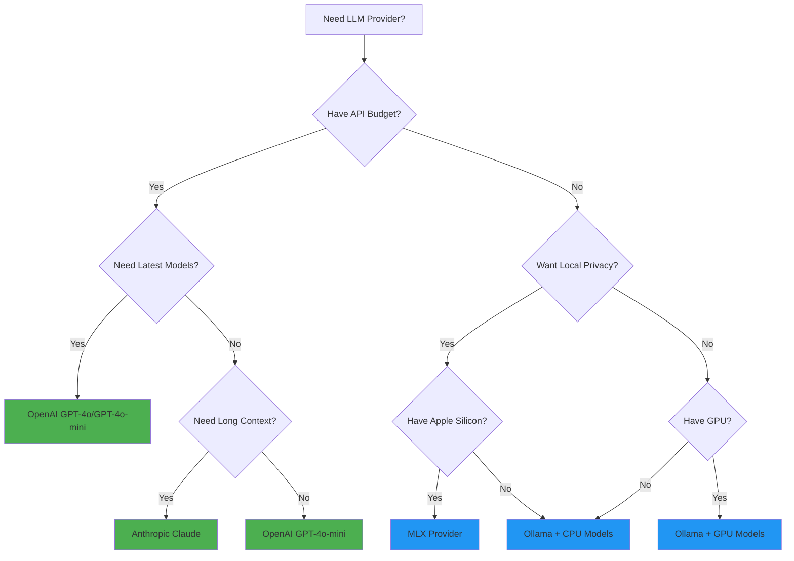

# Provider Guide

This guide helps you choose and configure the right LLM provider for your needs. All providers work with the exact same API, making it easy to switch or use multiple providers.

## Quick Provider Decision Tree



## Provider Comparison at a Glance

| Provider | Cost | Speed | Privacy | Best For | Setup Difficulty |
|----------|------|-------|---------|----------|-------------------|
| **OpenAI** | $$$ | ⚡⚡⚡ | Cloud | Production APIs, latest models | Easy |
| **Anthropic** | $$$ | ⚡⚡⚡ | Cloud | Long context, Claude models | Easy |
| **Ollama** | Free | ⚡⚡ | Local | Privacy, no costs, customization | Medium |
| **MLX** | Free | ⚡⚡⚡ | Local | Apple Silicon optimization | Medium |
| **LMStudio** | Free | ⚡⚡ | Local | GUI management, ease of use | Easy |
| **HuggingFace** | Free | ⚡ | Local | Open source models, research | Hard |

## Detailed Provider Guides

### OpenAI (Recommended for Production)

**Best for**: Production applications with budget, need for latest models and reliability.

**Setup**:
```bash
pip install abstractcore[openai]
export OPENAI_API_KEY="sk-your-key-here"
```

**Basic Usage**:
```python
from abstractllm import create_llm

llm = create_llm("openai", model="gpt-4o-mini")
response = llm.generate("What is machine learning?")
print(response.content)
```

**Model Selection**:
```python
# Recommended models (2024)
llm = create_llm("openai", model="gpt-4o-mini")      # Best value
llm = create_llm("openai", model="gpt-4o")           # Most capable
llm = create_llm("openai", model="gpt-3.5-turbo")    # Cheapest

# With configuration
llm = create_llm(
    "openai",
    model="gpt-4o-mini",
    temperature=0.7,        # Creativity (0-2)
    max_tokens=1000,        # Response length
    timeout=30              # Request timeout
)
```

**Features**:
- ✅ **Native tool calling** - Best tool support
- ✅ **Vision models** - Image understanding
- ✅ **Structured output** - JSON mode
- ✅ **Real-time streaming**
- ✅ **Production reliability**

**Pricing** (as of 2024):
- GPT-4o-mini: $0.15/1M input, $0.60/1M output
- GPT-4o: $2.50/1M input, $10.00/1M output

### Anthropic (Best for Long Context)

**Best for**: Applications needing long context (200k+ tokens), safety-conscious AI.

**Setup**:
```bash
pip install abstractcore[anthropic]
export ANTHROPIC_API_KEY="sk-ant-your-key-here"
```

**Basic Usage**:
```python
from abstractllm import create_llm

llm = create_llm("anthropic", model="claude-3-5-haiku-latest")
response = llm.generate("Explain quantum computing")
print(response.content)
```

**Model Selection**:
```python
# Recommended models
llm = create_llm("anthropic", model="claude-3-5-haiku-latest")     # Fast, cheap
llm = create_llm("anthropic", model="claude-3-5-sonnet-latest")    # Balanced
llm = create_llm("anthropic", model="claude-3-opus-latest")        # Most capable

# Long context example
llm = create_llm("anthropic", model="claude-3-5-sonnet-latest")
response = llm.generate("Summarize this document", max_tokens=4000)
```

**Features**:
- ✅ **200k context window** - Massive context support
- ✅ **Native tool calling** - XML-based tools
- ✅ **Vision support** - All Claude 3+ models
- ✅ **Constitutional AI** - Built-in safety
- ✅ **Real-time streaming**

**Pricing** (as of 2024):
- Claude 3.5 Haiku: $0.25/1M input, $1.25/1M output
- Claude 3.5 Sonnet: $3.00/1M input, $15.00/1M output

### Ollama (Best for Privacy/No Cost)

**Best for**: Privacy-sensitive applications, no API costs, customization.

**Setup**:
```bash
# Install Ollama
curl -fsSL https://ollama.com/install.sh | sh

# Pull recommended models
ollama pull qwen2.5-coder:7b      # Great for coding
ollama pull llama3.1:8b          # Good general model
ollama pull mistral:7b           # Fast and efficient

# Install AbstractCore
pip install abstractcore
```

**Basic Usage**:
```python
from abstractllm import create_llm

llm = create_llm("ollama", model="qwen2.5-coder:7b")
response = llm.generate("Write a Python function to sort a list")
print(response.content)
```

**Model Recommendations**:
```python
# Coding tasks
llm = create_llm("ollama", model="qwen2.5-coder:7b")       # Best coding model
llm = create_llm("ollama", model="qwen2.5-coder:14b")      # More capable coding

# General tasks
llm = create_llm("ollama", model="llama3.1:8b")            # Good all-around
llm = create_llm("ollama", model="mistral:7b")             # Fast responses

# Large models (if you have GPU/RAM)
llm = create_llm("ollama", model="llama3.1:70b")           # Very capable
```

**Custom Configuration**:
```python
# Custom endpoint
llm = create_llm(
    "ollama",
    model="qwen2.5-coder:7b",
    base_url="http://remote-server:11434",
    temperature=0.3,
    timeout=120
)
```

**Features**:
- ✅ **Completely free** - No API costs
- ✅ **Full privacy** - All local processing
- ✅ **Tool calling** - Architecture-dependent
- ✅ **Real-time streaming**
- ✅ **Model customization** - Create custom models

**Hardware Requirements**:
- **7B models**: 8GB RAM minimum
- **13B models**: 16GB RAM minimum
- **30B+ models**: 32GB RAM or GPU recommended

### MLX (Best for Apple Silicon)

**Best for**: Apple Silicon Macs, optimized performance, local inference.

**Setup**:
```bash
pip install abstractcore[mlx]
```

**Basic Usage**:
```python
from abstractllm import create_llm

llm = create_llm("mlx", model="mlx-community/Qwen2.5-Coder-7B-Instruct-4bit")
response = llm.generate("Explain async/await in Python")
print(response.content)
```

**Model Selection**:
```python
# Recommended models
llm = create_llm("mlx", model="mlx-community/Qwen2.5-Coder-7B-Instruct-4bit")
llm = create_llm("mlx", model="mlx-community/Llama-3.1-8B-Instruct-4bit")
llm = create_llm("mlx", model="mlx-community/Mistral-7B-Instruct-v0.3-4bit")

# Larger models (for M4 Max, M3 Max)
llm = create_llm("mlx", model="mlx-community/Qwen2.5-Coder-32B-Instruct-4bit")
```

**Features**:
- ✅ **Apple Silicon optimized** - Uses Metal Performance Shaders
- ✅ **4-bit quantization** - Memory efficient
- ✅ **Fast inference** - Optimized for M-series chips
- ✅ **Real-time streaming** - Native MLX streaming
- ❌ **Limited tool calling** - Depends on model

**Performance**:
- **M4 Max**: 50+ tokens/second for 7B models
- **M3 Pro**: 20-30 tokens/second for 7B models
- **M2**: 10-15 tokens/second for 7B models

### LMStudio (Easiest Local Setup)

**Best for**: Users who want local models with a GUI, easy model management.

**Setup**:
1. Download LM Studio from [lmstudio.ai](https://lmstudio.ai/)
2. Load a model in the GUI
3. Start the server (it mimics OpenAI API)

```bash
pip install abstractcore
```

**Basic Usage**:
```python
from abstractllm import create_llm

llm = create_llm("lmstudio", model="local-model")
response = llm.generate("What is machine learning?")
print(response.content)
```

**Configuration**:
```python
# Custom endpoint (if changed in LMStudio)
llm = create_llm(
    "lmstudio",
    model="your-model-name",
    base_url="http://localhost:1234",
    temperature=0.7
)
```

**Features**:
- ✅ **GUI management** - Easy model download and switching
- ✅ **OpenAI compatible** - Uses familiar API
- ✅ **Hardware optimization** - Automatic CPU/GPU detection
- ✅ **Model variety** - Supports many model formats
- ⚠️ **Limited tool calling** - Basic support only

### HuggingFace (Most Models Available)

**Best for**: Research, experimental models, custom fine-tuned models.

**Setup**:
```bash
pip install abstractcore[huggingface]
```

**Basic Usage**:
```python
from abstractllm import create_llm

# GGUF models (recommended)
llm = create_llm("huggingface", model="microsoft/DialoGPT-medium")
response = llm.generate("Hello! How are you?")
print(response.content)
```

**Model Types**:
```python
# Transformers models
llm = create_llm("huggingface", model="microsoft/DialoGPT-medium")

# GGUF models (more efficient)
llm = create_llm("huggingface", model="TheBloke/Llama-2-7B-Chat-GGUF")

# Custom models
llm = create_llm("huggingface", model="your-username/your-model")
```

**Features**:
- ✅ **Massive model selection** - 100k+ models
- ✅ **Custom models** - Use your fine-tuned models
- ✅ **Research models** - Latest experimental models
- ❌ **Complex setup** - Requires technical knowledge
- ❌ **Limited tool calling** - Depends on specific model

## Choosing the Right Provider

### For Production Applications

```python
# High-reliability production system
from abstractllm import create_llm
from abstractllm.core.retry import RetryConfig

# Primary: OpenAI (most reliable)
primary = create_llm(
    "openai",
    model="gpt-4o-mini",
    retry_config=RetryConfig(max_attempts=3)
)

# Fallback: Anthropic
fallback = create_llm("anthropic", model="claude-3-5-haiku-latest")

def reliable_generate(prompt, **kwargs):
    try:
        return primary.generate(prompt, **kwargs)
    except Exception as e:
        print(f"Primary failed ({e}), trying fallback...")
        return fallback.generate(prompt, **kwargs)
```

### For Development/Testing

```python
# Free local development
llm = create_llm("ollama", model="qwen2.5-coder:7b")

# Quick prototyping with API
llm = create_llm("openai", model="gpt-4o-mini")  # Cheapest API option
```

### For Privacy-Sensitive Applications

```python
# Apple Silicon
llm = create_llm("mlx", model="mlx-community/Qwen2.5-Coder-7B-Instruct-4bit")

# Any hardware
llm = create_llm("ollama", model="qwen2.5-coder:7b")

# GUI preference
llm = create_llm("lmstudio", model="local-model")
```

### For Specific Use Cases

**Coding Assistant**:
```python
# Best coding models
llm = create_llm("ollama", model="qwen2.5-coder:7b")        # Local
llm = create_llm("openai", model="gpt-4o")                  # Cloud
```

**Long Documents**:
```python
# Large context window
llm = create_llm("anthropic", model="claude-3-5-sonnet-latest")
```

**Cost-Sensitive**:
```python
# Cheapest options
llm = create_llm("ollama", model="mistral:7b")              # Free
llm = create_llm("openai", model="gpt-4o-mini")             # Cheap API
```

**Maximum Performance**:
```python
# Fastest responses
llm = create_llm("openai", model="gpt-4o-mini")             # Cloud
llm = create_llm("mlx", model="mlx-community/Qwen2.5-Coder-7B-Instruct-4bit")  # Local
```

## Multi-Provider Strategies

### Load Balancing
```python
import random
from abstractllm import create_llm

providers = [
    create_llm("openai", model="gpt-4o-mini"),
    create_llm("anthropic", model="claude-3-5-haiku-latest")
]

def load_balanced_generate(prompt, **kwargs):
    provider = random.choice(providers)
    return provider.generate(prompt, **kwargs)
```

### Cost Optimization
```python
# Use cheaper provider for simple tasks, expensive for complex
def smart_generate(prompt, **kwargs):
    if len(prompt) < 100:  # Simple tasks
        cheap_llm = create_llm("openai", model="gpt-4o-mini")
        return cheap_llm.generate(prompt, **kwargs)
    else:  # Complex tasks
        powerful_llm = create_llm("openai", model="gpt-4o")
        return powerful_llm.generate(prompt, **kwargs)
```

### Capability-Based Routing
```python
def capability_based_generate(prompt, tools=None, **kwargs):
    if tools:  # Need tool calling
        tool_provider = create_llm("openai", model="gpt-4o-mini")
        return tool_provider.generate(prompt, tools=tools, **kwargs)
    elif len(prompt) > 50000:  # Long context
        context_provider = create_llm("anthropic", model="claude-3-5-sonnet-latest")
        return context_provider.generate(prompt, **kwargs)
    else:  # General tasks
        general_provider = create_llm("ollama", model="qwen2.5-coder:7b")
        return general_provider.generate(prompt, **kwargs)
```

## Provider Migration

### From OpenAI SDK
```python
# Before
import openai
client = openai.OpenAI()
response = client.chat.completions.create(
    model="gpt-4o-mini",
    messages=[{"role": "user", "content": "Hello"}]
)

# After
from abstractllm import create_llm
llm = create_llm("openai", model="gpt-4o-mini")
response = llm.generate("Hello")
```

### From Anthropic SDK
```python
# Before
import anthropic
client = anthropic.Anthropic()
response = client.messages.create(
    model="claude-3-5-haiku-20241022",
    messages=[{"role": "user", "content": "Hello"}]
)

# After
from abstractllm import create_llm
llm = create_llm("anthropic", model="claude-3-5-haiku-latest")
response = llm.generate("Hello")
```

## Troubleshooting Common Issues

### OpenAI Issues
```python
# Issue: Authentication error
# Solution: Check API key
import os
print(os.getenv('OPENAI_API_KEY'))  # Should show your key

# Issue: Rate limiting
# Solution: Built-in retry handles this automatically
llm = create_llm("openai", model="gpt-4o-mini")  # Retry is automatic
```

### Ollama Issues
```bash
# Issue: Connection refused
# Solution: Make sure Ollama is running
ollama serve

# Issue: Model not found
# Solution: Pull the model first
ollama pull qwen2.5-coder:7b

# Issue: Out of memory
# Solution: Use smaller model or add swap
ollama pull qwen2.5-coder:1.5b  # Smaller model
```

### MLX Issues
```python
# Issue: Model not found
# Solution: Check model exists on HuggingFace
from abstractllm import create_llm
llm = create_llm("mlx", model="mlx-community/Qwen2.5-Coder-7B-Instruct-4bit")

# Issue: Slow performance
# Solution: Make sure you're on Apple Silicon
import platform
print(platform.processor())  # Should show 'arm'
```

## Performance Optimization

### Connection Reuse
```python
# Create once, use many times
llm = create_llm("openai", model="gpt-4o-mini")

# Reuse the same instance
for prompt in prompts:
    response = llm.generate(prompt)  # Reuses connection
```

### Batch Processing
```python
# For multiple similar requests
async def batch_generate(prompts):
    llm = create_llm("openai", model="gpt-4o-mini")

    tasks = []
    for prompt in prompts:
        tasks.append(llm.generate(prompt))

    return await asyncio.gather(*tasks)
```

### Model Selection by Task
```python
# Task-specific model selection
def get_provider_for_task(task_type):
    if task_type == "coding":
        return create_llm("ollama", model="qwen2.5-coder:7b")
    elif task_type == "analysis":
        return create_llm("anthropic", model="claude-3-5-sonnet-latest")
    else:
        return create_llm("openai", model="gpt-4o-mini")
```

## Next Steps

- **Start Simple**: Pick one provider and get familiar with the basics
- **Experiment**: Try different providers for your specific use case
- **Optimize**: Use provider-specific features and configurations
- **Scale**: Implement multi-provider strategies as needed

For more advanced usage:
- [Examples](examples.md) - Real-world use cases
- [Capabilities](capabilities.md) - What each provider can/cannot do
- [Architecture](architecture.md) - How provider abstraction works
- [API Reference](api_reference.md) - Complete API documentation

---

**Remember**: All providers use the same API, so you can switch between them by changing just one line of code. Start with what's easiest for you and evolve as needed.