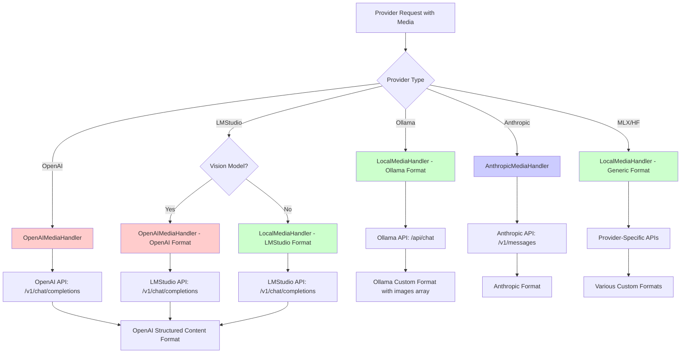

# Media Handler Architecture Analysis

## Executive Summary

The AbstractCore media handler architecture is **counterintuitive and confusing** due to a fundamental design decision that prioritizes **API compatibility over provider locality**. This report analyzes the source code to explain why LMStudio (a local provider) uses `OpenAIMediaHandler` while Ollama (also local) uses `LocalMediaHandler`, despite both being local providers.

## Key Finding

**The media handler selection is based on API format compatibility, not whether the provider is local or remote.**

## Architecture Overview

### Handler Selection Logic

The system uses **two primary factors** to determine which media handler to use:

1. **API Format Compatibility** (Primary)
2. **Vision Model Detection** (Secondary)

### Provider Classifications

| Provider | Handler Used | Reason | API Endpoint | Message Format |
|----------|-------------|--------|--------------|----------------|
| **OpenAI** | `OpenAIMediaHandler` | Native OpenAI API | `/v1/chat/completions` | OpenAI structured content |
| **LMStudio** | `OpenAIMediaHandler` (vision) / `LocalMediaHandler` (non-vision) | OpenAI-compatible API | `/v1/chat/completions` | OpenAI structured content |
| **Ollama** | `LocalMediaHandler` | Custom API format | `/api/chat` | Ollama-specific format |
| **Anthropic** | `AnthropicMediaHandler` | Native Anthropic API | `/v1/messages` | Anthropic format |
| **HuggingFace** | `LocalMediaHandler` | Custom implementation | Various | Provider-specific |
| **MLX** | `LocalMediaHandler` | Custom implementation | N/A | Provider-specific |

## Detailed Analysis

### 1. LMStudio Provider Logic

**File**: `abstractcore/providers/lmstudio_provider.py:412-435`

```python
def _get_media_handler_for_model(self, model_name: str):
    """Get appropriate media handler based on model vision capabilities."""
    from ..media.handlers import OpenAIMediaHandler, LocalMediaHandler

    # Normalize model name by removing provider prefixes
    clean_model_name = self._normalize_model_name(model_name)

    # Determine if model supports vision
    try:
        from ..architectures.detection import supports_vision
        use_vision_handler = supports_vision(clean_model_name)
    except Exception as e:
        self.logger.debug(f"Vision detection failed: {e}, defaulting to LocalMediaHandler")
        use_vision_handler = False

    # Create appropriate handler
    if use_vision_handler:
        handler = OpenAIMediaHandler(self.model_capabilities, model_name=model_name)
        self.logger.debug(f"Using OpenAIMediaHandler for vision model: {clean_model_name}")
    else:
        handler = LocalMediaHandler("lmstudio", self.model_capabilities, model_name=model_name)
        self.logger.debug(f"Using LocalMediaHandler for model: {clean_model_name}")

    return handler
```

**Key Insight**: LMStudio uses `OpenAIMediaHandler` for vision models because **LMStudio serves an OpenAI-compatible API** (`/v1/chat/completions`) that expects OpenAI's structured content format.

### 2. Ollama Provider Logic

**File**: `abstractcore/providers/ollama_provider.py:175-192`

```python
# Handle media content regardless of prompt (media can be used with messages too)
if media:
    # Get the text to combine with media
    user_message_text = prompt.strip() if prompt else ""
    try:
        from ..media.handlers import LocalMediaHandler
        media_handler = LocalMediaHandler("ollama", self.model_capabilities, model_name=self.model)

        # Create multimodal message combining text and media
        multimodal_message = media_handler.create_multimodal_message(user_message_text, media)
```

**Key Insight**: Ollama **always** uses `LocalMediaHandler` because it has a **custom API format** (`/api/chat`) that differs from OpenAI's standard.

### 3. Message Format Differences

#### OpenAI Format (Used by LMStudio + OpenAI)
```json
{
  "role": "user",
  "content": [
    {"type": "text", "text": "Analyze this image"},
    {
      "type": "image_url", 
      "image_url": {
        "url": "data:image/png;base64,iVBORw0...",
        "detail": "low"
      }
    }
  ]
}
```

#### Ollama Format (Custom)
```json
{
  "role": "user",
  "content": "Analyze this image",
  "images": ["iVBORw0KGgoAAAANSUhEUgAA..."]  // Raw base64, no data URL
}
```

### 4. Handler Implementation Differences

#### OpenAIMediaHandler
**File**: `abstractcore/media/handlers/openai_handler.py:202-233`

- **Purpose**: Formats for OpenAI's structured content API
- **Features**: 
  - Supports `detail` parameter (`low`, `high`, `auto`)
  - Qwen-specific optimizations
  - Base64 with data URL format
- **Used by**: OpenAI Provider, LMStudio Provider (vision models)

#### LocalMediaHandler  
**File**: `abstractcore/media/handlers/local_handler.py:23-553`

- **Purpose**: Handles multiple local provider formats
- **Features**:
  - Provider-specific message creation (`_create_ollama_message`, `_create_lmstudio_message`)
  - Text extraction fallbacks
  - Multiple format support
- **Used by**: Ollama Provider, LMStudio Provider (non-vision models), MLX Provider, HuggingFace Provider

## API Endpoint Analysis

### LMStudio API Compatibility

**File**: `abstractcore/providers/lmstudio_provider.py:1-4`
```python
"""
LM Studio provider implementation (OpenAI-compatible API).
"""
```

LMStudio **explicitly advertises OpenAI compatibility**, serving the same `/v1/chat/completions` endpoint with identical request/response formats.

### Ollama API Differences

**Endpoint**: `/api/chat` (not `/v1/chat/completions`)
**Format**: Custom message structure with separate `images` array

## The Confusing Design Decision

### Why This Architecture is Counterintuitive

1. **Local vs Remote Distinction is Misleading**: The names `OpenAIMediaHandler` vs `LocalMediaHandler` suggest a local/remote split, but the real distinction is **API format compatibility**.

2. **LMStudio is Local but Uses "OpenAI" Handler**: This breaks the mental model that local providers should use `LocalMediaHandler`.

3. **Inconsistent Naming**: `LocalMediaHandler` actually handles multiple providers (Ollama, MLX, HuggingFace) with different formats.

### Why This Design Exists

1. **API Compatibility**: LMStudio chose to implement OpenAI's exact API format to maximize compatibility with existing tools.

2. **Code Reuse**: Rather than duplicate OpenAI's message formatting logic, the system reuses `OpenAIMediaHandler` for any provider that implements OpenAI's format.

3. **Feature Parity**: OpenAI-compatible providers get access to OpenAI-specific features like the `detail` parameter automatically.

## Actionable Architecture Diagram



## Recommendations

### 1. Rename Handlers for Clarity

- `OpenAIMediaHandler` → `OpenAICompatibleMediaHandler`
- `LocalMediaHandler` → `CustomFormatMediaHandler`
- `AnthropicMediaHandler` → `AnthropicCompatibleMediaHandler`

### 2. Consolidate LMStudio Logic

The current LMStudio implementation has **duplicate logic** in both handlers:

**Current**: 
- `OpenAIMediaHandler` for vision models
- `LocalMediaHandler._create_lmstudio_message()` for non-vision models

**Recommendation**: Since LMStudio is always OpenAI-compatible, always use `OpenAIMediaHandler` and remove the LMStudio-specific logic from `LocalMediaHandler`.

### 3. Document API Compatibility Matrix

Create a clear matrix showing which providers implement which API formats:

| Provider | API Format | Endpoint | Handler |
|----------|------------|----------|---------|
| OpenAI | OpenAI | `/v1/chat/completions` | OpenAICompatible |
| LMStudio | OpenAI | `/v1/chat/completions` | OpenAICompatible |
| Ollama | Custom | `/api/chat` | CustomFormat |
| Anthropic | Anthropic | `/v1/messages` | AnthropicCompatible |

## Conclusion

The media handler architecture prioritizes **API format compatibility over provider locality**. While this creates confusion in naming, it enables **code reuse** and **feature consistency** across providers that implement the same API formats.

The key insight is: **LMStudio uses OpenAIMediaHandler not because it's trying to be OpenAI, but because it implements OpenAI's exact API specification for maximum compatibility.**

This design is actually **architecturally sound** but **poorly named and documented**. The recommendations above would clarify the intent without requiring major code changes.
