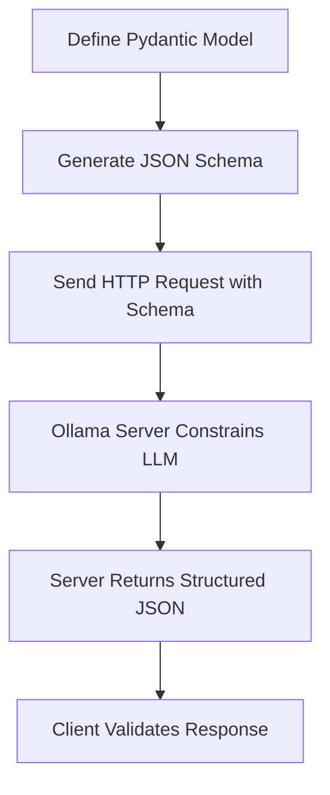

# Ollama Structured Outputs: Deep Dive Guide

## Table of Contents
- [Overview](#overview)
- [How It Works](#how-it-works)
- [The Underlying Mechanism](#the-underlying-mechanism)
- [Direct HTTP API Usage](#direct-http-api-usage)
- [Python Library vs Direct API](#python-library-vs-direct-api)
- [JSON Schema Examples](#json-schema-examples)
- [Practical Examples](#practical-examples)
- [Best Practices](#best-practices)
- [Troubleshooting](#troubleshooting)
- [Model Compatibility](#model-compatibility)
- [Server-Side Implementation](#server-side-implementation)
- [Pydantic Enums Support](#pydantic-enums-support)
- [Advanced Usage](#advanced-usage)
- [Streaming with Structured Outputs](#streaming-with-structured-outputs)

## Overview

Structured outputs in Ollama allow you to constrain Large Language Model (LLM) responses to follow specific JSON schemas. This ensures consistent, parseable output that matches your application's data structures.

**Key Insight**: Structured outputs are handled by the **Ollama server itself**, not by client libraries. The Python library is just a convenient wrapper around HTTP API calls.

## How It Works

### The Complete Flow



1. **Schema Definition**: Define your data structure (using Pydantic or raw JSON Schema)
2. **Schema Generation**: Convert to JSON Schema format
3. **HTTP Request**: Send schema to Ollama server in `format` parameter
4. **Server Processing**: Ollama constrains the LLM to generate conforming output
5. **Structured Response**: Server returns valid JSON matching your schema
6. **Client Validation**: Parse and validate the response

### Architecture Insight

```
┌─────────────────┐    HTTP POST     ┌─────────────────┐    Constrained    ┌─────────────────┐
│   Client App    │ ──────────────► │  Ollama Server  │ ──────────────► │      LLM        │
│                 │                 │                 │   Generation      │                 │
│ • Schema Gen    │                 │ • Schema Parse  │                   │ • Follows       │
│ • HTTP Request  │                 │ • LLM Constraint│                   │   Schema        │
│ • Response Parse│ ◄────────────── │ • JSON Return   │ ◄──────────────── │ • Valid JSON    │
└─────────────────┘   Structured    └─────────────────┘    Generated      └─────────────────┘
                        JSON                               Response
```

## The Underlying Mechanism

### What the Python Library Does

The `ollama-python` library performs these steps:

```python
# 1. Accept format parameter
format=FriendList.model_json_schema()

# 2. Create ChatRequest object
ChatRequest(
    model=model,
    messages=messages,
    format=format,  # Schema passed through unchanged
    # ... other params
)

# 3. Serialize to JSON and send HTTP POST
json=request.model_dump(exclude_none=True)
# Results in: {"format": {"type": "object", "properties": {...}}}

# 4. POST to /api/chat endpoint
requests.post("http://localhost:11434/api/chat", json=payload)
```

### What the Ollama Server Does

1. **Receives Request**: Parses the JSON payload including the `format` field
2. **Schema Validation**: Validates the JSON Schema syntax
3. **LLM Constraint**: Uses the schema to constrain the language model's generation process
4. **Output Validation**: Ensures generated content matches the schema
5. **Response Return**: Returns structured JSON in the response

### Type System

The `format` parameter accepts three types:

```python
format: Optional[Union[Literal['', 'json'], JsonSchemaValue]] = None
```

- `''` (empty): No formatting constraint
- `'json'`: Forces JSON output without schema validation  
- `JsonSchemaValue`: Complete JSON Schema dictionary

## Direct HTTP API Usage

### Basic Structure

All Ollama structured output requests follow this pattern:

```json
{
  "model": "llama3.1:8b",
  "messages": [
    {"role": "user", "content": "Your prompt here"}
  ],
  "format": {
    "type": "object",
    "properties": {
      // Your schema definition
    },
    "required": ["field1", "field2"]
  },
  "stream": false,
  "options": {
    "temperature": 0
  }
}
```

### HTTP Request Details

- **Endpoint**: `POST /api/chat`
- **Headers**: 
  - `Content-Type: application/json`
  - `Accept: application/json`
- **Body**: JSON payload with `format` field containing schema

## Python Library vs Direct API

### Using the Python Library

```python
from ollama import chat
from pydantic import BaseModel

class Person(BaseModel):
    name: str
    age: int

# Library handles HTTP details
response = chat(
    model='llama3.1:8b',
    messages=[{'role': 'user', 'content': 'Generate a person'}],
    format=Person.model_json_schema()  # Pydantic generates schema
)

person = Person.model_validate_json(response.message.content)
```

### Direct HTTP API Call

```python
import requests
import json

# Manual HTTP request
schema = {
    "type": "object",
    "properties": {
        "name": {"type": "string"},
        "age": {"type": "integer"}
    },
    "required": ["name", "age"]
}

response = requests.post('http://localhost:11434/api/chat', json={
    "model": "llama3.1:8b",
    "messages": [{"role": "user", "content": "Generate a person"}],
    "format": schema,  # Same schema, manual HTTP
    "stream": False
})

result = response.json()
person_data = json.loads(result['message']['content'])
```

### Using curl

```bash
curl -X POST http://localhost:11434/api/chat \
  -H 'Content-Type: application/json' \
  -d '{
    "model": "llama3.1:8b",
    "messages": [
      {"role": "user", "content": "Generate a person"}
    ],
    "format": {
      "type": "object",
      "properties": {
        "name": {"type": "string"},
        "age": {"type": "integer"}
      },
      "required": ["name", "age"]
    },
    "stream": false
  }'
```

## JSON Schema Examples

### Simple Object

```json
{
  "type": "object",
  "properties": {
    "name": {"type": "string"},
    "age": {"type": "integer"},
    "active": {"type": "boolean"}
  },
  "required": ["name", "age"]
}
```

### Array of Objects

```json
{
  "type": "object",
  "properties": {
    "users": {
      "type": "array",
      "items": {
        "type": "object",
        "properties": {
          "id": {"type": "integer"},
          "username": {"type": "string"},
          "email": {"type": "string", "format": "email"}
        },
        "required": ["id", "username"]
      }
    },
    "total": {"type": "integer"}
  },
  "required": ["users", "total"]
}
```

### Nested Objects with Enums

```json
{
  "type": "object",
  "properties": {
    "product": {
      "type": "object",
      "properties": {
        "name": {"type": "string"},
        "price": {"type": "number", "minimum": 0},
        "category": {
          "type": "string",
          "enum": ["electronics", "clothing", "books", "home"]
        },
        "specifications": {
          "type": "object",
          "properties": {
            "weight": {"type": "number"},
            "dimensions": {
              "type": "object",
              "properties": {
                "width": {"type": "number"},
                "height": {"type": "number"},
                "depth": {"type": "number"}
              }
            }
          }
        }
      },
      "required": ["name", "price", "category"]
    }
  },
  "required": ["product"]
}
```

## Practical Examples

### Example 1: Friend List (Pydantic + Direct API)

**Pydantic Model Definition:**
```python
from pydantic import BaseModel

class FriendInfo(BaseModel):
    name: str
    age: int
    is_available: bool

class FriendList(BaseModel):
    friends: list[FriendInfo]

# Generate schema
schema = FriendList.model_json_schema()
```

**Direct HTTP Call:**
```python
import requests

payload = {
    "model": "llama3.1:8b",
    "messages": [{
        "role": "user", 
        "content": "I have two friends. Ollama (22, busy) and Alonso (23, available). Return as JSON."
    }],
    "format": schema,
    "stream": False,
    "options": {"temperature": 0}
}

response = requests.post('http://localhost:11434/api/chat', json=payload)
result = response.json()

# Validate with Pydantic
friends = FriendList.model_validate_json(result['message']['content'])
print(f"Found {len(friends.friends)} friends")
```

### Example 2: Product Catalog (Raw JSON Schema)

**Raw Schema Definition:**
```python
product_schema = {
    "type": "object",
    "properties": {
        "catalog": {
            "type": "array",
            "items": {
                "type": "object",
                "properties": {
                    "id": {"type": "string"},
                    "name": {"type": "string"},
                    "price": {"type": "number", "minimum": 0},
                    "in_stock": {"type": "boolean"},
                    "tags": {
                        "type": "array",
                        "items": {"type": "string"}
                    }
                },
                "required": ["id", "name", "price", "in_stock"]
            }
        },
        "total_items": {"type": "integer"}
    },
    "required": ["catalog", "total_items"]
}
```

**curl Command:**
```bash
curl -X POST http://localhost:11434/api/chat \
  -H 'Content-Type: application/json' \
  -d '{
    "model": "llama3.1:8b",
    "messages": [{
      "role": "user",
      "content": "Generate a product catalog with 3 electronic items"
    }],
    "format": {
      "type": "object",
      "properties": {
        "catalog": {
          "type": "array",
          "items": {
            "type": "object",
            "properties": {
              "id": {"type": "string"},
              "name": {"type": "string"},
              "price": {"type": "number", "minimum": 0},
              "in_stock": {"type": "boolean"},
              "tags": {"type": "array", "items": {"type": "string"}}
            },
            "required": ["id", "name", "price", "in_stock"]
          }
        },
        "total_items": {"type": "integer"}
      },
      "required": ["catalog", "total_items"]
    },
    "stream": false
  }'
```

### Example 3: Minimal Standard Library

```python
import json
import urllib.request

def call_ollama_structured(prompt, schema):
    payload = {
        "model": "llama3.1:8b",
        "messages": [{"role": "user", "content": prompt}],
        "format": schema,
        "stream": False
    }
    
    req = urllib.request.Request(
        'http://localhost:11434/api/chat',
        data=json.dumps(payload).encode('utf-8'),
        headers={'Content-Type': 'application/json'}
    )
    
    with urllib.request.urlopen(req) as response:
        result = json.loads(response.read().decode('utf-8'))
        return json.loads(result['message']['content'])

# Usage
schema = {
    "type": "object",
    "properties": {
        "summary": {"type": "string"},
        "key_points": {
            "type": "array",
            "items": {"type": "string"}
        }
    },
    "required": ["summary", "key_points"]
}

result = call_ollama_structured("Summarize the benefits of structured outputs", schema)
print(f"Summary: {result['summary']}")
print(f"Key points: {result['key_points']}")
```

## Best Practices

### Schema Design

1. **Keep It Simple**: Start with simple schemas and add complexity gradually
2. **Required Fields**: Always specify required fields to ensure consistent output
3. **Type Constraints**: Use appropriate types (`string`, `integer`, `number`, `boolean`, `array`, `object`)
4. **Validation Rules**: Add constraints like `minimum`, `maximum`, `enum` for better validation

### Performance Optimization

1. **Temperature Control**: Use `temperature: 0` for deterministic outputs
2. **Model Selection**: Choose appropriate models for your complexity needs
3. **Schema Size**: Keep schemas reasonably sized to avoid processing overhead
4. **Caching**: Cache generated schemas when possible

### Error Handling

```python
def robust_structured_call(prompt, schema, max_retries=3):
    for attempt in range(max_retries):
        try:
            response = requests.post('http://localhost:11434/api/chat', json={
                "model": "llama3.1:8b",
                "messages": [{"role": "user", "content": prompt}],
                "format": schema,
                "stream": False,
                "options": {"temperature": 0}
            }, timeout=60)
            
            response.raise_for_status()
            result = response.json()
            
            # Validate JSON parsing
            content = json.loads(result['message']['content'])
            return content
            
        except (requests.RequestException, json.JSONDecodeError, KeyError) as e:
            if attempt == max_retries - 1:
                raise
            print(f"Attempt {attempt + 1} failed: {e}")
            
    return None
```

## Troubleshooting

### Common Issues

1. **Invalid JSON Schema**
   - **Problem**: Malformed schema causes server errors
   - **Solution**: Validate schema with tools like `jsonschema` library
   ```python
   import jsonschema
   jsonschema.Draft7Validator.check_schema(your_schema)
   ```

2. **Model Doesn't Support Structured Output**
   - **Problem**: Not all models support format constraints
   - **Solution**: Use compatible models (llama3.1, gemma2, etc.)

3. **Complex Schema Timeout**
   - **Problem**: Very complex schemas may cause generation timeouts
   - **Solution**: Simplify schema or increase timeout values

4. **Inconsistent Output Format**
   - **Problem**: Generated JSON doesn't match schema
   - **Solution**: Use `temperature: 0` and add more specific constraints

### Debugging Tips

1. **Test Schema Separately**: Validate your JSON schema before using it
2. **Start Simple**: Begin with basic schemas and add complexity
3. **Check Server Logs**: Monitor Ollama server logs for error details
4. **Validate Responses**: Always validate generated JSON against your schema

### Server Requirements

- **Ollama Version**: Ensure you're using a recent version that supports structured outputs (v0.1.26+)
- **Model Compatibility**: Verify your model supports the format parameter (see Model Compatibility section)
- **Memory Requirements**: Complex schemas may require more server memory

## Model Compatibility

### Supported Models

Structured outputs work best with models that have been trained or fine-tuned to follow instructions and generate structured data. Based on testing and documentation:

**✅ Confirmed Working Models:**
- `llama3.1:8b`, `llama3.1:70b` - Excellent structured output support
- `llama3.2:3b`, `llama3.2:1b` - Good support for simple to moderate schemas
- `gemma2:9b`, `gemma2:27b` - Strong structured output capabilities
- `qwen2.5:7b`, `qwen2.5:14b` - Good JSON schema adherence
- `mistral:7b` - Basic structured output support
- `codellama:7b` - Good for code-related structured outputs

**⚠️ Limited Support:**
- Older models (llama2, etc.) may have inconsistent structured output support
- Very small models (<1B parameters) may struggle with complex schemas
- Some specialized models may not follow JSON schemas reliably

**❌ Not Supported:**
- Models that don't support the `format` parameter will ignore it
- Pure embedding models (they don't generate text)

### Testing Model Compatibility

To test if a model supports structured outputs:

```bash
# Test with a simple schema
curl -X POST http://localhost:11434/api/chat \
  -H 'Content-Type: application/json' \
  -d '{
    "model": "your-model-name",
    "messages": [{"role": "user", "content": "Generate a person with name and age"}],
    "format": {
      "type": "object",
      "properties": {
        "name": {"type": "string"},
        "age": {"type": "integer"}
      },
      "required": ["name", "age"]
    },
    "stream": false
  }'
```

If the response contains valid JSON matching your schema, the model supports structured outputs.

## Server-Side Implementation

### How Ollama Server Handles Structured Outputs

The Ollama server implements structured outputs through several mechanisms:

1. **Schema Parsing**: The server validates the incoming JSON schema for syntax correctness
2. **Model Instruction**: The schema is converted into natural language instructions for the model
3. **Generation Constraint**: During generation, the server guides the model to produce valid JSON
4. **Output Validation**: The server validates the generated content against the schema
5. **Error Recovery**: If generation fails, the server may retry with adjusted parameters

### Internal Process Flow

```
Request with Schema → Schema Validation → Model Instruction Generation
                                              ↓
Response Validation ← JSON Generation ← Constrained Generation
                                              ↓
Client Response ← Format Validation ← Output Processing
```

### Performance Considerations

- **Schema Complexity**: More complex schemas require more processing time
- **Model Size**: Larger models generally handle structured outputs better
- **Temperature Settings**: Lower temperature (0-0.3) produces more consistent structured outputs
- **Retry Logic**: The server may internally retry generation if output doesn't match schema

## Pydantic Enums Support

### Overview

**Yes, Pydantic enums are fully supported!** Ollama's structured outputs work excellently with Pydantic enums, automatically converting them to JSON Schema `enum` constraints that the LLM respects.

### How Pydantic Enums Work

When you define enums in Pydantic models, they get converted to JSON Schema with `enum` constraints:

### Complete Data Flow: Pydantic Enums End-to-End

Here's the complete journey of how Pydantic enums are processed from client to server and back:

#### 1. **Client-Side: Enum Definition & Schema Generation**

```python
from enum import Enum
from pydantic import BaseModel

class Priority(str, Enum):
    LOW = "low"
    MEDIUM = "medium"
    HIGH = "high"

class Task(BaseModel):
    title: str
    priority: Priority

# Pydantic generates JSON Schema with enum constraints
schema = Task.model_json_schema()
```

**Generated Schema:**
```json
{
  "$defs": {
    "Priority": {
      "enum": ["low", "medium", "high"],
      "title": "Priority", 
      "type": "string"
    }
  },
  "properties": {
    "title": {"title": "Title", "type": "string"},
    "priority": {"$ref": "#/$defs/Priority"}
  },
  "required": ["title", "priority"],
  "title": "Task",
  "type": "object"
}
```

#### 2. **HTTP Request: Schema Transmission**

The client sends the schema to Ollama server:

```python
# Python library approach
response = chat(
    model='llama3.1:8b',
    messages=[{'role': 'user', 'content': 'Create a high priority task'}],
    format=schema  # Schema with enum constraints sent to server
)
```

**Actual HTTP Request Payload:**
```json
{
  "model": "llama3.1:8b",
  "messages": [{"role": "user", "content": "Create a high priority task"}],
  "format": {
    "$defs": {
      "Priority": {
        "enum": ["low", "medium", "high"],
        "title": "Priority",
        "type": "string"
      }
    },
    "properties": {
      "title": {"title": "Title", "type": "string"},
      "priority": {"$ref": "#/$defs/Priority"}
    },
    "required": ["title", "priority"],
    "title": "Task",
    "type": "object"
  },
  "stream": false
}
```

#### 3. **Server-Side: Ollama Processing**

The Ollama server processes the enum constraints:

```
┌─────────────────────────────────────────────────────────────┐
│                    Ollama Server Processing                 │
├─────────────────────────────────────────────────────────────┤
│ 1. Parse JSON Schema                                        │
│    • Identify enum constraints: ["low", "medium", "high"]   │
│    • Resolve $ref references to actual enum values         │
│                                                             │
│ 2. Convert Schema to Model Instructions                     │
│    • "Generate JSON with 'priority' field"                 │
│    • "Priority must be one of: low, medium, high"          │
│    • "Use exact string values, case-sensitive"             │
│                                                             │
│ 3. Constrained Generation                                   │
│    • LLM generates response following enum constraints      │
│    • Server validates output matches enum values           │
│    • Retry if generated value not in enum list             │
│                                                             │
│ 4. Response Validation                                      │
│    • Verify JSON structure matches schema                  │
│    • Confirm enum values are from allowed list             │
│    • Return validated JSON response                        │
└─────────────────────────────────────────────────────────────┘
```

#### 4. **Server Response: Structured JSON**

Ollama returns JSON that respects enum constraints:

```json
{
  "model": "llama3.1:8b",
  "created_at": "2024-01-15T10:30:00Z",
  "message": {
    "role": "assistant",
    "content": "{\"title\": \"Complete project documentation\", \"priority\": \"high\"}"
  },
  "done": true
}
```

**Key Point**: The `priority` value `"high"` is guaranteed to be one of the enum values `["low", "medium", "high"]`.

#### 5. **Client-Side: Response Processing & Validation**

The client receives and validates the response:

```python
# Extract JSON content
json_content = response.message.content
# Content: '{"title": "Complete project documentation", "priority": "high"}'

# Pydantic validation with enum checking
task = Task.model_validate_json(json_content)
# This validates:
# 1. JSON structure matches Task model
# 2. priority value "high" is valid Priority enum value
# 3. All required fields are present

print(f"Task: {task.title}")
print(f"Priority: {task.priority}")  # Priority.HIGH enum instance
print(f"Priority value: {task.priority.value}")  # "high" string
print(f"Priority type: {type(task.priority)}")  # <enum 'Priority'>
```

#### 6. **Complete Flow Diagram**

```
Client Side                 HTTP Transport              Server Side
┌─────────────┐            ┌─────────────┐            ┌─────────────┐
│ Pydantic    │   POST     │             │            │ Ollama      │
│ Enum Def    │ ────────►  │ JSON Schema │ ────────►  │ Server      │
│             │            │ with enum   │            │             │
│ Priority    │            │ constraints │            │ Schema      │
│ .HIGH       │            │             │            │ Parser      │
└─────────────┘            └─────────────┘            └─────────────┘
       ▲                                                      │
       │                                                      ▼
┌─────────────┐            ┌─────────────┐            ┌─────────────┐
│ Validated   │            │ Structured  │            │ LLM with    │
│ Enum Object │ ◄────────  │ JSON        │ ◄────────  │ Enum        │
│             │            │ Response    │            │ Constraints │
│ task.       │            │             │            │             │
│ priority    │            │ "priority": │            │ Generate    │
│ .value      │            │ "high"      │            │ "high"      │
└─────────────┘            └─────────────┘            └─────────────┘
```

#### 7. **Error Handling in the Flow**

**Server-Side Enum Validation:**
```python
# If LLM tries to generate invalid enum value
# Server detects: "priority": "super_urgent"  # Not in enum list
# Server response: Retry generation or return error
```

**Client-Side Enum Validation:**
```python
try:
    task = Task.model_validate_json(response_content)
except ValidationError as e:
    # Pydantic catches invalid enum values
    print(f"Invalid enum value: {e}")
    # Example: "Input should be 'low', 'medium' or 'high'"
```

#### 8. **Direct HTTP API Flow**

For direct HTTP calls, the flow is identical but manual:

```bash
# Send enum constraints directly
curl -X POST http://localhost:11434/api/chat \
  -d '{
    "format": {
      "type": "object", 
      "properties": {
        "priority": {
          "type": "string",
          "enum": ["low", "medium", "high"]  # Direct enum constraint
        }
      }
    }
  }'

# Server processes enum constraints the same way
# Response: {"priority": "medium"}  # Guaranteed valid enum value
```

This complete data flow ensures **double validation**:
1. **Server-side**: Ollama constrains LLM generation to valid enum values
2. **Client-side**: Pydantic validates the response matches enum definitions

The result is **bulletproof enum handling** with type safety and guaranteed valid values throughout the entire pipeline.

#### 9. **Practical End-to-End Example**

Here's a complete working example showing the entire data flow:

```python
import json
from enum import Enum
from pydantic import BaseModel
from ollama import chat

# 1. Define Pydantic enums
class Priority(str, Enum):
    LOW = "low"
    MEDIUM = "medium" 
    HIGH = "high"
    CRITICAL = "critical"

class Status(str, Enum):
    PENDING = "pending"
    IN_PROGRESS = "in_progress"
    COMPLETED = "completed"

class Task(BaseModel):
    title: str
    description: str
    priority: Priority
    status: Status

# 2. Generate schema (happens automatically)
schema = Task.model_json_schema()
print("Schema sent to server:")
print(json.dumps(schema, indent=2))

# 3. Send request with enum constraints
response = chat(
    model='llama3.1:8b',
    messages=[{
        'role': 'user',
        'content': 'Create a task to "Review code" with high priority and pending status'
    }],
    format=schema,  # Enum constraints included
    options={'temperature': 0}
)

# 4. Server returns JSON respecting enum constraints
print(f"\nServer response: {response.message.content}")

# 5. Client validates with Pydantic (enum validation included)
task = Task.model_validate_json(response.message.content)

# 6. Access validated enum objects
print(f"\nValidated task:")
print(f"  Title: {task.title}")
print(f"  Priority: {task.priority} (type: {type(task.priority)})")
print(f"  Priority value: {task.priority.value}")
print(f"  Status: {task.status} (type: {type(task.status)})")
print(f"  Status value: {task.status.value}")

# 7. Enum comparison and operations work
if task.priority == Priority.HIGH:
    print("  ✅ High priority task detected!")

if task.status in [Status.PENDING, Status.IN_PROGRESS]:
    print("  ⏳ Task is not yet completed")
```

**Expected Output:**
```
Schema sent to server:
{
  "$defs": {
    "Priority": {
      "enum": ["low", "medium", "high", "critical"],
      "title": "Priority",
      "type": "string"
    },
    "Status": {
      "enum": ["pending", "in_progress", "completed"],
      "title": "Status", 
      "type": "string"
    }
  },
  "properties": {
    "title": {"title": "Title", "type": "string"},
    "description": {"title": "Description", "type": "string"},
    "priority": {"$ref": "#/$defs/Priority"},
    "status": {"$ref": "#/$defs/Status"}
  },
  "required": ["title", "description", "priority", "status"],
  "title": "Task",
  "type": "object"
}

Server response: {"title": "Review code", "description": "Conduct thorough code review", "priority": "high", "status": "pending"}

Validated task:
  Title: Review code
  Priority: Priority.HIGH (type: <enum 'Priority'>)
  Priority value: high
  Status: Status.PENDING (type: <enum 'Status'>)
  Status value: pending
  ✅ High priority task detected!
  ⏳ Task is not yet completed
```

This example demonstrates the complete round-trip journey of Pydantic enums through the Ollama structured outputs system, showing how enum constraints are preserved and validated at every step.

### Enum Types Supported

**1. String Enums (Recommended)**
```python
class Status(str, Enum):
    PENDING = "pending"
    COMPLETED = "completed"
    CANCELLED = "cancelled"
```

**2. Integer Enums**
```python
class Level(int, Enum):
    BEGINNER = 1
    INTERMEDIATE = 2
    ADVANCED = 3
```

**3. Standard Enums**
```python
class Color(Enum):
    RED = "red"
    GREEN = "green"
    BLUE = "blue"
```

### Complete Working Example

```python
from enum import Enum
from typing import List
from pydantic import BaseModel
from ollama import chat

class Priority(str, Enum):
    LOW = "low"
    MEDIUM = "medium"
    HIGH = "high"
    CRITICAL = "critical"

class Status(str, Enum):
    PENDING = "pending"
    IN_PROGRESS = "in_progress"
    COMPLETED = "completed"

class Category(str, Enum):
    WORK = "work"
    PERSONAL = "personal"
    SHOPPING = "shopping"

class Task(BaseModel):
    title: str
    description: str
    priority: Priority
    status: Status
    category: Category

class TaskList(BaseModel):
    tasks: List[Task]
    total_count: int

# Use with Ollama
response = chat(
    model='llama3.1:8b',
    messages=[{
        'role': 'user',
        'content': '''Create a task list with 3 tasks:
        1. "Buy groceries" - high priority, pending status, shopping category
        2. "Finish report" - critical priority, in_progress status, work category  
        3. "Call dentist" - medium priority, pending status, personal category'''
    }],
    format=TaskList.model_json_schema(),
    options={'temperature': 0}
)

# Validate response
task_list = TaskList.model_validate_json(response.message.content)
print(f"Generated {len(task_list.tasks)} tasks")
for task in task_list.tasks:
    print(f"- {task.title}: {task.priority.value} priority, {task.status.value}")
```

### Direct HTTP API with Enums

You can also use enums with direct HTTP calls:

```bash
curl -X POST http://localhost:11434/api/chat \
  -H 'Content-Type: application/json' \
  -d '{
    "model": "llama3.1:8b",
    "messages": [{
      "role": "user",
      "content": "Create a user profile for Alice with admin role and active status"
    }],
    "format": {
      "type": "object",
      "properties": {
        "name": {"type": "string"},
        "role": {
          "type": "string",
          "enum": ["admin", "user", "moderator", "guest"]
        },
        "status": {
          "type": "string",
          "enum": ["active", "inactive", "suspended"]
        },
        "permissions": {
          "type": "array",
          "items": {
            "type": "string",
            "enum": ["read", "write", "delete", "admin"]
          }
        }
      },
      "required": ["name", "role", "status"]
    },
    "stream": false
  }'
```

### Enum Validation Benefits

**1. Server-Side Constraint**: Ollama ensures generated values match enum options
**2. Client-Side Validation**: Pydantic validates the response matches your enum definitions
**3. Type Safety**: Full IDE support and type checking
**4. Documentation**: Enums serve as clear documentation of valid values

### Complex Enum Examples

**Nested Enums in Objects:**
```python
class Product(BaseModel):
    name: str
    category: Category
    priority: Priority
    tags: List[str]

class Inventory(BaseModel):
    products: List[Product]
    categories: List[Category]  # Array of enum values
    summary: dict[Category, int]  # Enum as dict key
```

**Optional Enums:**
```python
from typing import Optional

class Task(BaseModel):
    title: str
    priority: Priority
    category: Optional[Category] = None  # Optional enum
```

**Enum with Default Values:**
```python
class Task(BaseModel):
    title: str
    priority: Priority = Priority.MEDIUM  # Default enum value
    status: Status = Status.PENDING
```

### Best Practices for Enums

1. **Use String Enums**: `class Status(str, Enum)` for better JSON compatibility
2. **Clear Naming**: Use descriptive enum values (`"in_progress"` vs `"ip"`)
3. **Consistent Casing**: Stick to snake_case or kebab-case for values
4. **Comprehensive Coverage**: Include all possible values the LLM might generate
5. **Validation**: Always validate responses with Pydantic after generation

### Troubleshooting Enums

**Common Issues:**

1. **Invalid Enum Values Generated**
   - **Problem**: LLM generates values not in enum
   - **Solution**: Use more specific prompts, lower temperature, or add examples

2. **Case Sensitivity**
   - **Problem**: LLM generates "Active" instead of "active"
   - **Solution**: Use clear enum values and explicit instructions

3. **Enum Reference Errors**
   - **Problem**: Complex `$ref` schemas not handled properly
   - **Solution**: Use simpler enum definitions or inline enums

**Example Fix:**
```python
# Instead of complex references, use direct enum constraints
schema = {
    "type": "object",
    "properties": {
        "status": {
            "type": "string",
            "enum": ["active", "inactive", "pending"]  # Direct enum
        }
    }
}
```

## Advanced Usage

### Dynamic Schema Generation

```python
def create_dynamic_schema(fields):
    """Generate schema dynamically based on field requirements."""
    properties = {}
    required = []
    
    for field_name, field_config in fields.items():
        properties[field_name] = {
            "type": field_config["type"],
            "description": field_config.get("description", "")
        }
        
        if field_config.get("required", False):
            required.append(field_name)
            
        if field_config["type"] == "string" and "enum" in field_config:
            properties[field_name]["enum"] = field_config["enum"]
    
    return {
        "type": "object",
        "properties": properties,
        "required": required
    }

# Usage
fields = {
    "name": {"type": "string", "required": True},
    "status": {"type": "string", "enum": ["active", "inactive"], "required": True},
    "score": {"type": "number", "required": False}
}

schema = create_dynamic_schema(fields)
```

## Streaming with Structured Outputs

### Overview

Streaming allows you to receive structured responses incrementally as they're generated, providing real-time feedback while maintaining JSON schema constraints. The key insight is that **structured outputs work with streaming**, but the JSON is built progressively.

### How Streaming Works with Structured Outputs

When streaming is enabled with structured outputs:

1. **Server-side**: Ollama generates JSON incrementally while respecting schema constraints
2. **Client-side**: You receive JSON fragments that build up to the complete structured response
3. **Final validation**: The complete JSON can be validated against your schema once streaming is done

### Streaming Data Flow

```
Client Request          Server Processing           Streaming Response
┌─────────────┐        ┌─────────────────┐        ┌─────────────────┐
│ format=     │ ────►  │ Schema-         │ ────►  │ {"title": "     │ (chunk 1)
│ schema +    │        │ constrained     │        │ Fix bug",       │ (chunk 2)  
│ stream=true │        │ generation      │        │ "priority":     │ (chunk 3)
└─────────────┘        │ (incremental)   │        │ "high"}         │ (chunk 4)
                       └─────────────────┘        └─────────────────┘
                                                           │
                                                           ▼
                                                  ┌─────────────────┐
                                                  │ Complete JSON   │
                                                  │ {"title": "Fix  │
                                                  │ bug", "priority"│
                                                  │ : "high"}       │
                                                  └─────────────────┘
```

### Python Library Streaming

#### Basic Streaming Example

```python
from pydantic import BaseModel
from enum import Enum
from ollama import chat

class Priority(str, Enum):
    LOW = "low"
    MEDIUM = "medium"
    HIGH = "high"

class Task(BaseModel):
    title: str
    description: str
    priority: Priority

# Stream structured response
def stream_structured_task():
    content_parts = []
    
    # Enable streaming with structured output
    stream = chat(
        model='llama3.1:8b',
        messages=[{
            'role': 'user',
            'content': 'Create a high priority task to fix a critical bug'
        }],
        format=Task.model_json_schema(),  # Schema constraint
        stream=True,  # Enable streaming
        options={'temperature': 0}
    )
    
    print("Streaming structured response:")
    
    # Process streaming chunks
    for chunk in stream:
        if chunk['message']['content']:
            content_parts.append(chunk['message']['content'])
            print(f"Chunk: {repr(chunk['message']['content'])}")
        
        if chunk['done']:
            break
    
    # Combine all chunks into complete JSON
    full_content = ''.join(content_parts)
    print(f"\nComplete JSON: {full_content}")
    
    # Validate with Pydantic
    task = Task.model_validate_json(full_content)
    print(f"Validated task: {task.title} - {task.priority.value} priority")
    
    return task

# Usage
task = stream_structured_task()
```

**Expected Output:**
```
Streaming structured response:
Chunk: '{'
Chunk: '"title"'
Chunk: ': "'
Chunk: 'Fix critical bug'
Chunk: '", "'
Chunk: 'description'
Chunk: '": "'
Chunk: 'Resolve critical system bug affecting users'
Chunk: '", "'
Chunk: 'priority'
Chunk: '": "'
Chunk: 'high'
Chunk: '"}'

Complete JSON: {"title": "Fix critical bug", "description": "Resolve critical system bug affecting users", "priority": "high"}
Validated task: Fix critical bug - high priority
```

#### Advanced Streaming with Progress Tracking

```python
import json
from typing import Optional

def stream_with_progress(prompt: str, schema: dict, model: str = "llama3.1:8b"):
    """Stream structured response with progress tracking and partial parsing."""
    
    content_parts = []
    current_content = ""
    
    stream = chat(
        model=model,
        messages=[{'role': 'user', 'content': prompt}],
        format=schema,
        stream=True,
        options={'temperature': 0}
    )
    
    print("🔄 Streaming structured response with progress...")
    
    for i, chunk in enumerate(stream):
        chunk_content = chunk['message']['content']
        
        if chunk_content:
            content_parts.append(chunk_content)
            current_content = ''.join(content_parts)
            
            # Show progress
            print(f"Chunk {i+1}: {repr(chunk_content)}")
            print(f"Current: {current_content}")
            
            # Try to parse partial JSON (optional)
            try:
                # This might fail for incomplete JSON
                partial = json.loads(current_content)
                print(f"✅ Valid JSON so far: {partial}")
            except json.JSONDecodeError:
                print("⏳ JSON incomplete, continuing...")
            
            print("-" * 40)
        
        if chunk['done']:
            print("✅ Streaming complete!")
            break
    
    # Final validation
    final_content = ''.join(content_parts)
    try:
        final_json = json.loads(final_content)
        print(f"🎉 Final structured response: {final_json}")
        return final_json
    except json.JSONDecodeError as e:
        print(f"❌ Invalid final JSON: {e}")
        return None

# Example usage
schema = {
    "type": "object",
    "properties": {
        "summary": {"type": "string"},
        "tasks": {
            "type": "array",
            "items": {
                "type": "object",
                "properties": {
                    "title": {"type": "string"},
                    "priority": {"type": "string", "enum": ["low", "medium", "high"]}
                },
                "required": ["title", "priority"]
            }
        }
    },
    "required": ["summary", "tasks"]
}

result = stream_with_progress(
    "Create a project summary with 2 tasks: one high priority, one medium priority",
    schema
)
```

### Direct HTTP API Streaming

#### Using requests with streaming

```python
import requests
import json

def stream_structured_http(prompt, schema, model="llama3.1:8b"):
    """Stream structured response using direct HTTP API."""
    
    payload = {
        "model": model,
        "messages": [{"role": "user", "content": prompt}],
        "format": schema,
        "stream": True,  # Enable streaming
        "options": {"temperature": 0}
    }
    
    response = requests.post(
        'http://localhost:11434/api/chat',
        json=payload,
        stream=True  # Important: enable streaming in requests
    )
    
    content_parts = []
    
    print("🔄 HTTP streaming structured response...")
    
    for line in response.iter_lines():
        if line:
            try:
                chunk = json.loads(line.decode('utf-8'))
                
                if 'message' in chunk and 'content' in chunk['message']:
                    chunk_content = chunk['message']['content']
                    if chunk_content:
                        content_parts.append(chunk_content)
                        print(f"Received: {repr(chunk_content)}")
                
                if chunk.get('done', False):
                    print("✅ Streaming complete!")
                    break
                    
            except json.JSONDecodeError:
                continue  # Skip invalid JSON lines
    
    # Combine and validate
    full_content = ''.join(content_parts)
    print(f"\n📄 Complete response: {full_content}")
    
    try:
        return json.loads(full_content)
    except json.JSONDecodeError as e:
        print(f"❌ Invalid JSON: {e}")
        return None

# Example usage
task_schema = {
    "type": "object",
    "properties": {
        "title": {"type": "string"},
        "description": {"type": "string"},
        "priority": {"type": "string", "enum": ["low", "medium", "high", "critical"]},
        "estimated_hours": {"type": "number", "minimum": 0}
    },
    "required": ["title", "description", "priority"]
}

result = stream_structured_http(
    "Create a task to implement user authentication with high priority, estimated 8 hours",
    task_schema
)
```

#### Using curl with streaming

```bash
# Stream structured response with curl
curl -X POST http://localhost:11434/api/chat \
  -H 'Content-Type: application/json' \
  -d '{
    "model": "llama3.1:8b",
    "messages": [{
      "role": "user",
      "content": "Create a user profile with name Alice, age 30, role admin"
    }],
    "format": {
      "type": "object",
      "properties": {
        "name": {"type": "string"},
        "age": {"type": "integer"},
        "role": {"type": "string", "enum": ["admin", "user", "guest"]}
      },
      "required": ["name", "age", "role"]
    },
    "stream": true
  }' \
  --no-buffer  # Important: disable buffering for real-time streaming

# Expected output (streaming):
# {"model":"llama3.1:8b","created_at":"...","message":{"role":"assistant","content":"{"},"done":false}
# {"model":"llama3.1:8b","created_at":"...","message":{"role":"assistant","content":"\"name\""},"done":false}
# {"model":"llama3.1:8b","created_at":"...","message":{"role":"assistant","content":": \"Alice\""},"done":false}
# ... more chunks ...
# {"model":"llama3.1:8b","created_at":"...","message":{"role":"assistant","content":""},"done":true}
```

### Async Streaming

#### Using AsyncClient

```python
import asyncio
from ollama import AsyncClient
from pydantic import BaseModel

class User(BaseModel):
    name: str
    email: str
    role: str

async def async_stream_structured():
    """Async streaming with structured outputs."""
    
    client = AsyncClient()
    content_parts = []
    
    # Async streaming
    stream = await client.chat(
        model='llama3.1:8b',
        messages=[{
            'role': 'user',
            'content': 'Create a user profile for John Doe, email john@example.com, admin role'
        }],
        format=User.model_json_schema(),
        stream=True,
        options={'temperature': 0}
    )
    
    print("🔄 Async streaming structured response...")
    
    async for chunk in stream:
        if chunk['message']['content']:
            content_parts.append(chunk['message']['content'])
            print(f"Chunk: {repr(chunk['message']['content'])}")
        
        if chunk['done']:
            break
    
    # Validate final result
    full_content = ''.join(content_parts)
    user = User.model_validate_json(full_content)
    
    print(f"✅ Created user: {user.name} ({user.email}) - {user.role}")
    return user

# Run async streaming
async def main():
    user = await async_stream_structured()
    print(f"User created: {user}")

# asyncio.run(main())
```

### Streaming Best Practices

#### 1. **Buffer Management**
```python
def robust_streaming(prompt, schema, max_buffer_size=10000):
    """Streaming with buffer size limits."""
    
    content_parts = []
    total_size = 0
    
    stream = chat(
        model='llama3.1:8b',
        messages=[{'role': 'user', 'content': prompt}],
        format=schema,
        stream=True
    )
    
    for chunk in stream:
        if chunk['message']['content']:
            chunk_content = chunk['message']['content']
            
            # Check buffer size
            if total_size + len(chunk_content) > max_buffer_size:
                print("⚠️ Buffer size limit reached!")
                break
            
            content_parts.append(chunk_content)
            total_size += len(chunk_content)
        
        if chunk['done']:
            break
    
    return ''.join(content_parts)
```

#### 2. **Error Handling**
```python
def stream_with_error_handling(prompt, schema):
    """Streaming with comprehensive error handling."""
    
    try:
        content_parts = []
        
        stream = chat(
            model='llama3.1:8b',
            messages=[{'role': 'user', 'content': prompt}],
            format=schema,
            stream=True,
            options={'temperature': 0}
        )
        
        for chunk in stream:
            try:
                if chunk['message']['content']:
                    content_parts.append(chunk['message']['content'])
                
                if chunk['done']:
                    break
                    
            except KeyError as e:
                print(f"⚠️ Malformed chunk: {e}")
                continue
        
        # Validate final JSON
        full_content = ''.join(content_parts)
        if not full_content.strip():
            raise ValueError("Empty response received")
        
        return json.loads(full_content)
        
    except json.JSONDecodeError as e:
        print(f"❌ Invalid JSON in streaming response: {e}")
        print(f"Content: {full_content}")
        return None
    except Exception as e:
        print(f"❌ Streaming error: {e}")
        return None
```

#### 3. **Real-time Processing**
```python
def stream_with_callback(prompt, schema, on_chunk=None, on_complete=None):
    """Streaming with real-time callbacks."""
    
    content_parts = []
    
    stream = chat(
        model='llama3.1:8b',
        messages=[{'role': 'user', 'content': prompt}],
        format=schema,
        stream=True
    )
    
    for chunk in stream:
        if chunk['message']['content']:
            chunk_content = chunk['message']['content']
            content_parts.append(chunk_content)
            
            # Real-time callback
            if on_chunk:
                on_chunk(chunk_content, ''.join(content_parts))
        
        if chunk['done']:
            break
    
    # Completion callback
    final_content = ''.join(content_parts)
    final_json = json.loads(final_content)
    
    if on_complete:
        on_complete(final_json)
    
    return final_json

# Usage with callbacks
def on_chunk_received(chunk, current_content):
    print(f"📥 Received: {chunk}")
    print(f"📄 Current: {current_content[:50]}...")

def on_streaming_complete(final_json):
    print(f"🎉 Complete: {final_json}")

result = stream_with_callback(
    "Create a task list with 3 items",
    {"type": "object", "properties": {"tasks": {"type": "array"}}},
    on_chunk=on_chunk_received,
    on_complete=on_streaming_complete
)
```

### Key Points for Streaming Structured Outputs

1. **JSON Building**: Structured responses are built incrementally as valid JSON
2. **Schema Compliance**: Each chunk respects the overall schema constraints
3. **Final Validation**: Always validate the complete JSON after streaming
4. **Error Handling**: Handle incomplete JSON during streaming gracefully
5. **Buffer Management**: Monitor content size to prevent memory issues
6. **Real-time Feedback**: Use callbacks for real-time processing of chunks

**Streaming with structured outputs provides the best of both worlds: real-time response generation with guaranteed schema compliance.**

## Conclusion

Structured outputs in Ollama are a powerful server-side feature that constrains LLM generation to follow JSON schemas. The key insights are:

1. **Server-Side Processing**: The magic happens in the Ollama server, not client libraries
2. **HTTP API**: You can use any HTTP client to access structured outputs
3. **JSON Schema Standard**: Uses standard JSON Schema for defining constraints
4. **Library Independence**: The Python library is just a convenient wrapper

This architecture makes structured outputs accessible from any programming language or tool that can make HTTP requests, providing maximum flexibility for integration into diverse applications.

Whether you use the Python library, direct HTTP calls, or curl commands, the underlying mechanism remains the same: send a JSON schema in the `format` parameter, and Ollama will constrain the LLM to generate conforming output.
